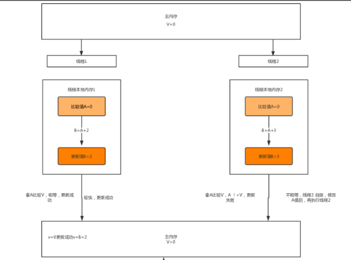
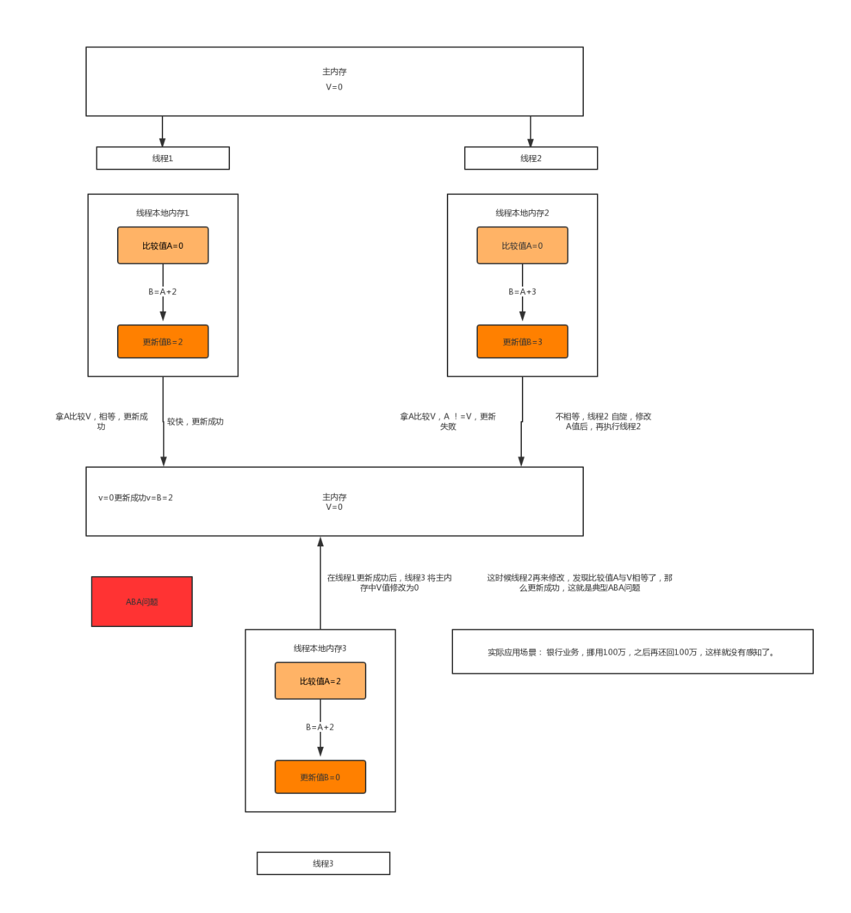

## CAS原理分析 ##

### 概述 ###
上一篇文章Java锁分类中，有提到一种分类的思想：乐观锁和悲观锁。悲观锁，总认为每次访问共享资源的时候，都有可能发生资源竞争，所以在线程获取到共享资源后，需要加锁，其余线程无法再对共享资源进行操作。而乐观锁，总认为每次访问共享资源时，都不会发生资源竞争，线程可以不停的执行，无需加锁，无需等待；当发生冲突的时候，会采用CAS来保证线程执行的安全性。

CAS全称Compare And Swap，即比较和交换，该技术是实现用于多线程中原子指令。其算法核心思想如下：`CAS（V,A,B）`，其中V代表内存中的值，A为预期值，B为改变后的新值。

###CAS原理 ###
我们知道在多线程环境下，有些共享资源存储在主内存中，每个线程对共享资源都有自己的一份线程副本，当“线程1”在线程本地副本中经过一系列操作后，将比较值A1修改为新值B1后，需要更新主内存中的V值。这时会拿V值与A1值进行比较，如果相等，则说明V值在"线程1"执行期间没有被修改，那么将主存中的V值修改为B1。

假如“线程2”与“线程1”同时拿到共想资源的值，线程2执行操作较慢，在线程2本地内存副本中经过操作，将A2值修改为B2值，然后去更新主存中的值，这时候发现V与预期值A2不想等，那么说明V值在“线程2”执行期间被修改。那么“线程2”可以选择放弃执行，或者会重新读取新的V值到本地线程副本中，重新执行操作，再重新判断是否更新V值。以下图为例：



基于这样的原理，CAS操作即使没有加锁，一样能够知道其他线程对共享资源是否产生影响，并做出相应的措施。同时从这点也可以看出，由于无锁操作中没有锁的存在，所以不可能出现死锁的情况。

说到这里，我们可能会产生这样的疑问：会不会存在“线程1”的A1值与主存V比较时相等，但是在将V更新为B1的时候，V值却被其余线程修改了呢？答案是否定的，因为CAS是一种系统原语，原语属于操作系统用语范畴，是有若干条指令组成的，用语完成某个功能的一个过程，并且系统原语的执行必须是连续的，在执行过程中不允许被中断，也就是说CAS是CPU的原子性操作，不会造成数据不一致问题。

### UnSafe类 ### 

Java中CAS的实现依赖于Unsafe类的方法，Unsafe类的内部方法可以像C语言一样直接操作系统内存，其所有方法都是native关键字修饰，单从名称看，该类就是不安全的，毕竟Unsafe类拥有像C一样操作内存的方法，所以我们不应该优先使用Unsafe类，Java官方也不建议使用该类。

下面列举一下CAS相关的Unsafe方法：
```
    public final native boolean compareAndSwapObject(Object var1, long var2, Object var4, Object var5);

    public final native boolean compareAndSwapInt(Object var1, long var2, int var4, int var5);

    public final native boolean compareAndSwapLong(Object var1, long var2, long var4, long var6);

```
上述三个方法入参基本相同，第一个参数var1为给定的Object对象，第二个参数var2为对象内存的偏移量，通过该参数可以快速定位到字段并设置或获取字段的值。第三个参数var4为预期值，最后一个参数为要设置的值，这三个方法都通过cas原子指令执行操作。

### Atomic系列中CAS的使用 ###
在java.util.concurrent.atomic包下，有一系列的atomic类，提供了很多基于CAS实现的原子操作类，用法方便，性能高效。其中原子操作更新基本类型的主要包括以下三类：
+ AtomicInteger
+ AtomicBoolean
+ AtomicLong

我们以AtomicInteger为例，来分析以下源码
```
public class AtomicInteger extends Number implements java.io.Serializable {
    private static final long serialVersionUID = 6214790243416807050L;

    //初始化指针类Unsafe
    private static final Unsafe unsafe = Unsafe.getUnsafe();
    //变量“value”在AtomicInteger实例对象内的内存偏移量
    private static final long valueOffset;

    static {
        try {
            //通过unsafe.objectFiledOffset获取到value的内存偏移量，通过偏移量，可以获取到value进行赋值或取值操作
            valueOffset = unsafe.objectFieldOffset
                (AtomicInteger.class.getDeclaredField("value"));
        } catch (Exception ex) { throw new Error(ex); }
    }

    
    private volatile int value;
   
    public AtomicInteger(int initialValue) {
        value = initialValue;
    }

    public AtomicInteger() {
    }
    //获取最新的value值
    public final int get() {
        return value;
    }
    //设置当前值，具备volatile效果，用final修饰是为了进一步保证线程安全
    public final void set(int newValue) {
        value = newValue;
    }
    //最终会设置为newValue，但是有一定延迟，使用该方法后可能导致其他线程在之后的一小段时间内获取到旧的值，类似于延迟加载
    public final void lazySet(int newValue) {
        unsafe.putOrderedInt(this, valueOffset, newValue);
    }
    //设置新值获取旧值，底层使用CAS操作unsafe.compareAndSwapInt
    public final int getAndSet(int newValue) {
        return unsafe.getAndSetInt(this, valueOffset, newValue);
    }
    //如果当前value值等于expect预期值，那么将value更新为update值
    public final boolean compareAndSet(int expect, int update) {
        return unsafe.compareAndSwapInt(this, valueOffset, expect, update);
    }
    //当前值加1，返回旧值
    public final int getAndIncrement() {
        return unsafe.getAndAddInt(this, valueOffset, 1);
    }
    //当前值减1，返回旧值
    public final int getAndDecrement() {
        return unsafe.getAndAddInt(this, valueOffset, -1);
    }
    //当前值加delta,返回旧值
    public final int getAndAdd(int delta) {
        return unsafe.getAndAddInt(this, valueOffset, delta);
    }
    ......

}

```
分析源码可以看出，AtomicInteger所有方法，底层都会调用Unsafe的相关方法，而所有关于值的自增和自减都间接调用了unsafe.getAndAddInt方法，该方法源码如下：
```
    public final int getAndAddInt(Object var1, long var2, int var4) {
        int var5;
        do {
            var5 = this.getIntVolatile(var1, var2);
        } while(!this.compareAndSwapInt(var1, var2, var5, var5 + var4));

        return var5;
    }
```
可以看到其通过while循环，来调用底层CAS方法compareAndSwapInt，直到值修改完成，然后返回旧值。


### CAS的ABA问题 ###
我们回到之前的场景中，假设线程1将主存中的V=0值修改为2，然后在线程2修改V值之前，有一个线程3拿到本地线程副本V值为2，然后通过运算将主存中的V值又修改为0了。那么在线程2再去修改的时候，它是没法感知主存中的V值是被修改过的，这就是经典的ABA问题。可能有的人会有疑问说，这样的操作逻辑上是没有问题的啊，最终的到的结果是线程2成功修改主存的值，可是如果我们应用到实际场景中，就会发现问题所在了。

例如在银行场景中，某公司账户有100万存款，某职员通过某种操作，挪用了公款100万去炒股，在公司查账之前，又将100万还了回来，如果这种ABA问题不得已解决，那么银行系统查账也就无法感知到该职员有挪用过公款了，而这种情况在现实生活中是不被允许的。

可以通过下列图示来理解ABA问题



Java也提供了两个类来解决ABA问题，分别是：AtomicStampedReference、AtomicMarkableReference。他们解决的方法类似，都是给值加上标记，只是一个是时间戳，一个是boolean值。
#### AtomicStampedReference ####
```
public class AtomicStampedReference<V> {
    
    //保存实例对象信息的内部类
    private static class Pair<T> {
        //实例对象
        final T reference;
        //时间戳
        final int stamp;
        private Pair(T reference, int stamp) {
            this.reference = reference;
            this.stamp = stamp;
        }
        static <T> Pair<T> of(T reference, int stamp) {
            return new Pair<T>(reference, stamp);
        }
    }

    private volatile Pair<V> pair;
    
    //expectedReference为预期值，newReference为新值，expectedStamp为预期时间戳，newStamp为新的时间戳
    //只有当预期值与当前值相等，并且预期时间戳与当前的时间戳相等时才会修改值
    public boolean compareAndSet(V   expectedReference,
                                 V   newReference,
                                 int expectedStamp,
                                 int newStamp) {
        Pair<V> current = pair;
        return
            expectedReference == current.reference &&
            expectedStamp == current.stamp &&
            ((newReference == current.reference &&
              newStamp == current.stamp) ||
             casPair(current, Pair.of(newReference, newStamp)));
    }

    .......
}

```
通过分析源码，我们可以看到，AtomicStampedReference通过Pair私有内部类存储数据和时间戳, 并构造volatile修饰的私有实例，接着看AtomicStampedReference类的compareAndSet（）方法的实现：同时对当前数据和当前时间进行比较，只有两者都相等是才会执行casPair()方法，单从该方法的名称就可知是一个CAS方法，最终调用的还是Unsafe类中的compareAndSwapObject方法。到这我们就很清晰AtomicStampedReference的内部实现思想了，只有两者都符合预期才会调用Unsafe的compareAndSwapObject方法执行数值和时间戳替换，也就避免了ABA的问题。

### AtomicMarkableReference ###
该类的解决方案与AtomicStampedReference类似，只是AtomicMarkableReference维护的是boolean标识，也就是维护true和false的切换，但是也很容易想到因为只有两种状态的切换，所以也没法完全避免ABA问题的发生。下面简单看一下相关源码
```
public class AtomicMarkableReference<V> {

    private static class Pair<T> {
        final T reference;
        final boolean mark;
        private Pair(T reference, boolean mark) {
            this.reference = reference;
            this.mark = mark;
        }
        static <T> Pair<T> of(T reference, boolean mark) {
            return new Pair<T>(reference, mark);
        }
    }

    private volatile Pair<V> pair;

    public boolean compareAndSet(V       expectedReference,
                                     V       newReference,
                                     boolean expectedMark,
                                     boolean newMark) {
            Pair<V> current = pair;
            return
                expectedReference == current.reference &&
                expectedMark == current.mark &&
                ((newReference == current.reference &&
                  newMark == current.mark) ||
                 casPair(current, Pair.of(newReference, newMark)));
        }

        ......
    }

```


>注：本文部分参考一下博文

>https://blog.csdn.net/qq_22771739/article/details/82824353

>https://www.cnblogs.com/javalyy/p/8882172.html

>https://www.jianshu.com/p/ae25eb3cfb5d


