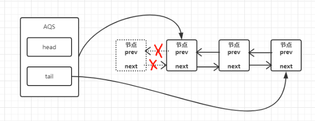

### 概述 ###
在前面我们初步认识了一下lock与AQS的基础内容，在同步组件的实现中，AQS是核心部分，我们通过AQS提供的模板方法来实现自定义同步组件，而底层的同步状态修改、阻塞线程等待队列和等待通知等具体实现则由AQS来完成。

AQS中提供的模板方法主要可以分为几大类：**独占式的获取和释放同步状态、共享式的获取和释放同步状态、可中断锁和超时等待锁获取**的实现。
+ 独占式：
```
void acquire(int arg) //独占式获取同步状态，如果当前线程获取同步状态成功，则该方法返回，否则将进入同步队列等待，该方法会调用重写的tryAcquire(int arg)方法

void acquireInterruptibly(int arg) //与acquire(int arg)方法相同，但是该方法响应中断，当前线程未获取到同步状态而进入同步队列，如果当前线程被中断，则该方法会抛出InterruptedException并返回

boolean tryAcquireNanos(int arg,long nanos) //在acquireInterruptibly(int arg)方法的基础上增加了超时限制，如果当前线程在超时时间内没有获取到同步状态，那么将返回false，否则返回true

boolean release(int arg) //独占式的释放同步状态，该方法在释放同步状态后，将同步队列中的第一个等待线程唤醒
```

+ 共享式：
```
void acquireShared(int args) //共享式的获取同步状态，如果当前线程未获取到同步状态，将会进入同步队列等待，与独占式获取的区别是在同一时刻可以有多个线程获取到同步状态

void acquireSharedInterruptibly(int args) //与acquireShared(int arg)方法大致相同，唯一不同点是此方法相应中断

boolean tryAcquireSharedNanos(int arg ,long nanos) //在acquireSharedInterruptibly(int arg)的基础上新增了超时时间

boolean releaseShared(int arg) //共享式的释放同步状态

```

我们想要深入了解和掌握AQS的实现原理，其实主要就是对这些模板方法实现的剖析，而这些模板方法的实现也与同步队列密切相关，我们需要先了解清楚同步队列的数据结构和实现过程，才能更容易的理解这些模板方法

### 同步队列 ###
同步器依赖内部的同步队列（一个FIFO双向队列）来完成同步状态的管理，当线程获取同步状态失败时，同步器会将当前线程和等待状态等信息构成一个Node节点加入到同步队列，并阻塞当前线程。当同步状态释放时，会把首节点中的线程唤醒，使其重新尝试获取同步状态。

同步队列中的节点（Node）用来保存获取同步状态失败的线程引用、等待状态以及前驱和后继节点，节点具体的属性和类型，我们可以摘取部分源码来看下
```
static final class Node {
        ......

        /** waitStatus value to indicate thread has cancelled */
        static final int CANCELLED =  1;
        /** waitStatus value to indicate successor's thread needs unparking */
        static final int SIGNAL    = -1;
        /** waitStatus value to indicate thread is waiting on condition */
        static final int CONDITION = -2;
        /**
         * waitStatus value to indicate the next acquireShared should
         * unconditionally propagate
         */
        static final int PROPAGATE = -3;

        /**
         * Status field, taking on only the values:
         *   SIGNAL:     The successor of this node is (or will soon be)
         *               blocked (via park), so the current node must
         *               unpark its successor when it releases or
         *               cancels. To avoid races, acquire methods must
         *               first indicate they need a signal,
         *               then retry the atomic acquire, and then,
         *               on failure, block.
         *   CANCELLED:  This node is cancelled due to timeout or interrupt.
         *               Nodes never leave this state. In particular,
         *               a thread with cancelled node never again blocks.
         *   CONDITION:  This node is currently on a condition queue.
         *               It will not be used as a sync queue node
         *               until transferred, at which time the status
         *               will be set to 0. (Use of this value here has
         *               nothing to do with the other uses of the
         *               field, but simplifies mechanics.)
         *   PROPAGATE:  A releaseShared should be propagated to other
         *               nodes. This is set (for head node only) in
         *               doReleaseShared to ensure propagation
         *               continues, even if other operations have
         *               since intervened.
         *   0:          None of the above
         *
         * The values are arranged numerically to simplify use.
         * Non-negative values mean that a node doesn't need to
         * signal. So, most code doesn't need to check for particular
         * values, just for sign.
         *
         * The field is initialized to 0 for normal sync nodes, and
         * CONDITION for condition nodes.  It is modified using CAS
         * (or when possible, unconditional volatile writes).
         */
        volatile int waitStatus;

        /**
         * Link to predecessor node that current node/thread relies on
         * for checking waitStatus. Assigned during enqueuing, and nulled
         * out (for sake of GC) only upon dequeuing.  Also, upon
         * cancellation of a predecessor, we short-circuit while
         * finding a non-cancelled one, which will always exist
         * because the head node is never cancelled: A node becomes
         * head only as a result of successful acquire. A
         * cancelled thread never succeeds in acquiring, and a thread only
         * cancels itself, not any other node.
         */
        volatile Node prev;

        /**
         * Link to the successor node that the current node/thread
         * unparks upon release. Assigned during enqueuing, adjusted
         * when bypassing cancelled predecessors, and nulled out (for
         * sake of GC) when dequeued.  The enq operation does not
         * assign next field of a predecessor until after attachment,
         * so seeing a null next field does not necessarily mean that
         * node is at end of queue. However, if a next field appears
         * to be null, we can scan prev's from the tail to
         * double-check.  The next field of cancelled nodes is set to
         * point to the node itself instead of null, to make life
         * easier for isOnSyncQueue.
         */
        volatile Node next;

        /**
         * The thread that enqueued this node.  Initialized on
         * construction and nulled out after use.
         */
        volatile Thread thread;

        /**
         * Link to next node waiting on condition, or the special
         * value SHARED.  Because condition queues are accessed only
         * when holding in exclusive mode, we just need a simple
         * linked queue to hold nodes while they are waiting on
         * conditions. They are then transferred to the queue to
         * re-acquire. And because conditions can only be exclusive,
         * we save a field by using special value to indicate shared
         * mode.
         */
        Node nextWaiter;

        ......
    }

```
从源码注释中，我们也可以看出这些Node属性的作用和取值

| 属性类型和名称| 描述 |
|:---|:---|
|int waitStatus|等待状态<br>有如下取值：<br>① CANCELLED,值为1,由于在同步队列中等待的线程超时或中断，需要从队列中取消等待，节点进入该状态将不会在变化<br>②SIGNAL，值为-1，后继节点的线程处于等待状态，而当前节点的线程如果释放了同步状态或者被取消，将会通知后继节点，<br>使后继节点的线程得以运行<br>③CONDITION 值为-2，该状态的节点在等待队列中，节点线程等待在condition上，当其他线程对condition调用了signal()方法后，该节点<br>将会从等待队列中转移到同步队列，加入到对同步状态的获取。<br>④PROPAGATE 值为-3，标识下一次共享式同步状态的获取将会被无条件地传播出去<br>⑤INITAL,值为0，初始状态
|Node prev|前驱节点，当节点加入队列时被设置（尾部添加）|
|Node next|后继节点|
|Node nextWaiter|等待队列中的后继节点。如果当前节点是共享的，那么该字段将会是一个SHARED常量，<br>也就是说节点类型（独占和共享）和等待队列中的后继节点共用同一个字段|
|Thread thread|要获取同步状态的线程|

节点是构成同步队列（等待队列）的基础，同步器拥有两个重要的成员变量：首节点（head）和尾节点（tail）
```
    private transient volatile Node head;
    private transient volatile Node tail;
```
AQS通过头尾指针来管理队列，没有成功获取到同步状态的线程将会成为节点被加入到队列的尾部，下图为同步队列的基本结构：


当一个线程成功获取到同步状态后，后续线程会被加入到同步队列中，而加入同步队列的过程必须要保证线程安全，所以AQS基于CAS提供了一个线程安全的方法：compareAndSetTail(Node expect,Node update),它的入参为当前线程期望的尾节点和当前节点，只有设置成功后，当前节点才正式与之前的尾节点进行连接

### 独占锁
#### 独占式获取同步状态（锁）(acquire方法源码分析)
继续以ReentrantLock类为例，当我们调用lock()方法独占式获取同步状态，当第一个线程已经获取到同步状态，后续线程则会加入到同步队列中，调用AQS的acquire方法，具体实现如下：
```
//ReentrantLock中，第一个线程已经成功获取到锁，再调用compareAndSetState(0,1)会返回false,调用acquire方法
final void lock() {
    if (compareAndSetState(0, 1))
        setExclusiveOwnerThread(Thread.currentThread());
    else
        acquire(1);
}

//AQS中acquire方法的实现如下
public final void acquire(int arg) {
    if (!tryAcquire(arg) &&
        acquireQueued(addWaiter(Node.EXCLUSIVE), arg))
        selfInterrupt();
}
```
acquire方法的实现逻辑如下：先调用tryAcquire(arg)方法，保证线程安全的获取同步状态，如果成功获取到，那么acquire(arg)方法结束。否则构造独占式节点（Node.EXCLUSIVE）,并通过addWaiter方法将节点加入到同步队列的尾部，最后通过acquireQueued(Node node,int arg)方法，是该节点以死循环的方式获取同步状态。如果获取不到则阻塞节点中的线程，而被阻塞线程的唤醒主要依靠前驱节点释放同步状态或阻塞线程被中断来实现。addWaiter方法和acquireQueued方法的实现如下：
```
private Node addWaiter(Node mode) {
    //将当前线程构建成node节点
    Node node = new Node(Thread.currentThread(), mode);
    // Try the fast path of enq; backup to full enq on failure
    //记录当前尾节点
    Node pred = tail;
    //判断当前尾节点是否为null
    if (pred != null) {
        //将node节点的前驱节点赋值为当前尾节点
        node.prev = pred;
        //用CAS方法尝试将当前节点设置为新的尾节点
        if (compareAndSetTail(pred, node)) {
            //将旧的尾节点的后继节点设置为当前节点
            pred.next = node;
            return node;
        }
    }
    //如果当前尾节点为null，那么说明当前节点是第一个加入同步队列进行等待的线程
    enq(node);
    return node;
}

private Node enq(final Node node) {
    for (;;) {
        Node t = tail;
        //如果当前尾节点为空
        if (t == null) { // Must initialize
            //构造头节点，如果失败则循环尝试
            if (compareAndSetHead(new Node()))
                tail = head;
        } else {
            //将当前尾节点赋值给当前节点的前驱节点
            node.prev = t;
            //尝试将当前节点通过CAS方法设置为新的尾节点，如果失败则循环尝试
            if (compareAndSetTail(t, node)) {
                t.next = node;
                return t;
            }
        }
    }
}

```
通过上面的源码分析，我们可以发现addWaiter(Node mode)方法中的程序实现逻辑为：

1. 当同步队列尾节点为null时，则调用enq(final Node node)方法插入；
2. 当同步队列尾节点不为null时，调用compareAndSetTail(Node expect, Node node)方法插入尾节点。

如果仔细看代码，会发现一个问题：如果compareAndSetTail返回false，那么会怎么办呢？按照代码逻辑，会继续走到enq(Node node)。很明显CompareAndSetTail方法是一个CAS方法，通常来说，CAS设置失败，会进行死循环来重新尝试。所以我们在没有分析enq方法前，大概可以总结enq的两点作用为：

1. 当同步队列尾节点为null时，对当前节点进行入队处理；
2. 当同步队列通过compareAndSetTail设置尾节点失败时，进行死循环重新尝试入队；

而通过分析enq(Node node)源码，我们也发现：如果尾节点是空的，那么说明当前节点是第一个插入到同步队列的，那么会优先构建一个头结点compareAndSetHead(new Node()),这说明同步队列是带头结点的链式存储结构，带头结点相比于不带头结点，在入队和出队时拥有更大的便捷性。compareAndSetTail(t,node)方法会利用CAS方法设置尾节点，如果CAS失败，则通过for(;;)死循环来不断尝试，直至成功返回；因此enq(Node node)的作用可以更具体的总结为以下两点：

1. 当同步队列尾节点为null，即当前线程是第一个插入到同步队列中时，通过compareAndSetHead(new Node())方法，初始化带头结点的同步队列；
2. 通过自旋CAS方法不断尝试将当前节点接入到队列中。

上面我们通过分析源码，已经理清了，线程如何构建成节点，并插入到同步队列中的。那么紧接着会有另外一个问题，线程成功加入同步队列中了，那么在什么时候被唤醒，怎么被唤醒，如何保证自己能够获得独占锁呢？带着这样的问题，我们接着分析acquireQueued(Node node,int arg)方法:

```
final boolean acquireQueued(final Node node, int arg) {
    boolean failed = true;
    try {
        boolean interrupted = false;
        for (;;) {
            //获取当前节点的前驱节点，如果前驱节点为null，会抛出NullPointException异常
            final Node p = node.predecessor();
            //如果前驱节点就是头结点，那么尝试获取同步状态
            if (p == head && tryAcquire(arg)) {
                如果获取同步状态成功，那么将队列头指针指向当前节点
                setHead(node);
                //释放前驱节点，便于垃圾回收
                p.next = null; // help GC
                failed = false;
                return interrupted;
            }
            //如果当前节点的前驱不是头结点，或者尝试获取同步状态失败，那么线程进入等待状态等待获取独占锁
            if (shouldParkAfterFailedAcquire(p, node) &&
                parkAndCheckInterrupt())
                interrupted = true;
        }
    } finally {
        if (failed)
            cancelAcquire(node);
    }
}

```
通过分析源码，我们可以看到，这里又是一个for（;;）的死循环流程，首先会获取当前节点的前驱节点，判断该前驱节点是否为头结点，如果是那么尝试获取同步状态，获取成功，那么当前线程拿到同步状态，成功获取锁。反之，则会进入等待状态。


当获取锁成功后，节点出队的逻辑如下：
```
setHead(node);
p.next = null; 
failed = false;
return interrupted;


private void setHead(Node node) {
    head = node;
    node.thread = null;
    node.prev = null;
}
```
将当前节点通过setHead(node)方法设置为头结点，将之前头结点的next索引设置为null并经pre也设置为null，即与队列断开连接，无任何引用方便GC回收，具体示意图如下：




而当获取锁失败的时候，则会调用shouldParkAfterFailedAcquire(p, node)和parkAndCheckInterrupt()方法，那么我们接下来分析下这两个方法的源码：
```
    private static boolean shouldParkAfterFailedAcquire(Node pred, Node node) {
        int ws = pred.waitStatus;
        if (ws == Node.SIGNAL)
            /*
             * This node has already set status asking a release
             * to signal it, so it can safely park.
             */
            return true;
        if (ws > 0) {
            /*
             * Predecessor was cancelled. Skip over predecessors and
             * indicate retry.
             */
            do {
                node.prev = pred = pred.prev;
            } while (pred.waitStatus > 0);
            pred.next = node;
        } else {
            /*
             * waitStatus must be 0 or PROPAGATE.  Indicate that we
             * need a signal, but don't park yet.  Caller will need to
             * retry to make sure it cannot acquire before parking.
             */
            compareAndSetWaitStatus(pred, ws, Node.SIGNAL);
        }
        return false;
    }

    private final boolean parkAndCheckInterrupt() {
        LockSupport.park(this);
        return Thread.interrupted();
    }

```
源码中shouldParkAfterFailedAcquire方法的主要逻辑为调用compareAndSetWaitStatus(pred, ws, Node.SIGNAL)方法，将节点状态有INITAL设置为SINGAL，表示当前线程阻塞。当compareAndSetWaitStatus设置失败时，shouldParkAfterFailedAcquire方法会返回false，在外层进行死循环继续获取尝试。当设置成功后，才会调用parkAndCheckInterrupt()方法，该方法会调用LockSupport.park(this)方法，阻塞当前线程。所以acquireQueued()方法在自旋过程中实现了两件事情：
1. 如果当前节点的前驱节点为头结点，并且尝试获取同步状态成功后，则将当前节点设置为头结点，断开与队列的链接，并退出。
2. 获取同步状态失败，那么将当前节点状态设置为SINGAL，然后调用LockSupport.park(this)是当前线程阻塞。

下面是我参考网上一篇写的比较好的博客，画出来的acquire(1)方法执行的流程图（ps:技术有限，将就着看哈）

方法执行流程图.png)

#### 独占式释放同步状态
当线程获取到同步状态并执行了相应逻辑之后，就需要释放同步状态，使得后续线程能够继续获取同步状态。通过调用release方法可以释放同步状态，该方法在释放同步状态之后，会唤醒后继节点，使后继节点继续尝试获取同步状态。源码如下：
```
    public final boolean release(int arg) {
        if (tryRelease(arg)) {
            Node h = head;
            if (h != null && h.waitStatus != 0)
                unparkSuccessor(h);
            return true;
        }
        return false;
    }

```
这段代码逻辑就稍微简单点了。首先调用tryRelease(arg)尝试释放锁，如果成功，那么返回true，失败返回false。同时，释放锁成功后，如果头结点不为空，并且头节点的waitStatus不为0，那么调用unparkSuccessor(h)方法来唤醒后继节点处于等待状态的线程，unparkSuccessor(Node node)方法的源码如下：
```
    private void unparkSuccessor(Node node) {
        /*
         * If status is negative (i.e., possibly needing signal) try
         * to clear in anticipation of signalling.  It is OK if this
         * fails or if status is changed by waiting thread.
         */
        //获取当前节点的等待状态
        int ws = node.waitStatus;
        //等待状态小于0 ，那么通过CAS方法，将状态置为0
        if (ws < 0)
            compareAndSetWaitStatus(node, ws, 0);

        /*
         * Thread to unpark is held in successor, which is normally
         * just the next node.  But if cancelled or apparently null,
         * traverse backwards from tail to find the actual
         * non-cancelled successor.
         */
        //获取后继节点
        Node s = node.next;
        //如果后继节点为null，或者后继节点的状态值大于0，即为取消状态，那么从尾节点开始前找到离头结点最近且状态小于等于0的后继节点
        if (s == null || s.waitStatus > 0) {
            s = null;
            for (Node t = tail; t != null && t != node; t = t.prev)
                if (t.waitStatus <= 0)
                    s = t;
        }
        //当后继节点不为null时唤醒后继节点
        if (s != null)
            LockSupport.unpark(s.thread);
    }

```
该方法的具体逻辑可以看代码中的注释，首先获取当前节点的等待状态，如果状态值小于0，那么通过compareAndSetWaitStatus(node,ws,0)方法使当前节点状态归零。然后获取当前节点的后继节点，如果后继节点不为空，那么调用LockSupport.unpark(thread)方法，唤醒该后继节点的线程。在这里我们就可以看出，每一次锁释放后就会唤醒该节点的后继节点所引用的线程，从而进一步佐证获得锁的过程是一个FIFO的过程。

如上，我们已经学习了独占式获取和释放同步状态（锁）的过程以及同步队列的执行过程。下面可以做一下总结：

1. 线程获取锁失败，线程被构建为Node节点，调用addWaiter(Node node)方法尝试入队操作，如果入队失败或者头结点为null，那么调用enq方法。enq(Node node)方法负责初始化带头结点的同步队列，和加入队列失败后的自旋重试。
2. 线程获取锁是一个自旋的过程，当且仅当，当前节点的前驱节点为头结点，并且成功获取到同步状态时，节点出队，该节点包含的线程才能获取到锁，否则，当不满足条件时，会调用LockSupport.park(Thread)方法，使当前线程阻塞。
3. 当前线程释放锁后，队列中的后继节点会被唤醒，获取锁的过程是一个FIFO的过程

#### 可中断式获取同步状态
在Java5之前，当一个线程获取不到锁而被阻塞在Synchronized之外时，对该线程进行中断操作，此时该线程的中断标志位已经被修改，但是该线程仍然会被阻塞在Synchronized上，等待获取锁。在Java5中，同步器提供了acquireInterruptibly(int arg)方法，这个方法在等待获取同步状态时，如果当前线程被中断，会立刻返回，并抛出InterruptedException异常。源码如下：
```
public final void acquireInterruptibly(int arg)
        throws InterruptedException {
    //如果当前线程已经被中断，那么抛出异常
    if (Thread.interrupted())
        throw new InterruptedException();
    //尝试获取同步状态，成功结束，失败则调用doAcquireInterruptibly方法
    if (!tryAcquire(arg))
        doAcquireInterruptibly(arg);
}

private void doAcquireInterruptibly(int arg)
    throws InterruptedException {
    //将当前线程构造成节点，加入同步队列
    final Node node = addWaiter(Node.EXCLUSIVE);
    boolean failed = true;
    try {
        for (;;) {
            获取前驱节点
            final Node p = node.predecessor();
            //如果获取到锁，那么出队
            if (p == head && tryAcquire(arg)) {
                setHead(node);
                p.next = null; // help GC
                failed = false;
                return;
            }
            //将当前线程阻塞，并判断是否中断，如果中断，则抛出异常
            if (shouldParkAfterFailedAcquire(p, node) &&
                parkAndCheckInterrupt())
                throw new InterruptedException();
        }
    } finally {
        //如果没有正常出队，那么取消排队，退出队列
        if (failed)
            cancelAcquire(node);
    }
}


```
#### 超时等待式获取同步状态（tryAcquireNanos方法）

超时等待式获取同步状态的过程可以视为可中断式获取同步状态的“增强版”，doAcquireNanos(int args,long nanosTimeout)方法在支持响应中断的基础上，添加了超时获取的特性。当调用tryLock(long time, TimeUnit unit)方法时，一般实现为调用tryAcquireNanos(int arg, long nanosTimeout)方法，该方法一般在三种情况下才会返回：
1. 当前线程在超时时间内被中断，抛出InterruptedException异常；
2. 在超时时间内正常获取到锁；
3. 超时时间结束，仍然没有获取到锁；

接下来，我们还是看下tryAcquireNanos方法的源码：
```
    public final boolean tryAcquireNanos(int arg, long nanosTimeout)
            throws InterruptedException {
        //如果线程被中断，抛出异常
        if (Thread.interrupted())
            throw new InterruptedException();
        //尝试获取锁，成功则直接返回，失败则调用doAcquireNanos方法实现超时等待效果
        return tryAcquire(arg) ||
            doAcquireNanos(arg, nanosTimeout);
    }

    private boolean doAcquireNanos(int arg, long nanosTimeout)
            throws InterruptedException {
        if (nanosTimeout <= 0L)
            return false;
        //根据当前时间和超时时间计算出截止时间
        final long deadline = System.nanoTime() + nanosTimeout;
        //将当前线程构建为节点，并入队
        final Node node = addWaiter(Node.EXCLUSIVE);
        boolean failed = true;
        try {
            for (;;) {
                //尝试获取同步状态并出队
                final Node p = node.predecessor();
                if (p == head && tryAcquire(arg)) {
                    //获取成功则设置为头结点，并出队
                    setHead(node);
                    p.next = null; // help GC
                    failed = false;
                    return true;
                }
                //截止时间减去当前时间，如果小于0，则超时返回false
                nanosTimeout = deadline - System.nanoTime();
                if (nanosTimeout <= 0L)
                    return false;
                //尝试阻塞当前线程
                if (shouldParkAfterFailedAcquire(p, node) &&
                    nanosTimeout > spinForTimeoutThreshold)
                    LockSupport.parkNanos(this, nanosTimeout);
                //判断线程是否被中断，中断则抛出异常
                if (Thread.interrupted())
                    throw new InterruptedException();
            }
        } finally {
            if (failed)
                cancelAcquire(node);
        }
    }

```
从源码可以看出tryAcquireNanos与acquireInterruptibly的基本逻辑相差不大，唯一的不同就是对同步状态获取失败后，对超时时间的处理上。doAcquireNanos方法中，第一步会先通过`final long deadline = System.nanoTime() + nanosTimeout;`计算出截止时间，然后根据`deadline - System.nanoTime()`来判断是否已经超时。如果没有超时，那么判断当前时间到截止时间是否大于1000纳秒，如果不是，那么会进入快速的自旋过程，如果是，那么才会通过`LockSupport.parkNanos(this, nanosTimeout)`方法来使线程阻塞nanosTimeout时间，超过时间后自动唤醒。这么做的原因是，如果超时等待时间非常短，无法做到非常精确，这个时候再进行超时等待的话，那么会使整体显得更加不准确。因此在超时时间非常短的情况下，同步器会进入无条件的快速自旋。下面是我根据程序逻辑整理出来的流程图：


### 共享式获取和释放同步状态（锁）
#### 共享式获取同步状态
共享式获取与独占式获取的最主要区别在于同一时刻能否多个线程同时获取同步状态。以文件的读写为例，如果一个程序在对文件进行读操作，那么这一时刻所有对于该文件的写操作都是被阻塞的，而读操作可以同时进行。写操作则要求独占资源，而读操作可以是共享资源访问，两种不同的访问模式在同一时刻对文件或资源的访问情况如下：


共享式获取同步状态的方法是acquireShared(int arg),其源码如下：
```
public final void acquireShared(int arg) {
    if (tryAcquireShared(arg) < 0)
        doAcquireShared(arg);
}

```
这段代码也非常容易理解。先调用tryAcquireShared(arg)尝试获取共享式同步状态，这个方法返回的是一个int值，当返回值大于等于0 的时候，说明获取锁成功直接返回，否则调用doAcquireShared(arg)方法。doAcquireShared(arg)方法的源码如下：
```
    private void doAcquireShared(int arg) {
        //将当前线程构建为节点，加入同步队列
        final Node node = addWaiter(Node.SHARED);
        boolean failed = true;
        try {
            boolean interrupted = false;
            for (;;) {
                //获取前驱节点
                final Node p = node.predecessor();
                //判断前驱节点是否为头结点，如果是尝试获取同步状态
                if (p == head) {
                    int r = tryAcquireShared(arg);
                    //返回值大于等于0，则说明获取状态成功
                    if (r >= 0) {
                        //设置当前节点为头结点，并将等待状态设置为PROPAGATE，出队
                        setHeadAndPropagate(node, r);
                        p.next = null; // help GC
                        if (interrupted)
                            selfInterrupt();
                        failed = false;
                        return;
                    }
                }
                if (shouldParkAfterFailedAcquire(p, node) &&
                    parkAndCheckInterrupt())
                    interrupted = true;
            }
        } finally {
            if (failed)
                cancelAcquire(node);
        }
    }

```
这段代码整体逻辑几乎与独占式获取锁一模一样，只是这里退出死循环的条件是：**当前节点的前驱节点是头结点，并且tryAcquireShared方法返回值大于等于0即成功获取到同步状态**

#### 共享式释放锁
共享式释放锁调用的方法是releaseShared(int arg),其源码如下；
```
public final boolean releaseShared(int arg) {
    if (tryReleaseShared(arg)) {
        doReleaseShared();
        return true;
    }
    return false;
}

```
首先调用tryReleaseShared(arg)方法，成功释放同步状态后，调用doReleaseShared()方法。doReleaseShared()方法的源码如下：
```
    private void doReleaseShared() {
        /*
         * Ensure that a release propagates, even if there are other
         * in-progress acquires/releases.  This proceeds in the usual
         * way of trying to unparkSuccessor of head if it needs
         * signal. But if it does not, status is set to PROPAGATE to
         * ensure that upon release, propagation continues.
         * Additionally, we must loop in case a new node is added
         * while we are doing this. Also, unlike other uses of
         * unparkSuccessor, we need to know if CAS to reset status
         * fails, if so rechecking.
         */
        for (;;) {
            Node h = head;
            if (h != null && h != tail) {
                int ws = h.waitStatus;
                if (ws == Node.SIGNAL) {
                    if (!compareAndSetWaitStatus(h, Node.SIGNAL, 0))
                        continue;            // loop to recheck cases
                    unparkSuccessor(h);
                }
                else if (ws == 0 &&
                         !compareAndSetWaitStatus(h, 0, Node.PROPAGATE))
                    continue;                // loop on failed CAS
            }
            if (h == head)                   // loop if head changed
                break;
        }
    }

```
tryReleaseShared方法在释放同步状态之后，将会唤醒后续处于等待状态的节点。对于能够支持多个线程同时访问的并发组件，比如semaphore,它和独占式主要区别在于tryRelease(int arg)方法必须保证同步状态线程安全的释放，一般是通过循环和CAS来保证的，因为释放同步状态的操作会同时来自多个线程。


###小结

到此为止，漫长的AQS源码学习算是结束了，这篇文章的整理花了我一个周多的时间，在整理的同时，也对AQS有了一个更深入的理解，后期也会继续学习更多相关知识。