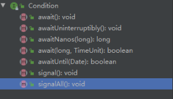
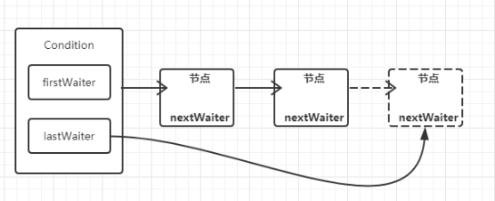
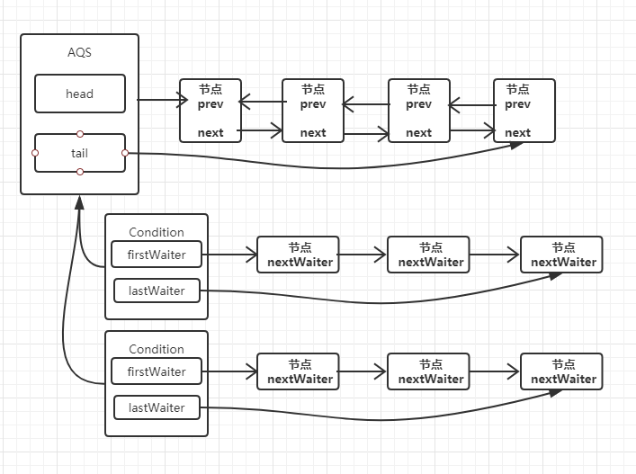
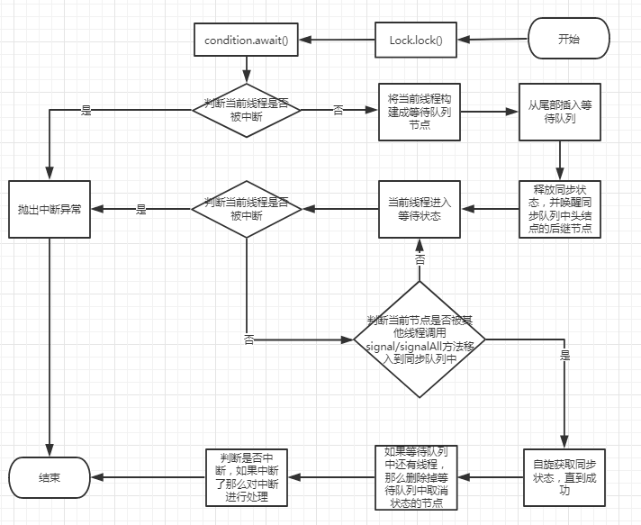
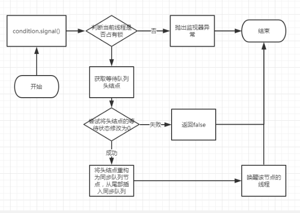

### 概述
对于Java来说万物皆对象，所有的Java对象的最终父类都是Object，所以它们都拥有一组监视器方法，主要包括：wait(),wait(long timeout),notify()和notifyAll()，这些方法与Synchronized关键字配合，可以实现等待/通知机制。
Condition也提供了类似Object的监控方法，与Lock接口配合能够实现等待/通知机制，但是这两者在使用方式和功能特性上有一定的区别。下面是一个Object的监视器方法与Condition接口的对比：

|对比项|Object监视器方法 |Condition接口|
|:---|:---|:---|
|前置条件|获取对象锁|1.调用Lock.lock()方法<br>2.调用Lock.newCondition()方法获取Condition对象|
|调用方式|直接调用。例如Object.wait()|直接调用。例如condition.await()方法|
|等待队列个数|一个|多个|
|当前线程释放锁，进入等待状态|支持|支持|
|当前线程释放锁，进入等待状态，<br>在等待状态中不响应中断|不支持|支持|
|当前线程释放锁，并进入超时等待状态|支持|支持|
|当前线程释放锁，进入等待状态到某个时间|不支持|支持|
|唤醒等待队列中的一个线程|支持|支持|
|唤醒等待队列中的所有线程|支持|支持|

### Condition的使用方式
Condition接口中定义了等待、通知两种类型的方法，具体如下图：



我们知道Condition是由`Lock.newCondition()`创建来的，也就是说condition是依赖于Lock对象的。在调用上图的方法时，必须先获取到Condition对象关联的锁。Condition的使用方式如下：
```
import java.util.concurrent.locks.Condition;
import java.util.concurrent.locks.Lock;
import java.util.concurrent.locks.ReentrantLock;

public class ConditionTest {

    public static final Lock lock = new ReentrantLock();
    public static final Condition condition = lock.newCondition();

    public static void conditionWait() throws InterruptedException{
        lock.lock();
        try {
            System.out.println(System.currentTimeMillis() + "  :" +Thread.currentThread().getName()+" 调用await!");
            condition.await();
            System.out.println(System.currentTimeMillis() + "  :" +Thread.currentThread().getName()+" 被唤醒，重新获得了锁！");
        } finally {
            lock.unlock();
            System.out.println(System.currentTimeMillis() + "  :" + Thread.currentThread().getName()+" 释放了锁！");
        }
    }

    public static void conditionSignal() throws InterruptedException{
        lock.lock();
        try {
            System.out.println(System.currentTimeMillis() + "  :" +Thread.currentThread().getName()+" 调用signal方法!");
            condition.signal();
            System.out.println(System.currentTimeMillis() + "  :" +Thread.currentThread().getName()+" 调用了signal方法！");
        } finally {
            lock.unlock();
            System.out.println(System.currentTimeMillis() + "  :" +Thread.currentThread().getName()+" 释放了锁！");
        }
    }

    public static void main(String[] args) {
        new Thread(new Runnable() {
            @Override
            public void run() {
                try {
                    System.out.println(System.currentTimeMillis() + "  :" +Thread.currentThread().getName()+" 开始执行！");
                    conditionWait();
                    System.out.println(System.currentTimeMillis() + "  :" +Thread.currentThread().getName()+" 结束执行！");
                } catch (InterruptedException e) {
                    e.printStackTrace();
                }
            }
        }).start();
        new Thread(new Runnable() {
            @Override
            public void run() {
                try {
                    System.out.println(System.currentTimeMillis() + "  :" +Thread.currentThread().getName()+" 开始执行！");
                    conditionSignal();
                    System.out.println(System.currentTimeMillis() + "  :" +Thread.currentThread().getName()+" 结束执行！");
                } catch (InterruptedException e) {
                    e.printStackTrace();
                }
            }
        }).start();
    }


}


```

一般都会将Condition对象作为成员变量。当调用await()方法后，当前线程会释放锁进入等待状态，而其他线程在获取锁，进行自己的业务逻辑后调用了Condition对象的Signal()方法，通知当前线程后，当前线程才从await()方法返回，并在返回前已经获取了锁。
关于Condition方法的描述如下：

1. `void await()`   当前线程进入等待状态，直到被通知（signal/signalAll）或中断（其他线程调用interrupt()方法），当前线程将进入运行状态且从await()方法返回，此时当前线程已经获取到了对应锁。
2. `void awaitUninterruptibly()`    当前线程进入等待状态，直到被通知，但是该方法不响应中断
3. `long awaitNanos(long nanosTimeout)` 当前线程进入等待状态，直到被通知、中断或者超时。返回值表示剩余时间，如果在nanosTimeout纳秒之前被唤醒，那么返回值为（nanosTimeout - 实际耗时）。返回值为0或负值，则表示已经超时了。
4. `boolean awaitUntil(Date deadline)` 当前线程进入等待状态，直到被通知、中断或者某个时间。如果没有到达指定时间就被通知，则返回true;否则返回false。
5. `void signal()`  唤醒一个等待在Condition上的线程，该线程从等待方法返回前必须获得与Condition相关的锁；
6. `void signalAll()`   唤醒所有等待在Condition上的线程，能够从等待方法返回的线程必须获得与Condition相关联的锁；

### Condition实现分析

上面我们说到Condition是由`Lock.newCondition()`方法创建出来的，而查看ReentrantLock中的源码，可以看到，newCondition()方法实际上会new一个ConditionObject对象。具体如下：
```
final ConditionObject newCondition() {
        return new ConditionObject();
    }

```
ConditionObject对象是AQS的一个内部类，之前说到Condition是依赖于Lock来使用的，那么ConditionObject是AQS的内部类也顺理成章了。每一个Condition对象都维护者一个队列，即等待队列，该队列是Condition实现等待/通知机制的关键。等待队列是一个FIFO的队列，在等待队列的每一个节点都包含了一个线程引用，如果一个线程调用condition.await()方法，那么该线程将会释放锁、构造成节点加入到等待队列并进入等待状态。这里说到的节点Node其实与之前AQS中提到的Node是同一个内部类AbstractQueuedSynchronizer.Node。
这里我们还需注意ConditionObject中包含两个成员变量：
```
/** First node of condition queue. */
private transient Node firstWaiter;
/** Last node of condition queue. */
private transient Node lastWaiter;

```
分别表示Condition的头尾指针，还有Node中还有一个属性是需要大家注意的`Node nextWaiter`，nextWaiter表示等待队列中的后继节点，而Node中关于同步队列的相关属性却有两个：prev和next。那么由此我们可以判断等待队列是一个单向队列，每个节点只保存其后一个节点的引用。而等待队列的基本结构则如下图：



如上图所示，Condition拥有首节点的引用，而新增节点只需要将原尾节点的nextWaiter指向它，并更新尾节点即可。需要注意的是节点更新的过程是没有使用CAS方法的，原因是调用await 方法的线程必定获取了锁。我们可以不止一次的调用lock.newCondition方法，这说明AQS中不止维护了一个等待队列。object监视器上只能拥有一个同步队列和一个等待队列，而AQS却拥有一个同步队列，多个等待队列。具体如下图：



如上图所示，Condition的实现是同步器的内部类，因此每个Condition实例都能够访问同步器提供的方法，相当于每个Condition都拥有同步器的引用。

### condition.await()方法
废话不多说，直接撸源码：
```
public final void await() throws InterruptedException {
    //如果线程被中断，那么抛出中断异常
    if (Thread.interrupted())
        throw new InterruptedException();
    //将线程构建成Node节点，并加入等待队列
    Node node = addConditionWaiter();
    //释放当前线程所占用的锁，并唤醒同步队列中的下一个节点
    int savedState = fullyRelease(node);
    int interruptMode = 0;
    while (!isOnSyncQueue(node)) {
        //当前线程进入等待状态
        LockSupport.park(this);
        //判断是否被中断
        if ((interruptMode = checkInterruptWhileWaiting(node)) != 0)
            break;
    }
    //自旋等待获取同步状态
    if (acquireQueued(node, savedState) && interruptMode != THROW_IE)
        interruptMode = REINTERRUPT;
    if (node.nextWaiter != null) // clean up if cancelled
        unlinkCancelledWaiters();
    //处理被中断状态
    if (interruptMode != 0)
        reportInterruptAfterWait(interruptMode);
}
```
当前线程调用condition.await()方法后，会使得当前线程释放锁并进入等待队列中，直到被signal/signalAll方法唤醒后会使当前线程从等待队列移至同步队列中去，知道获取锁后返回，或者在等待过程中被中断做中断处理。那么这中间的细节是如何处理的呢？当前线程是如何加入等待队列中的？又是怎么释放锁的呢？释放之后await方法如何退出呢？这些我们都还不清楚，下面我们来仔细分析下源码中调用的几个方法。
```
private Node addConditionWaiter() {
    //获取尾节点指针
    Node t = lastWaiter;
    // If lastWaiter is cancelled, clean out.
    //如果尾节点不为null，并且尾节点等待状态不是CONDITION，那么删除等待队列中所有非CONDITION状态的节点
    if (t != null && t.waitStatus != Node.CONDITION) {
        unlinkCancelledWaiters();
        //重新获取尾节点
        t = lastWaiter;
    }
    //将当前线程构建成节点
    Node node = new Node(Thread.currentThread(), Node.CONDITION);
    //如果尾节点为空，则将头结点指针指向当前节点，否则将尾节点的后继节点指向当前节点
    if (t == null)
        firstWaiter = node;
    else
        t.nextWaiter = node;
    //然后将尾节点指针指向当前节点
    lastWaiter = node;
    return node;
}

```
从上面这段代码可以看到，该方法将当前线程构建成节点，判断头结点firstWaiter是否为空，如果为空，则将firstWaiter指向当前节点，如果不为空，则更新尾节点。这就解决了如何加入等待队列的问题，下面由fullRelease方法来释放锁，具体源码如下；
```
final int fullyRelease(Node node) {
    boolean failed = true;
    try {
        int savedState = getState();
        //尝试释放锁，并唤醒同步队列中的下一个节点
        if (release(savedState)) {
            //成功则返回同步状态
            failed = false;
            return savedState;
        } else {    
            //不成功抛出异常
            throw new IllegalMonitorStateException();
        }
    } finally {
        if (failed)
            node.waitStatus = Node.CANCELLED;
    }
}


```
这段代码就很容易理解了，调用AQS中的release()方法释放锁，并唤醒同步队列中头结点的后继节点引用的线程，如果释放成功则正常返回，释放失败则抛出异常。然后在回到await()方法的源码中，发现以上方法调用完后有这么一段逻辑：
```

while (!isOnSyncQueue(node)) {
    LockSupport.park(this);
    if ((interruptMode = checkInterruptWhileWaiting(node)) != 0)
        break;
}


final boolean isOnSyncQueue(Node node) {
    //如果当前节点为等待状态，或前置节点为空，那么返回false
    if (node.waitStatus == Node.CONDITION || node.prev == null)
        return false;
    //如果当前节点的后继节点next不为空，这说明在同步队列中，返回true
    if (node.next != null) // If has successor, it must be on queue
        return true;
    /*
     * node.prev can be non-null, but not yet on queue because
     * the CAS to place it on queue can fail. So we have to
     * traverse from tail to make sure it actually made it.  It
     * will always be near the tail in calls to this method, and
     * unless the CAS failed (which is unlikely), it will be
     * there, so we hardly ever traverse much.
     */
    //再同步队列中寻找当前节点，找到返回true，未找到返回false
    return findNodeFromTail(node);
}
```
很显然要想退出await方法，需要先跳出该循环。而从代码中可以看出跳出循环的方法两种：1、!isOnSyncQueue(node)返回false；2、(interruptMode = checkInterruptWhileWaiting(node)) != 0等于true。从上面的源码可以看出`isOnSyncQueue(node)`方法,用来判断当前节点是否在同步队列中，即另外线程调用signal/signalAll方法。第二个条件判断当前线程是否被中断。
总结为：退出await方法的前提条件是当前线程被中断或其他线程调用signal/signalAll方法将当前线程移动到同步队列中。当跳出while循环后，会继续调用acquireQueued(node, savedState)方法，自旋获取同步状态，直到成功，这样说明了要跳出await方法必须要获得锁。到这里我们已经解决了上面提出的疑问，对await方法也理解的更加透彻了。下面是await方法的示意图:

示意图.png)

### signal/signalAll

调用Condition的signal()和signalAll()方法，将会唤醒等待队列中等待时间最长的节点（即首节点），在唤醒节点之前，会将节点移动到同步队列中。下面先看下Signal()方法的源码：
```
public final void signal() {
    //先判断当前线程是否获取到了锁，没有的话，抛出异常
    if (!isHeldExclusively())
        throw new IllegalMonitorStateException();
    Node first = firstWaiter;
    if (first != null)
        //唤醒等待队列中的头结点
        doSignal(first);
}

```
从上面代码可以看出，首先会判断当前线程是否获取到了锁，如果没有获取到，则会抛出异常。如果获取到了锁，那么先拿到等待队列的头指针引用的节点，之后唤醒等待队列中的头结点，具体细节在doSignal(first)方法中，具体看下源码；
```
private void doSignal(Node first) {
    do {
        if ( (firstWaiter = first.nextWaiter) == null)
            lastWaiter = null;
        //将头结点从等待队列中移除
        first.nextWaiter = null;
        //对头结点做处理的部分在transferForSignal(first)中
    } while (!transferForSignal(first) &&
             (first = firstWaiter) != null);
}

    final boolean transferForSignal(Node node) {
        使用CAS将等待状态改为0，如果失败返回false
        if (!compareAndSetWaitStatus(node, Node.CONDITION, 0))
            return false;

        //将节点移入同步队列
        Node p = enq(node);
        int ws = p.waitStatus;
        //如果该节点等待状态>0或者尝试修改等待状态为SIGNAL失败，则唤醒该节点对应的线程，返回true
        if (ws > 0 || !compareAndSetWaitStatus(p, ws, Node.SIGNAL))
            LockSupport.unpark(node.thread);
        return true;
    }

```
阅读源码，能够发现，doSignal主要做了一下几件事：1、将头结点从等待队列移除；2、将头结点状态由CONDITION改为0，即初始状态；3、将节点从同步队列尾部插入；4、唤醒该节点。由此我们可以得出结论：调用Condition.signal()方法的前提是当前线程已经获取到了锁，该方法会将等待队列中的头结点移除并从同步队列的尾节点插入，并唤醒当前节点对应的线程。

方法示意图.png)

#### signalAll()
signalAll()方法与signal()方法的区别仅仅体现在doSignal和doSignalAll方法上，我们看下doSignalAll方法的源码：
```
private void doSignalAll(Node first) {
    lastWaiter = firstWaiter = null;
    do {
        Node next = first.nextWaiter;
        first.nextWaiter = null;
        transferForSignal(first);
        first = next;
    } while (first != null);
}

```
可以看到这里的区别就是，doSignalAll会将等待队列中的所有节点都移动到同步队列中，并唤醒全部对应节点的线程。

### 总结
下面是我自己总结的关于condition.await方法和signal方法的运行流程图：





如果有什么问题的话，欢迎大家留言指正，谢谢！

>注：本文参考《Java并发编程的艺术》