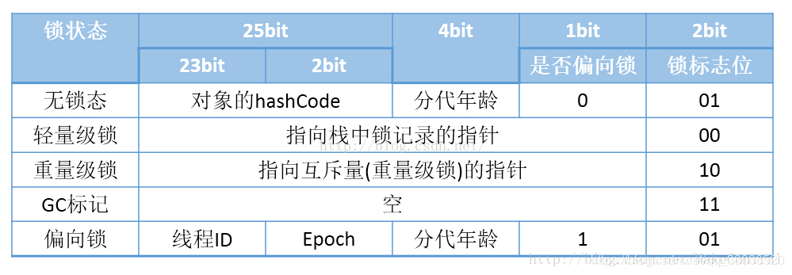

### 概述 ###

对于 Java 锁的分类没有严格意义的规则。我们常说的分类，一般都是依据锁的特性、锁的设计、锁的状态等进行归纳整理出来的。如下使我们常见的所分类：
+ 公平锁/非公平锁
+  可重入锁
+ 独享锁/共享锁
+ 互斥锁/读写锁
+ 分段锁
+ 偏向锁/轻量级锁/重量级锁
+ 自旋锁

### 公平锁/非公平锁 ###
公平锁是指多个线程按照申请锁的顺序获取锁。而非公平锁则是完全没有顺序，随机获取锁，有可能后申请锁的线程会比先申请锁的线程先获取到锁，这就可能会造成饥饿现象或者优先级反转（**饥饿现象和优先级反转在后面详细了解**）。

公平锁，在并发环境中，每个线程在获取锁时会先查看此锁维护的等待队列,  如果等待队列为空，或者当前线程是等待队列里的第一个，那么就占有锁，否则，就会加入等待队列中，按照先进先出的规则进行排队。公平锁的有点是等待锁的线程不会出现饿死的现象。缺点是整体的吞吐效率相对非公平锁要低，除等待队列中的第一个线程的所有线程都会进入阻塞状态，CPU唤醒阻塞线程的开销比非公平锁要大。

公平锁的经典应用是Java的ReentrantLock,在创建ReentrantLock时，可以指定构造函数的boolean类为true，即new ReentrantLock（true）来创建公平锁

非公平锁是指在并发环境中，每个线程在获取锁时会直接尝试占有锁，如果占有锁失败，才会再按照公平锁后面的处理方式。

非公平锁的优点是可以减少唤起线程的开销，整体的吞吐效率较公平锁高，因为线程有几率不阻塞直接获取到锁，CPU不必唤醒所有线程。缺点是处于等待队列中的线程，有可能出现饥饿现象，饿死或者等待时间过久。

非公平锁的典型应用是synchronized，Java 的ReentrantLock可以在创建的时候指定boolean参数为false来创建非公平锁。


### 可重入锁 ###
可重入锁，又叫做递归锁，是指在同一个线程中在一个方法获取到了该锁的期间，该线程的其余方法可以再次获取到该锁。下面举一个自定义可重入锁的例子：

```java
/**
 * 测试可重入锁
 */
public class ReentrantLockTest {

    public static void main(String[] args) {
        //创建可重入锁
        Lock lock = new Lock();
        //创建两个线程，去竞争可重入锁
        Thread thread = new TestLockThread(lock);
        Thread thread1 = new TestLockThread(lock);
        //开启线程
        thread.start();
        thread1.start();
    }


    /**
     * 自定义可重入锁
     */
    static class Lock{
        private boolean isLock = false;
        /**
         * 重入锁次数
         */
        private int lockCount  = 0;
        /**
         * 当前锁定线程
         */
        private Thread lockedBy;


        public  synchronized void lock() throws InterruptedException {
            Thread callingThread  = Thread.currentThread();
            //如果该锁已经被其他线程获取到，那么当前线程进入阻塞状态
            while(isLock && callingThread != lockedBy ){
                System.out.println("线程：" + callingThread.getName() + "没有获取到锁，进入变成等待队列！");
                wait();
            }
            isLock = true;
            //重入次数加一
            lockCount++;
            lockedBy = callingThread;
            System.out.println("线程：" + callingThread.getName() + "获取到锁，重入次数为：" + lockCount +"!");
        }

        
        public synchronized  void unLock() throws  InterruptedException {
            if(Thread.currentThread() == lockedBy){
                lockCount--;
                if (lockCount == 0) {
                    isLock = false;
                    System.out.println("线程：" + Thread.currentThread().getName() +"解锁成功，唤醒其他线程！");
                    notify();
                }
            }
        }

    }


     static class TestLockThread extends Thread{

        private Lock lock;

        public TestLockThread(Lock lock){
            this.lock = lock;
        }

        @Override
        public void run(){
            int count = 0;
            try {
                fun1(count);
            } catch (InterruptedException e) {
                e.printStackTrace();
            }
        }


        public void fun1(int count) throws InterruptedException {
            if (count > 10) {
                return;
            }
            count++;
            //获取锁
            lock.lock();
            //递归获取锁
            if (lock.isLock) {
                System.out.println("成功获取到锁，count：" + count);
                fun1(count);
            }
            lock.unLock();
        }
    }
}
```

该测试用例运行后的结果如下：
```
    线程：Thread-0获取到锁，重入次数为：1!
   成功获取到锁，count：1
   线程：Thread-0获取到锁，重入次数为：2!
   成功获取到锁，count：2
   线程：Thread-0获取到锁，重入次数为：3!
   成功获取到锁，count：3
   线程：Thread-0获取到锁，重入次数为：4!
   成功获取到锁，count：4
   线程：Thread-0获取到锁，重入次数为：5!
   成功获取到锁，count：5
   线程：Thread-0获取到锁，重入次数为：6!
   成功获取到锁，count：6
   线程：Thread-0获取到锁，重入次数为：7!
   成功获取到锁，count：7
   线程：Thread-0获取到锁，重入次数为：8!
   成功获取到锁，count：8
   线程：Thread-0获取到锁，重入次数为：9!
   成功获取到锁，count：9
   线程：Thread-0获取到锁，重入次数为：10!
   成功获取到锁，count：10
   线程：Thread-0获取到锁，重入次数为：11!
   成功获取到锁，count：11
   线程：Thread-0解锁成功，唤醒其他线程！
   线程：Thread-1获取到锁，重入次数为：1!
   成功获取到锁，count：1
   线程：Thread-1获取到锁，重入次数为：2!
   成功获取到锁，count：2
   线程：Thread-1获取到锁，重入次数为：3!
   成功获取到锁，count：3
   线程：Thread-1获取到锁，重入次数为：4!
   成功获取到锁，count：4
   线程：Thread-1获取到锁，重入次数为：5!
   成功获取到锁，count：5
   线程：Thread-1获取到锁，重入次数为：6!
   成功获取到锁，count：6
   线程：Thread-1获取到锁，重入次数为：7!
   成功获取到锁，count：7
   线程：Thread-1获取到锁，重入次数为：8!
   成功获取到锁，count：8
   线程：Thread-1获取到锁，重入次数为：9!
   成功获取到锁，count：9
   线程：Thread-1获取到锁，重入次数为：10!
   成功获取到锁，count：10
   线程：Thread-1获取到锁，重入次数为：11!
   成功获取到锁，count：11
   线程：Thread-1解锁成功，唤醒其他线程！

```
通过结果可以发现，同一个线程可以重复获取锁，但是当该线程获取到锁后，其余线程是无法获取到锁的。在当前线程解除锁之后，会随机唤醒等待队列中的一个线程来获取锁。

ReentrantLock和synchronized都是可重入锁，可重入锁可以一定程度上避免死锁问题


### 独享所/共享锁 ###

独享锁，也叫排它锁或互斥锁，是指该锁一次只能被一个线程所持有；如果线程A对数据N加上独享锁后，其余线程将无法对该线程再加任何类型的锁了，线程A则能够对数据N进行读写操作。synchronized和ReentrantLock都是互斥锁

而共享锁可以同时被多个线程所持有。如果线程A对数据N加上共享锁后，其余线程只能对数据N继续加共享锁，但是不允许再加独享锁了。而共享锁，只能对数据A执行读操作，无法进行写操作。ReentrantReadWriteLock中包含两把锁，一把读锁（ReadLock）为共享锁，一把写锁（WriteLock）为独享锁，他们也是用AQS实现的，后面会详细了解AQS和CAS这两个概念

### 乐观锁/悲观锁 ###

乐观锁和悲观锁是广义上的一种概念，并不对应某个特定的锁，它体现的是看待线程同步的不同角度，它们分别对应生活中对事物持乐观和悲观态度的两种人。

#### 乐观锁 ####
顾名思义，乐观锁，总是往最好的方向假设，每次去拿数据的时候都认为别人不会修改，所以不会上锁，只有在更新数据的时候，会去判断该数据是否在此期间被修改过。乐观锁的实现方式一般有两种，分别是版本号控制和CAS算法。乐观锁适用于多读的应用类型，由于每次读取数据都不会加锁，只在更新是判断，所以可以提高数据的吞吐量。在Java中`java.util.concurrent.atomic`包下的原子变量类就是使用CAS实现的。

#### 悲观锁 ####
悲观锁则总是假设会发生最坏的情况，每次拿数据的时候都认为别人会修改，所以在每次拿数据的时候就会上锁，这样当下一个线程过来拿数据的时候就会被阻塞，知道他拿到锁。Java中的synchronized和ReentrantLock都是悲观锁的一种体现。 

#### 使用场景 ####
从上面的描述，我们发现两种锁都有各自的优缺点，我们不能不结合具体的应用场景而武断的说哪一种锁更加优秀。在多读少写的场景下，乐观锁可以起到更好的作用，这种时候冲突发生的次数极少，乐观锁可以省去锁开销。但是当冲突频繁发生时，由于乐观锁自旋的实现原理，返回会使系统开销加大，这时候悲观锁就派上用场了，悲观锁适用于写操作非常频繁的场景。


### 分段锁 ###
分段锁其实是一种锁的设计方式，并不是指某一个特定的锁。其经典的使用案例就是`ConcurrentHashMap`，其通过分段锁的设计方式实现并发下的高效操作。 ConcurrentHashMap中的分段锁称为segment,它的底层结构既类似于HashMap,内部拥有一个Node数组，数组的每个元素又是一个双向链表；同时segment又继承了ReentrantLock,所以它本身又是一个锁。

当需要put元素的时候，并不是整个ConcurrentHashMap加锁，而是通过hashcode来判断该元素应该存放的分段，然后对这个分段进行加锁，所以并发环境下，只要不是插入的元素在同一个分段，就可以实现并发插入的效果

### 偏向锁/轻量级锁/重量级锁 ###

Java中每个对象都可以作为锁， 锁有四种级别，按照锁的量级由轻到重分别为：无锁、偏向锁、轻量级锁、重量级锁。每个对象一开始都是无锁的，随着锁的竞争越来越激烈，锁的级别也越来越高，并且锁只能升级不能降级。

#### Java对象头 ####

HotSpot虚拟机中，对象在内存中存储的布局可以分为三个区：对象头、实例数据和对齐填充。HotSpot的对象头信息包含两部分信息，其中一部分用于存储对象自身的运行时数据，如哈希码、GC分代年龄、锁状态标志、线程持有的锁、偏向线程ID、偏向时间戳等。这部分数据的长度在32位和64位的虚拟机（暂不考虑开启压缩指针的场景）中分别为32个和64个Bits，官方称它为“MarkWord”。

下图为不同状态下，Markword对应的存储信息；


#### 偏向锁 ####
引入偏向锁是为了在无多线程竞争的情况下尽量减少不必要的轻量级锁执行路径，因为轻量级锁的获取及释放依赖多次CAS原子指令，而偏向锁只需要在置换ThreadID的时候依赖一次CAS原子指令。当只有一个线程去竞争锁的时候，我们不需要阻塞，也不需要自旋，因为只有一个线程在竞争，我们只要去判断该偏向锁中的ThreadID是否为当前线程即可，如果是当前线程，则进入同步代码，无需每次加锁解锁都去CAS更新对象头，如果不一致意味着发生了锁竞争，这时候锁已经不是总偏向于某一个线程了，偏向锁会膨胀为轻量级锁，才能保证线程间公平竞争锁。

#### 轻量级锁 ####
获取轻量锁的过程与偏向锁不同，竞争锁的线程首先需要拷贝对象头中的Mark Word到帧栈的锁记录中。拷贝成功后使用CAS操作尝试将对象的Mark Word更新为指向当前线程的指针。如果这个更新动作成功了，那么这个线程就拥有了该对象的锁。如果更新失败，那么意味着有多个线程在竞争。当竞争线程尝试占用轻量级锁失败多次之后（使用自旋）轻量级锁就会膨胀为重量级锁，重量级线程指针指向竞争线程，竞争线程也会阻塞，等待轻量级线程释放锁后唤醒他。

轻量级锁与偏向锁的区别在于：
+ 轻量级锁每次退出同步块都需要释放锁，但是偏向锁只有在竞争发生时才释放锁
+ 轻量级锁每次进入退出同步块都需要CAS更新对象头
+ 争夺轻量级锁失败时，线程会自旋尝试获取锁

轻量级锁在发生竞争时，线程会通过自旋获取锁，这样可以保证相应速度快，但是自旋锁会一直占用CPU，所以轻量级锁不适合在同步块执行时间长的场景下使用。

#### 重量级锁 ####

重量级锁的加锁、解锁过程和轻量级锁差不多，区别是：竞争失败后，线程阻塞，释放锁后，唤醒阻塞的线程，不使用自旋锁，不会那么消耗CPU，所以重量级锁适合用在同步块执行时间长的情况下。


> 注：本文参考
>http://developer.51cto.com/art/201901/589756.htm
>https://www.cnblogs.com/qifengshi/p/6831055.html
>https://www.cnblogs.com/wewill/p/8058292.html
