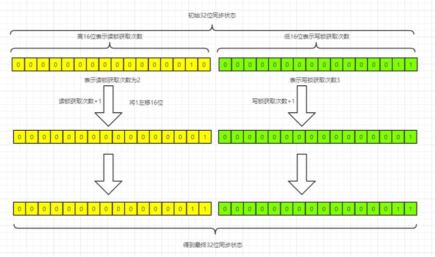

## 概述 
在并发编程中，为了解决线程安全问题，我们会高频率的使用独占式锁，一般我们使用java提供的Synchronized关键字或java.util.concurrent中的[ReentrantLock][1]，他们都是排他锁，这些锁在同一时刻只允许一个线程进行访问。而接下来要学习的读写锁，同一时刻可以允许多个读线程访问，当时在写线程访问的时候，所有的读线程和其它的写线程都会被阻塞。读写锁维护了一对锁，一个读锁一个写锁，通过分离读锁和写锁，是的并发性相比于一般的排他锁有了很大的提升。

[1]:https://www.jianshu.com/p/7a556302bb47

在一些实际的业务场景中，大部分时间只需要获取读锁，只有少部分需要获取写锁，但是写操作在完成之后，需要对后续的读操作可见。在Java5之前，要实现上述的业务场景，只能使用Java的等待通知机制，就是当写操作开始时，所有晚于当前写操作的读写操作均会进入等待状态，只有当前写操作完成并进行通知之后，所有等待的读操作才能继续进行（写操作可以依靠Synchronized来交互），这样是为了使读操作能够读到正确的数据，避免脏读。而在Java5之后，要实现上述场景，只需要在读操作的时候获取读锁，写操作的时候获取写锁即可。

**一般情况下，读写锁的性能要比排他锁的性能好，因为大多数场景都是读多余写,在这种情况下，读写锁能够提供更好的并发性和吞吐量**。java.util.concurrent包下的ReentrantReadWriteLock就是对读写锁的实现，它提供的特性可以总结如下表：

|特性|描述|
|:---|:---|
|公平性选择|支持非公平（默认）和公平锁的不同获取方式，吞吐量还是非公平锁优于公平锁|
|重入性|该锁支持重进入，读线程在获取到读锁之后，还可以获取读锁；而写线程在获取到写锁之后，还可以获取读锁或写锁。|
|锁降级|遵循获取写锁、获取读锁再释放写锁的次序，写锁能够降级为读锁|

我们想要完全理解这三个特性的实现原理，则需要更加深入的去了解ReentrantReadWriteLock的源码，接下来我们带着这几个问题去看源码：

1. 读写锁是如何实现读写状态的记录的？
2. 读锁和写锁分别是怎么样获取和释放的？
3. 是如何实现写锁排他，读锁共享，读锁排斥写锁的？
4. 锁降级是如何完成的？

### 写锁详解
下面我们先写个例子看如何运用ReentrantReadWriteLock：
```
import java.time.LocalDateTime;
import java.util.concurrent.locks.Lock;
import java.util.concurrent.locks.ReentrantReadWriteLock;

/**
 * @author xiongchenyang
 * @Date 2019/10/28
 **/
public class ReentrantReadWriteLockTest {

    public static ReentrantReadWriteLock readWriteLock = new ReentrantReadWriteLock();
    public static Lock readLock = readWriteLock.readLock();
    public static Lock writeLock = readWriteLock.writeLock();

    public static void main(String[] args) {
        for(int i = 0;i < 20;i++){
            if(i%2 == 0){
                Thread readThread = new Thread(new Runnable() {
                    @Override
                    public void run() {
                        try {
                            System.out.println(LocalDateTime.now() + ":"+Thread.currentThread().getName() + "准备获取读锁！");
                            readLock.lock();
                            System.out.println(LocalDateTime.now() + ":"+Thread.currentThread().getName() + "获取到读锁了");
                            Thread.sleep(1000*5);
                        } catch (InterruptedException e) {
                            e.printStackTrace();
                        } finally {
                            System.out.println(LocalDateTime.now() + ":"+Thread.currentThread().getName() + "释放了读锁");
                            readLock.unlock();
                        }
                    }
                });
                readThread.start();

            }else{
                Thread writeThread = new Thread(new Runnable() {
                    @Override
                    public void run() {
                        try {
                            System.out.println(LocalDateTime.now() + ":"+Thread.currentThread().getName() + "准备获取写锁");
                            writeLock.lock();
                            System.out.println(LocalDateTime.now() + ":"+Thread.currentThread().getName() + "获取到写锁了");
                            Thread.sleep(1000*5);
                        } catch (InterruptedException e) {
                            e.printStackTrace();
                        } finally {
                            System.out.println(LocalDateTime.now() + ":"+Thread.currentThread().getName() + "释放了写锁");
                            writeLock.unlock();
                        }
                    }
                });
                writeThread.start();
            }
        }
    }
}

```
从上面的demo，我们可以看到，读锁通过readWriteLock.readLock()来创建，写锁通过readWriteLock.writeLock()来创建。而读写锁的获取和释放锁都是通过lock和unlock方法。下面我们具体看下写锁的获取和释放源码

### 读写锁的获取与释放
#### 写锁的获取

写锁在同一时刻只能被一个线程所获取，很显然，写锁是独占式锁，该锁的同步语义是通过AQS中的tryAcquire实现的。源码如下；
```
protected final boolean tryAcquire(int acquires) {
        /*
         * Walkthrough:
         * 1. If read count nonzero or write count nonzero
         *    and owner is a different thread, fail.
         * 2. If count would saturate, fail. (This can only
         *    happen if count is already nonzero.)
         * 3. Otherwise, this thread is eligible for lock if
         *    it is either a reentrant acquire or
         *    queue policy allows it. If so, update state
         *    and set owner.
         */
        Thread current = Thread.currentThread();
        //获取同步状态
        int c = getState();
        //获取独占保留数也就是写锁获取的次数
        int w = exclusiveCount(c);
        //如果同步状态不为0
        if (c != 0) {
            // (Note: if c != 0 and w == 0 then shared count != 0)
            //如果写锁获取数为0，或独占线程不是当前线程，那么返回false，加锁失败
            if (w == 0 || current != getExclusiveOwnerThread())
                return false;
            //如果重入锁次数大于最大限定次数，那么抛出异常，最大限定次数为2^16 = 65536
            if (w + exclusiveCount(acquires) > MAX_COUNT)
                throw new Error("Maximum lock count exceeded");
            // Reentrant acquire
            //更新同步状态，加锁成功返回true
            setState(c + acquires);
            return true;
        }
        //同步状态为0，那么调用CAS方法尝试修改同步状态，失败则返回false，成功则返回true
        if (writerShouldBlock() ||
            !compareAndSetState(c, c + acquires))
            return false;
        setExclusiveOwnerThread(current);
        return true;
    }

```
整段代码的具体实现逻辑可以看代码中的注释，而在这段代码中比较重要的一个方法就是`exclusiveCount(int c)`，我们看下它相关的一小段源码：
```
static final int SHARED_SHIFT   = 16;
static final int SHARED_UNIT    = (1 << SHARED_SHIFT);
static final int MAX_COUNT      = (1 << SHARED_SHIFT) - 1;
static final int EXCLUSIVE_MASK = (1 << SHARED_SHIFT) - 1;

 /** Returns the number of shared holds represented in count  */
static int sharedCount(int c)    { return c >>> SHARED_SHIFT; }
/** Returns the number of exclusive holds represented in count  */
static int exclusiveCount(int c) { return c & EXCLUSIVE_MASK; }

```
可以看出其中EXCLUSIVE_MASK为1左移16位减1，即低16为全部为1，高16为全为0。exclusiveCount方法是将同步状态与EXCLUSIVE_MASK做与运算，即只取同步状态的低16位。这是我们可以看出**同步状态的低16位，表示写锁的获取次数**。

#### 写锁的释放

写锁的释放，通过重写tryRelease(int arg)方法，源码如下
```
protected final boolean tryRelease(int releases) {
    //如果占有写锁的线程不是当前线程，那么抛出非法异常
    if (!isHeldExclusively())
        throw new IllegalMonitorStateException();
    //得到新的同步状态
    int nextc = getState() - releases;
    //得到新同步状态的低16位，判断是否为0
    boolean free = exclusiveCount(nextc) == 0;
    //为0，则说明写锁全部释放，将该锁的占有线程置为null
    if (free)
        setExclusiveOwnerThread(null);
    //更新同步状态，返回释放情况
    setState(nextc);
    return free;
}

```
这里的代码逻辑就比较简单了，大体上与ReentrantLock的实现方法差不多，只需要注意`int nextc = getState() - releases;`这里可以直接用同步状态减去写状态是因为同步状态的低16位是用来表示写操作的获取次数的。

#### 读锁的获取

读锁不是独占式锁，同一时刻该锁允许被多个读线程获取到，也就是一种共享式锁。按照之前对AQS的源码分析，这里肯定需要通过tryAcquireShared和tryReleaseShared方法实现，具体获取方法源码如下：
```
        protected final int tryAcquireShared(int unused) {
            /*
             * Walkthrough:
             * 1. If write lock held by another thread, fail.
             * 2. Otherwise, this thread is eligible for
             *    lock wrt state, so ask if it should block
             *    because of queue policy. If not, try
             *    to grant by CASing state and updating count.
             *    Note that step does not check for reentrant
             *    acquires, which is postponed to full version
             *    to avoid having to check hold count in
             *    the more typical non-reentrant case.
             * 3. If step 2 fails either because thread
             *    apparently not eligible or CAS fails or count
             *    saturated, chain to version with full retry loop.
             */
            Thread current = Thread.currentThread();
            int c = getState();
            如果同步状态低16位，也就是写锁获取次数不为0，且占有线程不为当前线程，那么返回-1，加锁失败
            if (exclusiveCount(c) != 0 &&
                getExclusiveOwnerThread() != current)
                return -1;
            //获取同步状态高16位
            int r = sharedCount(c);
            if (!readerShouldBlock() &&
                r < MAX_COUNT &&
                //当前线程获取读锁
                compareAndSetState(c, c + SHARED_UNIT)) {
                //如果读锁获取次数为0，那么要记录第一次获取读锁的线程
                if (r == 0) {
                    firstReader = current;
                    firstReaderHoldCount = 1;
                //如果第一次获取读锁的线程就是当前线程，那么获取读锁次数加一
                } else if (firstReader == current) {
                    firstReaderHoldCount++;
                } else {
                    //记录当前线程获取读锁的次数
                    HoldCounter rh = cachedHoldCounter;
                    if (rh == null || rh.tid != getThreadId(current))
                        cachedHoldCounter = rh = readHolds.get();
                    else if (rh.count == 0)
                        readHolds.set(rh);
                    rh.count++;
                }
                return 1;
            }
            //如果CAS获取读锁失败，那么自旋尝试
            return fullTryAcquireShared(current);
        }

```
如上代码，在获取读锁时，会优先判断是否有其他线程已经获取了写锁，如果有，那么该线程获取读锁失败，返回-1，进入等待状态；如果没有，那么尝试获取读锁，成功则返回1，失败则自旋。另外这里需要注意的是`compareAndSetState(c, c + SHARED_UNIT)`，尝试获取同步状态，需要加上SHARED_UNIT（1 << 16），是因为同步状态中高16位表示读锁的获取次数。下面是读锁和写锁被获取时，同步状态的修改示意图：


#### 读锁的释放
读锁的释放，主要调用tryReleaseShared方法，下面我们看下该方法的源码：
```
protected final boolean tryReleaseShared(int unused) {
    Thread current = Thread.currentThread();
    //这里是实现了getReadHoldCount等新功能
    //如果当前线程是第一个获取读锁的线程
    if (firstReader == current) {
        // assert firstReaderHoldCount > 0;
        //那么如果第一个读锁线程获取次数是否为1，那么将firstReader置为null，否则firstReaderHoldCount减1
        if (firstReaderHoldCount == 1)
            firstReader = null;
        else
            firstReaderHoldCount--;
    } else {
        //如果当前线程不是第一个获取读锁的线程，那么从该线程的ThreadLocal中获取到该线程的获取次数，如果获取次数<=1,那么从ThreadLocal里面移除，否则获取次数减1
        HoldCounter rh = cachedHoldCounter;
        if (rh == null || rh.tid != getThreadId(current))
            rh = readHolds.get();
        int count = rh.count;
        if (count <= 1) {
            readHolds.remove();
            if (count <= 0)
                throw unmatchedUnlockException();
        }
        --rh.count;
    }
    
    for (;;) {
        int c = getState();
        //获取锁状态，将同步状态，减去读状态
        int nextc = c - SHARED_UNIT;
        if (compareAndSetState(c, nextc))
            // Releasing the read lock has no effect on readers,
            // but it may allow waiting writers to proceed if
            // both read and write locks are now free.
            return nextc == 0;
    }
}

```
以上代码比较简单，这里就不赘述了，代码逻辑可以看注释。

### 锁降级
锁降级指的是写锁降级为读锁。如果当前线程拥有了写锁，然后将其释放，再获取读锁，这个过程不能称之为锁降级。锁降级指的是持有当前获取的写锁，然后获取到读锁，再释放之前持有的写锁的过程。下面看下ReentrantReadWriteLock中锁降级的相关代码：
```
class CachedData {
    Object data;
    volatile boolean cacheValid;
    final ReentrantReadWriteLock rwl = new ReentrantReadWriteLock();

    void processCachedData() {
        rwl.readLock().lock();
        if (!cacheValid) {
            // Must release read lock before acquiring write lock
            rwl.readLock().unlock();
            rwl.writeLock().lock();
            try {
                // Recheck state because another thread might have
                // acquired write lock and changed state before we did.
                if (!cacheValid) {
                    data = ...
                    cacheValid = true;
                }
                // Downgrade by acquiring read lock before releasing write lock
                rwl.readLock().lock();
            } finally {
                rwl.writeLock().unlock(); // Unlock write, still hold read
            }
        }

        try {
            use(data);
        } finally {
            rwl.readLock().unlock();
        }
    }
}

```
这段代码在ReentrantReadWriteLock的注释中，讲述了锁降级的使用过程。在已经获取写锁的线程中，获取读锁，然后释放写锁的过程。当数据发生变化后，被volatile修饰的布尔类型cacheValid被设置为false，此时所有访问processCacheData方法的线程都能够感知到变化，但是只有一个线程能够获取到写锁，其他线程会被阻塞在读锁和写锁的lock()方法上。当前线程获取写锁完成数据准备之后，再获取读锁，随后释放写锁，完成锁降级。

锁降级中读锁的获取是不是必须的呢？答案是肯定的。这是为了保证数据的可见性，如果当前线程不获取读锁而直接释放写锁，那么此时可能有另一个线程T获取到了写锁，并修改了数据，那么当前线程无法感知线程T的数据更新。如果当前线程获取到读锁，再释放写锁，那么线程T将会被阻塞，知道当前线程释放读锁之后，线程T才能获取写锁修改数据。同理，为了保证数据可见性，ReentrantReadWriteLock是不支持锁升级的，假设多个线程获取到读锁，如果能够锁升级，其中某个线程获取到了写锁，修改数据，那么其余线程是不可见的。