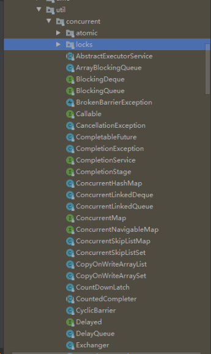
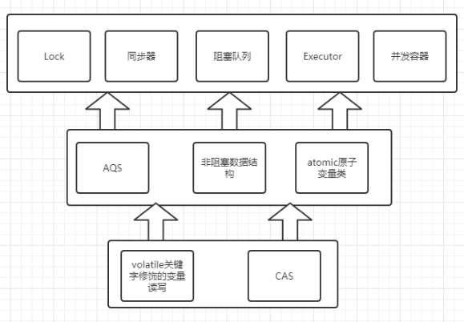
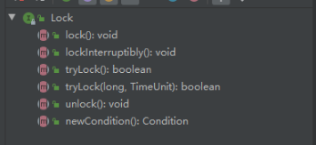
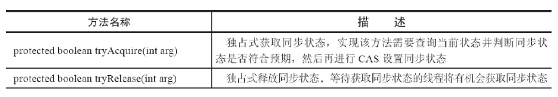
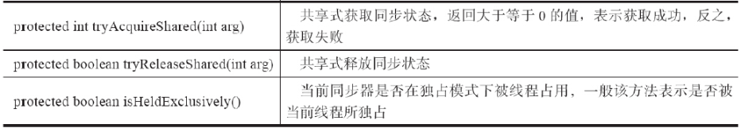
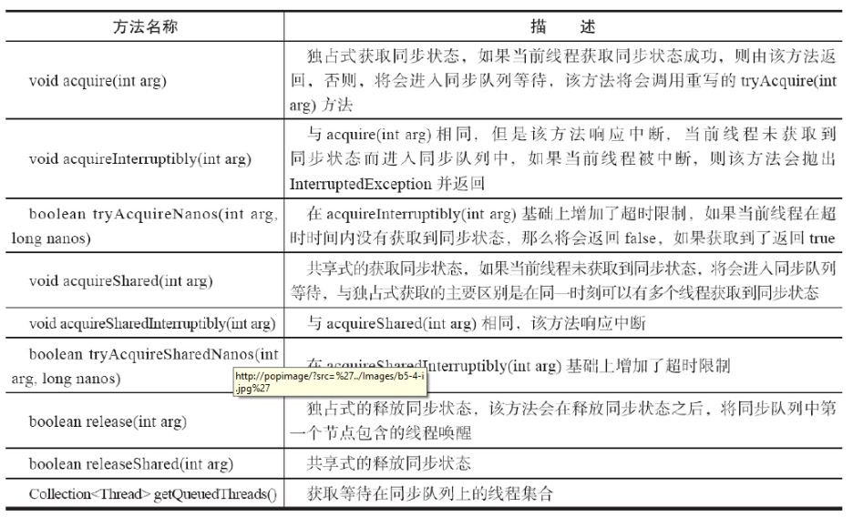
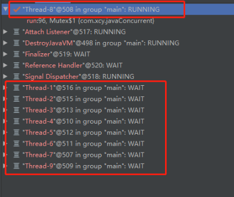

## 初识Lock和AQS（AbstractQueuedSynchronizer） 

###概述
在学习java并发编程的过程中，java.util.concurrent包是我们需要学习和理解的关键之一，concurrent包的作者Doug Lea在其中为我们提供了大量实用，高性能的工具。在并发编程的过程中，这些工具也得到了广泛的应用。

### Concurrent包的层次结构
打开java.util.concurrent包，我们会发现其中包含了两个子包atomic和locks，另外还有很多非阻塞队列和`ThreadPoolExecutor`，而这些就是concurrent包的精华。后面我也会对其中的关键类的源码进行逐个研读，增加自己对并发编程的理解。



分析整个concurrent包，得出如下concurrent整体实现示意图，如下：



>图片来自https://www.jianshu.com/p/7a65ab32de2a

### Lock接口

锁是用来控制多线程访问共享资源的方式，一般在说，一个锁能防止多个线程同时访问共享资源（但是也有些锁允许多个线程同时访问共享资源，例如读写锁）。在Lock接口出现之前，java程序靠synchronized关键字来实现锁功能，在Java SE5之后，并发包新增了Lock接口和相关实现类用来实现锁功能，它提供了与synchronized关键字相似的功能，只是在使用时需要显示的获取锁和释放锁。虽然它失去了synchronized提供的隐式获取和释放锁的便捷性，但是却拥有了锁获取和释放的可操作性、可中断获取锁以及超时获取锁等多种synchronized不具备的特性。（摘自：《Java并发编程的艺术》）

Lock的使用也非常简单，通常我们显示的使用锁方式如下：
```
ReentrantLock reentrantLock = new ReentrantLock();
//获取锁
reentrantLock.lock();
try {
    //业务逻辑处理
    ...
}catch (Exception e){
    //异常捕获
    ...
}finally {
    //释放锁
    reentrantLock.unlock();
}

```
这里需要注意的是，一定要在finally中释放锁，目的是保证在获取到锁之后，最终能够被释放。

#### Lock的API
接下来我们来看下Lock接口中提供的几种方法：


对这几种方法的解释，从源码的注释中翻译过来大概可以做出以下总结：

| 方法名称 | 描述 |
| :--- | :--- |
| `void lock()`|获取锁，当前线程获取到锁后返回|
|`void lockInterruptibly()`|可中断的获取锁，该方法会响应中断，即在锁的获取过程中可以中断线程|
|`boolean tryLock()`|非阻塞的获取锁，如果获取到锁了返回true，否则返回false|
|`boolean tryLock(long,TimeUnit)`|超时获取锁，在超时时间内或未中断的情况下能够获取到锁，超时后会返回false|
|`void unLock()`|释放锁|
|`Condition newCondition()`|获取与lock绑定的等待通知组件，当前线程必须获得了锁才能进行等待，进行等待时会先释放锁，当再次获取锁时才能从等待中返回|

下面我们来简单看下实现了Lock接口的类是怎样来实现这五个方法的，以ReentrantLock为例，可以看下摘出来的部分源码：
```
public class ReentrantLock implements Lock, java.io.Serializable {
    private final Sync sync;

    abstract static class Sync extends AbstractQueuedSynchronizer{...}

    public void lock() {
            sync.lock();
    }

    public void lockInterruptibly() throws InterruptedException {
            sync.acquireInterruptibly(1);
    }

    public boolean tryLock() {
        return sync.nonfairTryAcquire(1);
    }

    public boolean tryLock(long timeout, TimeUnit unit)
            throws InterruptedException {
        return sync.tryAcquireNanos(1, unit.toNanos(timeout));
    }

    public void unlock() {
        sync.release(1);
    }

    public Condition newCondition() {
        return sync.newCondition();
    }

    ...
```
从上面的源码可以发现，ReentrantLock本身对Lock接口的5个方法实现都非常简单，其核心都是调用了一个继承于AbstractQueuedSynchronizer（AQS）的类。所以想要理解Lock接口这五个方法的详细实现，那么理解AQS就非常必要了。

### 初识AQS
AQS又称队列同步器，它是用来构建锁或者其他同步组件的基础框架，它使用了一个int state成员变量来表示同步状态,通过内置的FIFO队列来完成资源获取线程的排队工作。AQS的主要使用方法是继承，子类通过继承AQS并实现它的抽象方法来管理同步状态，而对状态的修改，AQS提供了3个方法：getState(),setState(int newState)和compareAndSetState(int expect,int update)，这三个方法可以保证对状态的修改是安全的。

AQS的子类推荐被定义为自定义同步组件的静态内部类，同步器自身没有实现任何同步接口，它仅仅是定义了若干同步状态获取和释放的方法来供自定义同步组件使用，同步器既可以支持独占式的获取同步状态，也可以支持共享式的获取同步状态，这样就可以方便的实现不同类型的同步组件（ReentrantLock、ReentrantReadWriteLock和CountDownLatch等）。

同步器是实现锁（或任意同步组件）的关键，在锁的实现中聚合同步器，利用同步器实现锁的语义。可以这样理解二者的关系：锁是面向使用者的，它定义了使用者与锁交互的接口，隐藏了实现细节；同步器面向的是锁的实现者，它简化了锁的实现方式，屏蔽同步状态管理、线程的排队、等待和唤醒等底层操作。锁和同步器很好的隔离了使用者和实现者锁关注的领域。

####AQS的接口与示例
AQS同步器的设计是**基于模板方法模式的**,使用者需要继承同步器并重写指定的方法，随后将同步器组合在自定义同步组件中，并调用同步器提供的模板方法，而这些方法又会调用使用者重写的方法。这里可能有点绕，我们还是以ReentrantLock为例，摘取部分源码来看下

AQS中需要重写tryAcquire()方法:
```
    protected boolean tryAcquire(int arg) {
        throw new UnsupportedOperationException();
    }

```
在ReentrantLock类中继承自AQS的内部类NonfairSync是这样实现tryAcquire的：
```
static final class NonfairSync extends Sync {
        
        ......

        protected final boolean tryAcquire(int acquires) {
            return nonfairTryAcquire(acquires);
        }
    }

abstract static class Sync extends AbstractQueuedSynchronizer {

        ......        

        final boolean nonfairTryAcquire(int acquires) {
            final Thread current = Thread.currentThread();
            int c = getState();
            if (c == 0) {
                if (compareAndSetState(0, acquires)) {
                    setExclusiveOwnerThread(current);
                    return true;
                }
            }
            else if (current == getExclusiveOwnerThread()) {
                int nextc = c + acquires;
                if (nextc < 0) // overflow
                    throw new Error("Maximum lock count exceeded");
                setState(nextc);
                return true;
            }
            return false;
        }

        ......

```
在AQS模板方法acquire()中调用了子类实现的tryAcquire()方法：
```
public final void acquire(int arg) {
        if (!tryAcquire(arg) &&
            acquireQueued(addWaiter(Node.EXCLUSIVE), arg))
            selfInterrupt();
    }

```

当继承AQS的NonfairSync调用模板方法acquire时就会调用已经被NonfairSync重写的tryAcquire方法,这就是使用AQS的方式。在重写同步器指定的方法时，需要使用下面这三个方法来访问或修改同步状态：

| 方法名 | 描述 | 
|:---|:---|
|getState()|获取当前同步状态|
|setState(int newState)|设置当前同步状态|
|compareAndSetState(int expect,int new State)|使用CAS设置当前状态，该方法能够保证设置状态的原子性|

AQS可重写的方法和描述，我从《Java并发编程的艺术》一书中摘取过来如下：



在实现自定义同步组件时， 将会调用同步器提供的模板方法，这些模板方法和描述如下：


同步器提供的模板方法基本上可以分为以下三类：
1. 独占式获取和释放同步状态；
2. 共享式获取和释放同步状态；
3. 查询同步队列中的线程等待情况。

只有掌握了同步器的工作原理，才能更深入的理解并发包中其他的并发组件，下面写一个例子来看看。
```

public class Mutex implements Lock{

        private final Sync sync = new Sync();

        @Override
        public void lock() {
                sync.acquire(1);
        }

        @Override
        public void lockInterruptibly() throws InterruptedException {
                sync.acquireInterruptibly(1);
        }

        @Override
        public boolean tryLock() {
            return sync.tryAcquire(1);
        }

        @Override
        public boolean tryLock(long time, TimeUnit unit) throws InterruptedException {
            return sync.tryAcquireNanos(1,unit.toNanos(time));
        }

        @Override
        public void unlock() {
                sync.release(0);
        }

        @Override
        public Condition newCondition() {
            return sync.newCondition();
        }

        private static class Sync extends  AbstractQueuedSynchronizer{
                @Override
                protected boolean tryAcquire(int arg) {
                        if(compareAndSetState(0,1)){
                                setExclusiveOwnerThread(Thread.currentThread());
                                return true;
                        }
                        return false;
                }

                @Override
                protected boolean tryRelease(int arg) {
                        if(getState() == 0) {throw new IllegalStateException();}
                        setExclusiveOwnerThread(null);
                        setState(0);
                        return true;
                }

                @Override
                protected boolean isHeldExclusively() {
                        return getState() == 1;
                }

                final ConditionObject newCondition() {
                        return new ConditionObject();
                }
        }


        public static void main(String[] args) {
                Mutex mutex = new Mutex();
                for (int i = 0 ; i< 10 ; i ++){
                        Thread thread = new Thread(){
                                @Override
                                public void run(){
                                        System.out.println("线程："+Thread.currentThread().getName()+ " 创建成功！");
//                                        if(mutex.tryLock()){
//                                                try {
//                                                        System.out.println("线程： "+Thread.currentThread().getName()+" 获取到锁！");
//                                                        Thread.sleep(3*1000);
//                                                } catch (InterruptedException e) {
//                                                        e.printStackTrace();
//                                                } finally {
//                                                        System.out.println("线程： "+Thread.currentThread().getName()+" 释放锁！");
//                                                        mutex.unlock();
//                                                }
//                                        }
                                        try {
                                                mutex.lock();
                                                System.out.println("线程： "+Thread.currentThread().getName()+" 获取到锁！");
                                                Thread.sleep(3*1000);
                                        } catch (InterruptedException e) {
                                                e.printStackTrace();
                                        } finally {
                                                System.out.println("线程： "+Thread.currentThread().getName()+" 释放锁！");
                                                mutex.unlock();
                                        }
                                }
                        };
                        thread.start();
                }
        }

}

```
执行情况如下图：



上面的例子中，独占锁Mutex是一个自定义的同步组件，它在同一时刻只允许一个线程占有锁。Mutex中定义了一个静态内部类，该内部类继承了同步器并实现了独占式获取和释放同步状态的方法。在main方法中，我用for循环创建了10个线程，run方法中有两种获取锁的方式，mutex.lock()和mutex.tryLock()。查看程序执行情况，可以发现，当Thread-8获取到独占锁时，其余线程都处于等待状态（阻塞中）。如果执行tryLock()方法话，当Thread-8获取到线程后,其余线程获取不到锁会，会直接结束。从这个例子中看到，Mutex在对state状态的修改时，调用了getState(),setState(),compareAndSetState()方法，在lock()方法中，只需要调用AQS的模板方法acquire()。

可以发现实现一个自定义同步器，主要是利用AQS，AQS屏蔽了同步状态修改、线程排队等底层实现，大大降低了实现一个可靠自定义同步组件的门槛。