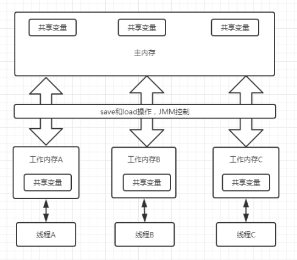
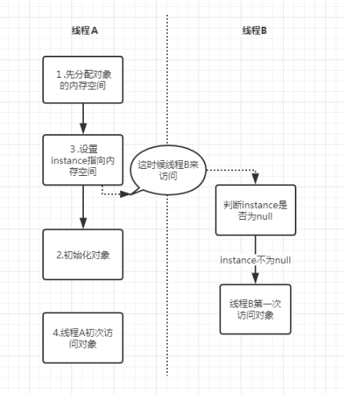

## 线程安全两大核心和三条性质 ##

### 线程安全的两大核心 ###
我们知道，出现线程安全的问题一般是因为**主内存和线程工作内存数据不一致和重排序导致的**，而解决线程安全问题，最重要的就是理解这两种问题是怎么来的，而理解他们的核心在于理解java内存模型（JMM）。

#### java内存模型 ####
并发编程领域的两大关键问题分别是：1、线程之间如何通信；2、线程之间如何同步。线程之间的通信，是指线程之间以何种机制来交换信息。在编程中，线程之间的通信有两种方式为：共享内存和消息传递。在共享内存的并发模式里，线程之间通过读写主内存中的共享变量，来实现线程间的隐式通信，java的内存模型就是共享内存模型。    



如上图所示，是JMM的内存模型示意图。线程A如果要实现与线程B之间的通信，那么需要经历以下过程：
1. 线程A从主内存中将共享变量读取到线程A的工作内存A中，并执行操作后修改数据，将数据重新回写到主内存中。
2. 线程B从主内存中读取修改后的共享变量到线程B的工作内存B中。   
这种通信机制，本身就会存在一些问题。比如，线程A修改的值，还未及时更新到主内存中，这时候线程B来读取主内存中的值，那么这时候线程B读到值就不是最新值了，这种现象被成为“脏读”。我们可以通过线程同步机制，或者volatile关键词修饰共享变量，解决这个问题。这里就涉及到volatile关键字的第一个作用，保证线程间共享变量的可见性。它会要求线程A将修改后的值立即回写到主内存中。


#### 指令重排序 ####
在程序执行时，为了提升性能，编译期和处理器常常会对指令进行重排序。重排序一般会经历以下几种：


1. 编译器优化重排序；编译器在不改变单线程程序语义的前提下，可以重新安排执行语句的顺序；
2. 指令级并行的重排序；现代处理器采用了指令级并行技术（Instruction-LevelParallelism，ILP）来将多条指令重叠执行。如果**不存在数据依赖性**，处理器可以改变语句对应机器指令的执行顺序。
3. 内存系统重排序；由于处理器使用缓存和读/写缓冲区，这使得加载和存储操作看上去可能是在乱序执行的。

而重排序并不是随时随地都能够进行的，如果两个操作同时访问一个变量，而且这两个操作中至少有一个是写操作，那么此时两个操作就存在数据依赖性。如下是有数据依赖性的是三中情况：

| 名称 | 代码示例 | 说明 |                                                                                                                         
| ---- | --- | ----|
|写后读|a=1;<br>a=b;|写一个变量后，再读一个变量|
|写后写|a=1;<br>a=2;|写一个变量后，再修改这个变量|
|读后写|a=b;<br>a=1;|读一个变量后，再写这个变量|

这三种情况，只要重排序两个操作的执行顺序，那么得到的结果就会发生改变；所以重排序必须要遵守一定的规则：
1. 编译器和处理器不会改变存在数据依赖性关系的两个操作的执行顺序
2. 单线程下，不能改变数据的执行结果

这里数据依赖性仅限于单个处理器中执行的指令序列和单个线程执行的操作，不同处理器之间和不同线程之间的数据依赖性不被编译器和处理器考虑。

还有一个叫as-if-serial的东西，它的含义是；不管怎么重排序，单线程程序的结果不能被改变。编译器和处理器都必须遵从as-if-serial语义。举一个代码例子，如下：
```

double pi = 3.14;               //A
double r = 1.0;                 //B
double area = pi * r * r ;      //C

```
可以看到语句A和B并没有数据依赖，所以他们的执行顺序可以进行重排序，这三条语句的执行顺序可能是A>B>C或B>A>C,最终的结果都是3.14。编译器，runtime和处理器都必须遵守as-if-serial语义。as-if-serial语义把单线程保护了起来，使程序员觉得单线程程序是按程序的顺序来执行的。

#### heppens-before 定义 ####

JMM可以通过happens-before关系向程序员提供跨线程的内存可见性，即如果A线程的写操作a与B线程的读操作b之间存在happens-before关系，尽管a操作和b操作不在同一个线程中执行，但是JMM向程序员保证a操作对b操作可见。具体定义为：
1. 如果一个操作happens-before另外一个操作，那么第一个操作的执行结果对第二个操作可见，且第一个操作的执行顺序在第二个操作之前。
2. 两个操作之间存在happens-before关系，并不意味着Java平台的具体实现必须要按照happens-before关系指定的顺序来执行。如果重排序之后的执行结果，与按happens-before关系来执行的结果一致，那么这种重排序并不非法（也就是说，JMM允许这种重排序）。

上面两条规则，第一条，是JMM对程序员的保证。从程序员的角度可以这样理解happens-before：如果A happens-before B ,那么java内存模型将想程序员保证————A操作的结果一定对B操作可见，且A的执行顺序一定在B的前面。第二条是JMM对编译器和处理器重排序的约束原则，只要不改变程序的执行结果，编译器和处理器怎么优化都行。

这样听起来好像happens-before和as-if-serial语义没什么区别，下面对两者进行一个比较：

1. as-if-serial语义保证单线程内程序的执行结果不被改变，happens-before保证正确同步的多线程和单线程的执行结果不被改变。
2. as-if-serial语义给编写单线程程序的程序员创造了一个幻境：单线程程序是按程序的顺序来执行的。happens-before关系给编写正确同步的多线程程序的程序员创造了一个幻境：正确同步的多线程程序是按happens-before指定的顺序来执行的。
3. as-if-serial语义和happens-before这么做的目的，都是为了在不改变程序执行结果的前提下，尽可能地提高程序执行的并行度。

happens-before一共有八条具体规则如下：
+ 程序顺序规则：一个线程中的每个操作，happens-before于该线程的任意后续操作。
+ 监视器锁规则：对一个锁的解锁，happens-before于随后对这个锁的加锁。
+ volatile变量规则：对一个volatile域的写，happens-before于任意后续对该volatile域的读。
+ 传递性：如果A happens-before B ,且B happens-before C，那么A happens-before C。
+ start()规则： 如果线程A执行ThreadB.start(),那么A线程的ThreadB.start()操作happens-before于线程B的任意操作。
+ join()规则： 如果线程A执行ThreadB.join(),那么B线程中的任意操作happens-before于线程A从ThreadB.join()成功返回。
+ 程序中断规则：对线程interrupted()方法的调用happens-before与被中断线程的代码检测到中断时间的发生。
+ 对象finalize规则：一个对象初始化完成（构造函数执行结束）happens-before于发生它的finalize()方法的开始。


###满足多线程安全的三条性质 ###

多线程要保证程序正确运行，必须遵循三大性质即：原子性，可见性，有序性

#### 原子性 ####
原子性，从字面意思理解是不可分割的属性，即一个操作是不可中断的，要么全部执行成功，要么全部执行失败。即使在多个线程中同时操作，一个操作一旦开始，就不会被其他线程所干扰。下面举几个例子，来实际看下原子性：
```
    int a = 10; //1
    a++;
    int b = a;//3
    a = a + 1; //4
```
以上这四行代码中，只有第一行是原子操作，把10赋值给线程工作内存变量a,而语句2 `a++`,实际上包含了三个操作：1、读取a的值；2、对a的值进行加1操错；3、将加一后的值赋值给a。这种操作无法构成原子操作。后面两个语句也可以拆分成几步操作，同样不具备原子性。java内存模型定义了八种原子性操作：
1. lock(锁定)：作用于主内存中的变量，它把一个变量标识为一个线程独占的状态。
2. unlock(解锁)：作用于主内存中的变量，它把一个处于锁定状态的变量释放出来，释放后的变量才可以被其他线程锁定。
3. read(读取)：作用于主内存中的变量，它把一个主内存中的值传输到线程工作内存中，以便后面的load动作使用。
4. load(载入)：作用于工作内存中的变量，它把read操作从主内存中得到的变量值放入工作内存中的变量副本。
5. use（使用）：作用于工作内存中的变量，它把工作内存中一个变量的值传递给执行引擎，每当虚拟机遇到一个需要使用到变量的值的字节码指令时将会执行这个操作；
6. assign（赋值）：作用于工作内存中的变量，它把一个从执行引擎接收到的值赋给工作内存的变量，每当虚拟机遇到一个给变量赋值的字节码指令时执行这个操作；
7. store（存储）：作用于工作内存的变量，它把工作内存中一个变量的值传送给主内存中以便随后的write操作使用；
8. write（操作）：作用于主内存的变量，它把store操作从工作内存中得到的变量的值放入主内存的变量中。

由原子性变量操作read,load,use,assign,store,write，可以大致认为基本数据类型的访问读写具备原子性（例外就是long和double的非原子性协定）。上面一共有八条原子操作，其中六条可以满足基本数据类型的访问读写具备原子性，还剩下lock和unlock两条原子操作。如果我们需要更大范围的原子性操作就可以使用lock和unlock原子操作。尽管jvm没有把lock和unlock开放给我们使用，但jvm以更高层次的指令monitorenter和monitorexit指令开放给我们使用，反应到java代码中就是---synchronized关键字，也就是说synchronized满足原子性。

关于volatile是否有原子性，我们举个例子看下：
```
public class VolatileTest {
   
       public static  volatile  int count = 0;
   
       public static void main(String[] args) throws InterruptedException {
           for(int i = 0;i<100;i++){
               Thread thread = new Thread(){
                   @Override
                   public void run(){
                       for(int j = 0;j<10000;j++){
                           count++;
                       }
                   }
               };
               thread.start();
           }
           Thread.sleep(10000);
           System.out.println(count);
   
       }
   }

```
执行上面这一段代码，执行多次，你会发现每次得到的结果都不一样，其原因就是volatile关键字并不能保证原子性，在前面已经说过count++并不是一个原子操作。如果线程A和线程B同时读取count到工作内存中，同时执行+1操作再更新到主内存中，那么这时候主内存的值只+1了，其实应该+2。这就是为什么每次执行的结果都小于1000000的原因。

#### 有序性 ####
有序性，即程序执行的顺序按照代码的先后顺序执行。synchronized语义表示锁在同一时刻只能被一个线程占有，当锁被占用后，其他线程只能等待。因此，synchronized语义就要求线程在访问读写共享变量的时候只能“串行”，所以synchronized具备有序性。
对于volatile关键字，在单例模式的实现方式中，有一种双重检查锁定的方式（Double-checked locking）。代码如下：
```
public class DoubleChecked {

    private DoubleChecked(){

    }

    private static volatile DoubleChecked instance;

    public DoubleChecked getInstance() {
        if (instance == null){
            synchronized (DoubleChecked.class){
                if(instance == null){
                    instance = new DoubleChecked();
                }
            }
        }
        return instance;
    }
}

```
以上代码中，存在问题的是`instance = new Singleton();`。这条语句实际上包含了三个操作：1.分配对象的内存空间。2.初始化对象。3.设置instance指向分配的内存地址。但是由于存在重排序问题，可能有以下的执行顺序：

如上图线程A先执行到`instance = new DoubleChecked();`但是该语句执行过程进行了重排序，执行过程2和3顺序反过来了，还未初始化对象，但是已经将instance指向了对应的内存空间，这时候B线程判断`instance==null`,会返回false，然后B线程直接访问instance对象，但是，这个时候instance对象还未正常初始化，所以会出现问题。而用volatile关键字修饰instance实例，将禁止重排序，从而避免这种情况发生。**volatile包含禁止指令重排序的语义，其具有有序性。**

#### 可见性 ####
当多个线程访问同一个变量时，一个线程修改了变量的值，其他的线程能立即看到，这就是可见性。synchronized当线程获取锁时会从主内存中获取共享变量的最新值，释放锁的时候会将共享变量同步到主内存中，所以synchronized具有可见性。而volatile会通过在指令中添加lock指令，以实现内存可见性，因此, volatile具有可见性。

    


>注，由于我自己也是跟着这两篇博文学习的，所以内容大部分转自：https://www.jianshu.com/p/d52fea0d6ba5，https://www.jianshu.com/p/cf57726e77f2。侵删