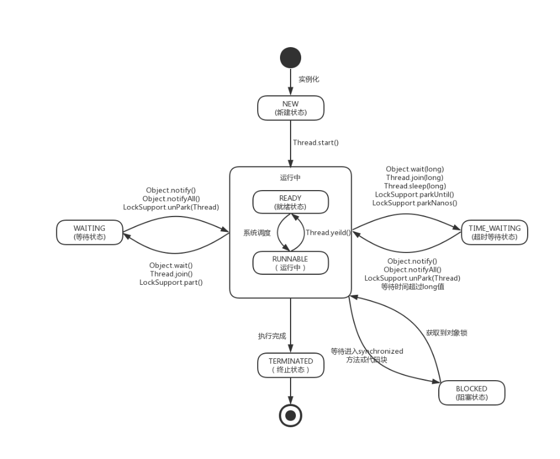

## 线程的状态及基本操作 ##

### 概述 ###
先了解一下基本概念。线程是操作系统能够进行运算调度的最小单位。它被包含在进程中，是进程中的实际运作单位。一条线程指的是进程中一个单一顺序的控制流，一个进程中可以并发多个线程，每条线程并行执行不同的任务（多核CPU下才能实现线程并行）。
在单核CPU中，多线程的并发从宏观角度看，是多个线程同时执行，但是从微观角度看，多线程还是需要通过CPU的时间片切换来实现的，同一时间是无法做到多个线程在单个CPU中执行的。在多核CPU中，才能实现多个线程并行执行。在实际应用场景中，具体使用
单线程还是多线程， 需要根据实际场景来做衡量，并不是所有场景都更适合多线程。

### 新建线程的几种方式 ###
Java中新建线程有三种方式：继承Tread类；实现Runnable接口；通过callable和Future实现；

#### 继承Thread ####
1. 定义Thread类的子类，并重写run方法，该类中run方法的方法体就代表了该线程要执行的内容。
2. 创建Thread子类的实例，即创建线程对象。
3. 调用线程对象的start()方法启动线程。
```
    public static void main(String[] args) {
        //第一种创建线程实例的方式
        Thread threadDemo1 = new ThreadDemo1();
        threadDemo1.start();
        //第二种创建线程实例的方式
        Thread threadDemo2 = new Thread(){
            @Override
            public void run(){
                System.out.println("新建线程Demo2！");
            }
        };
        threadDemo2.start();
    }

    static class ThreadDemo1 extends Thread{

        @Override
        public void run() {
            System.out.println("继承Thread类，新建线程Demo1！");
        }
    }
```

#### 实现Runnable ####
1. 实现Runnable接口，重写该接口的run()方法。
2. 创建Runnable实现类的实例，并将此实例作为创建Thread的Target来创建thread的实例，该tread实例才是真正的线程对象。
3. 调用thread实例的start()方法启动线程。
```
public static void main(String[] args) {
        //第一种实现方式
        Runnable runnable = new RunnableDemo1();
        Thread runnableDemo1 = new Thread(runnable);
        runnableDemo1.start();
        //第二种实现方式
        Thread runnableDemo2 = new Thread(new Runnable() {
            @Override
            public void run() {
                System.out.println(Thread.currentThread().getName()+"实现Runnable接口，新建RunnableDemo2!");
            }
        });
        runnableDemo2.start();
    }

    static class RunnableDemo1 implements  Runnable {
        @Override
        public void run() {
            System.out.println(Thread.currentThread().getName() + "实现Runnable接口，新建线程RunnableDemo1!");
        }
    }
```

#### 通过Callable和Future ####
1. 实现Callable接口，并重写改接口的call()方法，call()方法的方法体即该类的执行内容。
2. 创建Callable接口实现类的实例，并使用FutureTask来包装callable实例，该FutureTask封装了callable实例的call()方法的返回值。（FutureTask是一个包装器，它通过接受Callable来创建，它同时实现了Future和Runnable接口。）
3. 使用FutureTask实例作为thread的target创建线程。
4. 调用tread的start()方法启动线程。
```
public static void main(String[] args) {
        CallableDemo1 callableDemo1 = new CallableDemo1();
        FutureTask<Integer> futureTask = new FutureTask<>(callableDemo1);
        Thread thread = new Thread(futureTask);
        thread.start();
        try {
            Integer i = futureTask.get();
            System.out.println(Thread.currentThread().getName() + "获取到线程的返回值为:" + i);
        } catch (InterruptedException e) {
            e.printStackTrace();
        } catch (ExecutionException e) {
            e.printStackTrace();
        }
    }


    static class CallableDemo1 implements Callable<Integer>{

        @Override
        public Integer call() throws Exception {
            int i = 100;
            System.out.println(Thread.currentThread().getName() +" " + i);
            return i;
        }
    }

```

#### 三种创建方式的比较 ####
+ 由于Java是单继承多实现的，所以尽量使用接口实现的方式创建线程，这样还可以继承其余的类
+ callable接口实现方式，较其余两种相对复杂，但是该实现方式线程执行后有返回值，其余方式没有
+ Thread类实现了Runnable接口

### 线程状态的转换 ###
我们通过查看Thread类的源码，发现线程只有六种状态:NEW(新建)、RUNNABLE(运行)、BLOCKED(阻塞装填)、WAITING(等待状态)、TIMED_WAITING(超时等待状态)、TERMINATED(终止状态)，具体源码如下：
```
public enum State {
        /**
         * Thread state for a thread which has not yet started.
         */
        NEW,

        /**
         * Thread state for a runnable thread.  A thread in the runnable
         * state is executing in the Java virtual machine but it may
         * be waiting for other resources from the operating system
         * such as processor.
         */
        RUNNABLE,

        /**
         * Thread state for a thread blocked waiting for a monitor lock.
         * A thread in the blocked state is waiting for a monitor lock
         * to enter a synchronized block/method or
         * reenter a synchronized block/method after calling
         * {@link Object#wait() Object.wait}.
         */
        BLOCKED,

        /**
         * Thread state for a waiting thread.
         * A thread is in the waiting state due to calling one of the
         * following methods:
         * <ul>
         *   <li>{@link Object#wait() Object.wait} with no timeout</li>
         *   <li>{@link #join() Thread.join} with no timeout</li>
         *   <li>{@link LockSupport#park() LockSupport.park}</li>
         * </ul>
         *
         * <p>A thread in the waiting state is waiting for another thread to
         * perform a particular action.
         *
         * For example, a thread that has called <tt>Object.wait()</tt>
         * on an object is waiting for another thread to call
         * <tt>Object.notify()</tt> or <tt>Object.notifyAll()</tt> on
         * that object. A thread that has called <tt>Thread.join()</tt>
         * is waiting for a specified thread to terminate.
         */
        WAITING,

        /**
         * Thread state for a waiting thread with a specified waiting time.
         * A thread is in the timed waiting state due to calling one of
         * the following methods with a specified positive waiting time:
         * <ul>
         *   <li>{@link #sleep Thread.sleep}</li>
         *   <li>{@link Object#wait(long) Object.wait} with timeout</li>
         *   <li>{@link #join(long) Thread.join} with timeout</li>
         *   <li>{@link LockSupport#parkNanos LockSupport.parkNanos}</li>
         *   <li>{@link LockSupport#parkUntil LockSupport.parkUntil}</li>
         * </ul>
         */
        TIMED_WAITING,

        /**
         * Thread state for a terminated thread.
         * The thread has completed execution.
         */
        TERMINATED;
    }

```
从源代码注释中可以整理出线程状态转换的过程。当一个线程创建之后，就处于**NEW(新建状态)**,调用Thread.start()后，线程并不会立马执行，而是进入**REDAY(就绪状态)**，等待系统调度该线程之后，进入**RUNNING(运行中状态)**。
CPU执行每个线程是有一个时间限制的，这个时间段被称为时间片，当一个时间片结束后，线程仍在执行中，那么系统会将线程重新置为REDAY（就绪状态）,或者在线程运行时，调用Thread.yeild()方法，该线程一样会被置为READY状态，等待系统再次调用。
当系统调用Object.wait()、Thread.join()、LockSupport.park()方法后，线程状态转换为WAITTING(等待状态)。而同样的，如果调用的是Object.wait(long)、Thread.sleep(long)、Thread.join(long)、LockSupport.parkNanos()、LockSupport.parkUntil()方法时，会进入TIMED_WAITING(超时等待)状态。
当线程进入WAITING(等待状态)后需要系统调用Object.notify()、Object.notifyAll()、LockSupport.unPark(Thread)方法才能重新唤醒线程。当线程进入TIMED_WAITING(超时等待)状态后当等待时间超过long值后，线程会自动唤醒，或者调用Object.notify()、Object.notifyAll()、LockSupport.unPark(Thread)后也会唤醒线程。
当线程在READY或RUNNING状态中，等待进入synchronized方法或代码块的时候，即没有获取到对象锁的时候，就将进入阻塞状态，直到该线程获取到对象锁之后，重新进入READY状态。当线程运行结束后，进入TERMINATED(线程终止)状态。

将上述过程总结之后，可以用下图表示:



这里需要注意几点：
1. 处于WAITING和TIMED_WAITING的线程也可能持有对象锁，比如调用Thread.sleep()方法进入等待状态的线程就有可能持有对象锁。
2. 当线程遇到I/O的时候，还是处于RUNNABLE状态


### 线程常用方法 ###

#### sleep()方法 ####
sleep()是Thread类的静态方法，源码如下：
```
    public static native void sleep(long millis) throws InterruptedException;
```
它是native修饰的静态方法，用于让当前线程按照指定的long值时间进行休眠，其休眠时间的精度取决于处理器的计时器和调度器，在休眠指定时间后，线程会恢复执行。需要注意的是sleep()方法会交出CPU，但是不会释放对象锁。从上面的线程状态转换图中，可以看到sleep方法会使线程进入TIMED_WAITTING状态。
Thread.sleep(long)方法经常被拿来与Object.wait()方法进行比较，两者的主要区别如下：
1. sleep()方法为Thread类的静态方法。而wait()方法为Object类的实例方法。
2. wait()方法必须在synchronized修饰的同步块或同步方法中调用，否则会报InterruptedException异常，换言之，wait()方法调用必须持有对象锁。而sleep方法则没有这个限制,可以在任何地方使用。
3. wait()方法会释放CPU资源，并释放对象锁，等待下次重新获取资源。而sleep()方法，只会释放CPU资源，但是不会释放对象锁。
4. 调用sleep()方法的线程超过等待时间后，获取到CPU时间片资源则会立即执行。而调用了wait()方法的线程必须等待Object.notify(),Object.notifyAll()之后，才会尝试重新获取CPU资源，并执行。

#### yield()方法 ####
yield()也是Thread类的静态方法，源码如下：
```
    public static native void yield();
```
当执行该方法时，线程会让出CPU，进入就绪状态。但需要注意的是，让出CPU并不代表该线程不执行了，当前线程仍然会参与到下一次CPU时间片的竞争中，如果该线程在下一次竞争时，仍然获取到了CPU，那么该线程会继续执行。另外，让出的CPU时间片只允许与它相同优先级的线程去竞争。
下面说一下线程优先级是个什么东西。现代操作系统中基本采用时分的形式调度运行的线程，操作系统会分出一个个时间片，线程会分配到若干时间片，当线程分配到的时间片用完，就会发生线程调度，该线程只能等待下一次分配。线程分配到的处理器时间多少也就决定了线程使用处理器资源的多少，而线程优先级就是决定线程分配时间多少的线程属性。
在Java中，线程通过Thread中的一个int型私有成员变量来Priority(`private int   priority;`)来控制线程优先级，优先级的范围从1~10，可以在构建线程的时候通过调用setPriority(priority)来设置，默认优先级为5，优先级高的线程相较于优先级低的线程先获取到CPU的时间片。具体源码如下:
```
public final static int MIN_PRIORITY = 1;

public final static int NORM_PRIORITY = 5;

public final static int MAX_PRIORITY = 10;

public final void setPriority(int newPriority) {
        ThreadGroup g;
        checkAccess();
        if (newPriority > MAX_PRIORITY || newPriority < MIN_PRIORITY) {
            throw new IllegalArgumentException();
        }
        if((g = getThreadGroup()) != null) {
            if (newPriority > g.getMaxPriority()) {
                newPriority = g.getMaxPriority();
            }
            setPriority0(priority = newPriority);
        }
    }

```
但是有一点需要注意，不同JVM以及不同操作系统上，对线程的规划是存在差异的，有的操作系统甚至会忽略线程优先级的设定。yield()方法与sleep()方法一样会释放CPU资源，但是不会释放对象锁（如果当前线程持有对象锁的话）；它们之间不同的是sleep()释放的CPU资源所有线程都可以竞争，但是yield()释放的资源只有相同优先级的线程才能竞争

#### join()方法 ####
如果在一个线程实例A中调用了threadB.join()方法，那么当前线程A会等待线程B终止后才会继续执行。其在Thread类中的源码如下：
```
public final synchronized void join(long millis)
    throws InterruptedException {
        long base = System.currentTimeMillis();
        long now = 0;

        if (millis < 0) {
            throw new IllegalArgumentException("timeout value is negative");
        }

        if (millis == 0) {
            while (isAlive()) {
                wait(0);
            }
        } else {
            while (isAlive()) {
                long delay = millis - now;
                if (delay <= 0) {
                    break;
                }
                wait(delay);
                now = System.currentTimeMillis() - base;
            }
        }
    }

    public final synchronized void join(long millis, int nanos)
    throws InterruptedException {

        if (millis < 0) {
            throw new IllegalArgumentException("timeout value is negative");
        }

        if (nanos < 0 || nanos > 999999) {
            throw new IllegalArgumentException(
                                "nanosecond timeout value out of range");
        }

        if (nanos >= 500000 || (nanos != 0 && millis == 0)) {
            millis++;
        }

        join(millis);
    }

    public final void join() throws InterruptedException {
        join(0);
    }

```
可以看到Thread中除了提供join()方法外，还提供了超时等待相关的join(long)和join(long,int)方法。如果线程B超过给定时间还未执行完成，那么线程A会在线程B执行超时后继续执行。翻看源码发现join()和join(long,int)最终都是调用join(long)方法，而join(long)方法中多次调用了isAlive()方法。

```
public final native boolean isAlive();
```
该方法为native修饰的本地方法，该方法用于判断一个线程是否存活。可以看出来当前等待对象threadA会一直阻塞，直到被等待对象threadB结束后即isAlive()返回false的时候才会结束while循环，当threadB退出时会调用notifyAll()方法通知所有的等待线程

下面来写一个例子，看下join的作用
```
public static void main(String[] args) {
        Thread preThread = Thread.currentThread();
        for(int i= 0;i<10;i++){
            Thread joinDemo = new JoinDemo(i,preThread);
            joinDemo.start();
            preThread = joinDemo;
        }
    }

    static class JoinDemo extends Thread{
        private int i;
        private Thread preThread;

        public JoinDemo(int i,Thread preThread){
            this.i = i;
            this.preThread = preThread;
        }

        @Override
        public void run(){
            try {
                preThread.join();
            } catch (InterruptedException e) {
                e.printStackTrace();
            }
            System.out.println(this.getName()+": "+ i);
        }
    }
```
这段代码，去除掉run()方法中的join方法调用的时候，答应出的i顺序是不确定的。但是加上join后，即相当于每个线程的执行需要等待上一个线程执行结束，那么i就会按照自然顺序打印到控制台，得到结果如下：
```
加join()方法前：            加join()方法后：
Thread-1: 1                 Thread-0: 0
Thread-0: 0                 Thread-1: 1
Thread-2: 2                 Thread-2: 2
Thread-3: 3                 Thread-3: 3
Thread-4: 4                 Thread-4: 4
Thread-5: 5                 Thread-5: 5
Thread-6: 6                 Thread-6: 6
Thread-7: 7                 Thread-7: 7
Thread-8: 8                 Thread-8: 8
Thread-9: 9                 Thread-9: 9
```

### interrupt()方法 ###
interrupt()方法为中断线程方法，调用该方法并不是里面中断线程，而是将线程中的中断标志位设置为true;中断好比其他线程对该线程打了一个招呼,其他线程可以调用该线程的interrupt()方法对其进行中断操作,而中断的结果线程是死亡、还是等待新的任务或是继续运行至下一步，就取决于这个程序本身。
该线程可以调用isInterrupted（）来感知其他线程对其自身的中断操作，从而做出响应。也可以调用Interrupted()方法来获取中断标志位状态，但是该方法获取到标志位状态后，会将标志位重新设置为false。
需要注意的是，当抛出InterruptedException时候，会清除中断标志位，也就是说在调用isInterrupted会返回false。

|  方法名   | 详细解释  | 备注  |
|  ----  | ----  | ---- |
| interrupt()     | 中断该线程对象 | 如果该线程被调用Object.wait()/wait(long)<br>或调用了Thread.sleep(long)/join()/join(long)方法时，<br>会抛出InterruptedException异常,并清除中断标志位
| isInterrupted()  | 检测该线程是否被中断 |中断标志位不会被清除，类似于get()方法|
| interrupted() | 检测该线程是否被中断| 中断标志位会被清除，类似于get()+set()方法|

下面我们结合具体的例子来看下：

```
public class InterruptDemo {
    public static void main(String[] args) throws InterruptedException {
        //sleepThread睡眠1000ms
        final Thread sleepThread = new Thread() {
            @Override
            public void run() {
                try {
                    Thread.sleep(1000);
                } catch (InterruptedException e) {
                    e.printStackTrace();
                }
                super.run();
            }
        };
        //busyThread一直执行死循环
        Thread busyThread = new Thread() {
            @Override
            public void run() {
                while (true) ;
            }
        };
        sleepThread.start();
        busyThread.start();
        sleepThread.interrupt();
        busyThread.interrupt();
        while (sleepThread.isInterrupted()) ;
        System.out.println("sleepThread isInterrupted: " + sleepThread.isInterrupted());
        System.out.println("busyThread isInterrupted: " + busyThread.isInterrupted());
    }
}

```
最终输出结果如下:

```
sleepThread isInterrupted: false
busyThread isInterrupted: true
java.lang.InterruptedException: sleep interrupted
	at java.lang.Thread.sleep(Native Method)
	at com.xcy.javaConcurrent.InterruptDemo$1.run(InterruptDemo.java:14)


```
以上demo中开启了两个线程分别为sleepThread和BusyThread。sleepThread调用sleep方法睡眠1秒，busyThread则进行死循环。当分别对两个线程进行interrupt操作时，可以看出sleepThread抛出InterruptedException，并清除了标志位。而busyThread则没有清除标志位。
我们关注一下`while (sleepThread.isInterrupted()) ;`这行代码，Interrupt()方法也可以看做线程之间的一种简单交互方式，这行代码说明main方法会一直监控sleepThread的中断标志位状态，当中断标志位被清零时才会继续往下执行。


### 守护线程  isDaemon()方法###
Thread中的isDaemon方法用于判断该线程是否为守护线程，守护线程是运行在后台的一种特殊进程，它独立于控制终端，并且周期性地执行某种任务或着等待处理某些发生的事件。也就是在程序运行的时候在后台提供一种通用服务的线程，在没有用户线程客服务时会自动离开。用户线程完全结束后就意味着整个系统的业务任务全部结束了，因此系统就没有对象需要守护的了，守护线程自然而然就会退。当一个Java应用，只有守护线程的时候，虚拟机就会自然退出。例如垃圾回收线程，JIT线程就可以理解守护线程。
其在Thread中的源码如下：
```
    public final boolean isDaemon() {
            return daemon;
        }

```


>注：本文参考：https://www.jianshu.com/p/f65ea68a4a7f ，该文章作者有一系列关于java并发包知识的讲解，值得学习