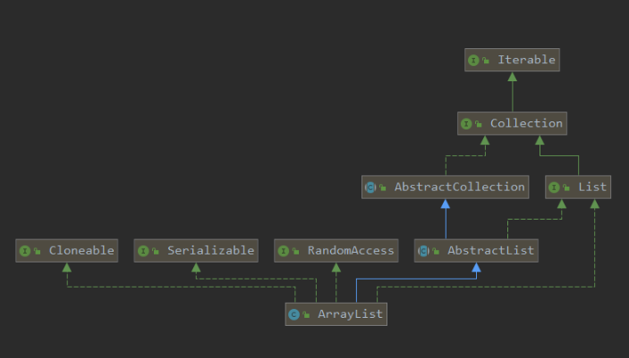

### 概述
ArrayList使我们从学习Java开始经常使用到的一种集合类，也是我们在面试中经常被面试官提起的一个知识点，仔细阅读ArrayList的源码，深入理解ArrayList的底层设计，扩容机制，增删改查的详细过程，有利于我们以后在开发过程中更加明确合适该使用ArrayList，使用ArrayList有哪些好处。
我们先看下ArrayList的Diagram；



从上图可以看到，ArrayList继承了AbstractList，实现了Cloneable、Serializable、RandomAccess、List<E>接口。从ArrayList的继承关系可以发现：
1. 其中AbstractList和List<E>是规定了ArrayList作为一个集合框架所必须要具备的一些属性和方法，这里面就包括了我们后面要分析的增删改查一类。
2. 其次ArrayList实现RandomAccess接口表示它支持随机快速访问，通过get(index)查找ArrayList中的元素时间复杂度是O(1)，有些类则不具备这一特性，例如LinkedList;
3. ArrayList实现Cloneable接口说明它支持被克隆/复制，其内部提供了clone()方法供使用者调用来对ArrayList进行赋值，但是其实现仅仅通过Arrays.copyOf完成了对ArrayList的浅复制，即当arrayList中保存的是引用类型变量时，改变原ArrayList的数据，克隆的ArrayList随之改变。
4. ArrayList实现Serializable接口说明它支持序列化，可以被序列化。

### ArrayList的重要属性
我们先来看下ArrayList中的几个重要属性：
```
    /**
     * Default initial capacity.
     */
    private static final int DEFAULT_CAPACITY = 10;

    /**
     * Shared empty array instance used for empty instances.
     */
    private static final Object[] EMPTY_ELEMENTDATA = {};

    /**
     * Shared empty array instance used for default sized empty instances. We
     * distinguish this from EMPTY_ELEMENTDATA to know how much to inflate when
     * first element is added.
     */
    private static final Object[] DEFAULTCAPACITY_EMPTY_ELEMENTDATA = {};

    /**
     * The array buffer into which the elements of the ArrayList are stored.
     * The capacity of the ArrayList is the length of this array buffer. Any
     * empty ArrayList with elementData == DEFAULTCAPACITY_EMPTY_ELEMENTDATA
     * will be expanded to DEFAULT_CAPACITY when the first element is added.
     */
    transient Object[] elementData; // non-private to simplify nested class access

    /**
     * The size of the ArrayList (the number of elements it contains).
     *
     * @serial
     */
    private int size;

```
从源码的英文注释中，我们也可以大概了解到每个全局变量的用途：
+ DEFAULT_CAPACITY 表示ArrayList底层数组的默认长度为10；
+ EMPTY_ELEMENTDATA 一个共享的空数组，当使用ArrayList(0)或者ArrayList(Collection<? extends E> c ) c.size() = 0 时，将elementData指向该数组；
+ DEFAULTCAPACITY_EMPTY_ELEMENTDATA 也是一个空的数组，在第一次add元素的时候，用它来判断数组大小是否设置为DEFAULT_CAPACITY；
+ elementData 真正装在集合元素的底层数组
+ size 表示ArrayList中元素的个数

### 构造函数
ArrayList中有三个构造函数：ArrayList() 、ArrayList(int initialCapacity)、ArrayList(Collection<? extends E> c)。下面我们一次来看下这三个构造函数的源码

#### ArrayList()
```
public ArrayList() {
    this.elementData = DEFAULTCAPACITY_EMPTY_ELEMENTDATA;
}

```
这是我们使用最频繁的无参构造函数，**最开始只是将elementData指向DEFAULTCAPACITY_EMPTY_ELEMENTDATA这个空数组，也就是说当我们调用无参构造函数创建ArrayList，但还没有插入元素的时候，其底层是一个空数组，长度为0**。在后面我们看add方法的时候会发现，第一次插入元素的时候，这个空数组会扩容到10。

#### ArrayList(int initialCapacity)
```
public ArrayList(int initialCapacity) {
    //如果initialCapacity>0,则创建长度为initialCapacity的数组，将elementData指向该数组
    if (initialCapacity > 0) {
        this.elementData = new Object[initialCapacity];
    } else if (initialCapacity == 0) {
        //如果initialCapacity == 0 ，则将elementData指向EMPTY_ELEMENTDATA这个空数组
        this.elementData = EMPTY_ELEMENTDATA;
    } else {
        //initialCapacity<0,则直接抛出非法异常
        throw new IllegalArgumentException("Illegal Capacity: "+
                                           initialCapacity);
    }
}

```
该方法的具体逻辑可以看如上的代码注释，如果初始化长度大于0，则会创建一个长度为initialCapacity的数组，并将elementData指向该数组。**如果我们预先知道需要创建的ArrayList长度，那么推荐使用这种方式来创建，这样可以避免不必要的扩容，减少系统开销。**

#### ArrayList(Collection<? extends E> c)
```
public ArrayList(Collection<? extends E> c) {
    //将集合转换为数组，并将elementData指向该数组
    elementData = c.toArray();
    if ((size = elementData.length) != 0) {
        // c.toArray might (incorrectly) not return Object[] (see 6260652)
        // c.toArray 可能(错误地)不返回 Object[]类型的数组，如果出现这种情况，则用Arrays.copyOf克隆一个新的 
        if (elementData.getClass() != Object[].class)
            elementData = Arrays.copyOf(elementData, size, Object[].class);
    } else {
        // replace with empty array.
        this.elementData = EMPTY_ELEMENTDATA;
    }
}

```
这里的代码其实也比较简单，只是将传入的集合转为数组，将elementData指向该数组，其中涉及到JDK的一个Bug 6260652。是指c.toArray返回的可能不是Object[]类型的数组，如果出现这种情况的话，这里会用Arrays.copyOf重新创建一个等长度的Object数组，并将原集合的元素插入到这个数组中，具体细节不在此深究。

### 添加元素 & 扩容机制

####add(E e) 与扩容机制
ArrayList是如何添加元素的，在什么时候扩容呢？又是怎么扩容的呢？这部分是我们在面试中经常被问到的，下面我们来阅读源码进行解读。
```
public boolean add(E e) {
    //检查当前底层数组容量，如果容量不够则进行扩容
    ensureCapacityInternal(size + 1);  // Increments modCount!!
    //将数组添加一个元素，size加1
    elementData[size++] = e;
    return true;
}

private void ensureCapacityInternal(int minCapacity) {
    //如果elementData是空数组，那么取默认长度10与minCapacity中的较大值，重新赋值给minCapacity
    if (elementData == DEFAULTCAPACITY_EMPTY_ELEMENTDATA) {
        minCapacity = Math.max(DEFAULT_CAPACITY, minCapacity);
    }

    ensureExplicitCapacity(minCapacity);
}

private void ensureExplicitCapacity(int minCapacity) {
    modCount++;

    // overflow-conscious code
    // 如果最小长度大于elementData的长度，那么需要扩容
    if (minCapacity - elementData.length > 0)
        grow(minCapacity);
}

```
下面我们来看下扩容方法grow(minCapacity)的源码；
```
    private void grow(int minCapacity) {
        // overflow-conscious code
        int oldCapacity = elementData.length;
        //扩容为原长度的1.5倍（原数组长度+ 原数组长度左移1位）
        int newCapacity = oldCapacity + (oldCapacity >> 1);
        //如果扩容1.5倍，还是没有达到最小数组长度，那么直接扩容到最小数组长度
        if (newCapacity - minCapacity < 0)
            newCapacity = minCapacity;
        //如果新数组长度大于最大数组长度，就需要进一步比较 minCapacity 和 MAX_ARRAY_SIZE 的大小
        if (newCapacity - MAX_ARRAY_SIZE > 0)
            newCapacity = hugeCapacity(minCapacity);
        // minCapacity is usually close to size, so this is a win:
        //使用 Arrays.copyOf 构建一个长度为 newCapacity 新数组 并将 elementData 指向新数组
        elementData = Arrays.copyOf(elementData, newCapacity);
    }

    private static int hugeCapacity(int minCapacity) {
        //如果minCapacity小于0，则报内存溢出
        if (minCapacity < 0) // overflow
            throw new OutOfMemoryError();
        //比较 minCapacity 与 Integer.MAX_VALUE - 8 的大小如果大则放弃-8的设定，设置为 Integer.MAX_VALUE
        return (minCapacity > MAX_ARRAY_SIZE) ?
            Integer.MAX_VALUE :
            MAX_ARRAY_SIZE;
    }

```
具体逻辑可以看代码中的注释，从上面的代码中可以总结出下面比较重要的两点：
1. **每次扩容，会先扩容为原数组长度的1.5倍，如果扩容后的长度还是小于所需的最小容量，那么直接扩容到所需最小容量。**
2. **扩容的过程，其实是将原数组中的元素拷贝到新数组中。所以ArrayList的扩容相对来说比较消耗性能。**

#### add(int index, E element)
需要在指定索引位置添加元素时，调用add(int index, E element)方法，我们来看下源码：
```
    public void add(int index, E element) {
        //检查索引位置是否越界，如果越界则抛出数组越界异常
        rangeCheckForAdd(index);
        //判断是否需要扩容，如果所需最小容量大于当前数组长度，则扩容
        ensureCapacityInternal(size + 1);  // Increments modCount!!
        //调用 native 方法新型数组拷贝
        System.arraycopy(elementData, index, elementData, index + 1,
                         size - index);
        //在索引位置添加元素
        elementData[index] = element;
        size++;
    }

    private void rangeCheckForAdd(int index) {
        if (index > size || index < 0)
            throw new IndexOutOfBoundsException(outOfBoundsMsg(index));
    }
```
一个数组是不能在角标位置直接插入元素的，ArrayList 通过数组拷贝的方法将指定角标位置以及其后续元素整体向后移动一个位置，空出 index 角标的位置，来赋值新的元素。System.arraycopy方法的作用是：
将一个数组src起始srcPos角标后length长度间的元素，赋值到dest数组中destPos到destPos+length-1长度角标位置上。只是这里调用的时候src和dest都是同一个数组elementData,得到的效果就是从索引位置开始的所有元素后移一位。

#### addAll(Collection<? extends E> c)

批量添加元素，调用方法addAll(Collection<? extends E> c)，这里逻辑与add(E e)方法相差不大：
```
    public boolean addAll(Collection<? extends E> c) {
        // 调用 c.toArray 将集合转化数组
        Object[] a = c.toArray();
        int numNew = a.length;
        //扩容检查以及扩容
        ensureCapacityInternal(size + numNew);  // Increments modCount
        //将参数集合中的元素添加到原来数组 [size，size + numNew -1] 的角标位置上。
        System.arraycopy(a, 0, elementData, size, numNew);
        size += numNew;
        //与单一添加的 add 方法不同的是批量添加有返回值，如果 numNew == 0 表示没有要添加的元素则需要返回 false 
        return numNew != 0;
    }

```

#### add
在指定索引位置批量添加元素，该方法用的比较少，下面是相关源码:
```
    public boolean addAll(int index, Collection<? extends E> c) {
        //判断索引位置越界
        rangeCheckForAdd(index);

        Object[] a = c.toArray();
        int numNew = a.length;
        //判断是否需要扩容，如果需要则扩容
        ensureCapacityInternal(size + numNew);  // Increments modCount
        
        int numMoved = size - index;
        //这里做了判断，如果要numMoved > 0 代表插入的位置在集合中间位置，在 numMoved == 0最后位置 则表示要在数组末尾添加 ，如果 numMoved< 0，  rangeCheckForAdd 就跑出了角标越界
        if (numMoved > 0)
            //将从index开始的数组元素往后移动numNew个位置
            System.arraycopy(elementData, index, elementData, index + numNew,
                             numMoved);
        //将a中的元素，添加到elementData中
        System.arraycopy(a, 0, elementData, index, numNew);
        size += numNew;
        return numNew != 0;
    }
```
这里与单个添加元素的add方法不同的是这里有返回值。在代码中对numMoved做了判断，如果numMoved>0，则说明要从数组中间添加元素，那么才需要将指定位置开始的元素都后移numNew个位置。如果numMoved=0的话，怎么直接在数组的末尾位置添加元素即可。

### ArrayList 删除元素
```
    public E remove(int index) {
        //检查角标是否越界
        rangeCheck(index);

        modCount++;
        //获取要删除的角标元素的值
        E oldValue = elementData(index);

        int numMoved = size - index - 1;
        if (numMoved > 0)
            //复制数组元素，覆盖角标元素
            System.arraycopy(elementData, index+1, elementData, index,
                             numMoved);
        //将数组末尾元素置为空，size减1
        elementData[--size] = null; // clear to let GC do its work

        return oldValue;
    }

    private void rangeCheck(int index) {
        if (index >= size)
            throw new IndexOutOfBoundsException(outOfBoundsMsg(index));
    }
```
具体删除逻辑可以看上面代码注释，这里需要注意的一点是：rangeCheck 和 rangeCheckForAdd 方法不完全想同 ，rangeCheck 只检查了 index是否大于等于 size，因为我们知道 size 为elementData 已存储数据的个数，我们只能移除 elementData 数组中 [0 , size -1] 的元素，否则应该抛出角标越界。但是为什么没有 和 rangeCheckForAdd  一样检查小于0的角标呢，是不是remove（-1） 不会抛异常呢？ 其实不是的，因为 rangeCheck(index); 后我们去调用 elementData(index) 的时候也会抛出 IndexOutOfBoundsException 的异常，这是数组本身抛出的，不是 ArrayList 抛出的。
下面我们来看看移除指定元素的方法：
```
 public boolean remove(Object o) {
        //如果要删除元素为null
        if (o == null) {
            //循环查找结果为null的元素，并删除，返回true
            for (int index = 0; index < size; index++)
                if (elementData[index] == null) {
                    fastRemove(index);
                    return true;
                }
        } else {
            //否则循环查找数组中值与o相等的值，并删除，返回true
            for (int index = 0; index < size; index++)
                if (o.equals(elementData[index])) {
                    fastRemove(index);
                    return true;
                }
        }
        //否则返回false
        return false;
    }

    private void fastRemove(int index) {
        modCount++;
        int numMoved = size - index - 1;
        if (numMoved > 0)
            //从指定角标位置后一位开始，所有元素前移一位，覆盖原角标index处的元素。
            System.arraycopy(elementData, index+1, elementData, index,
                             numMoved);
        elementData[--size] = null; // clear to let GC do its work
    }
```
具体代码逻辑请看如上代码中的注释，可以发现，移除指定位置元素和指定值的元素，其最终底层都是通过System.arraycopy方法，将原有数组从index+1位置往后所有元素前移1位，并释放原来位于size处的元素。

### removeAll/retainAll
ArrayList提供了removeAll/retainAll方法，这两个方法的作用分别是：
+ removeAll，移除集合中与入参集合共享的元素
+ retainAll，获取集合中与入参集合共享的元素

```
public boolean removeAll(Collection<?> c) {
    Objects.requireNonNull(c);
    return batchRemove(c, false);
}

public boolean retainAll(Collection<?> c) {
    //判断c是否为空，空则抛出NullPointException异常
    Objects.requireNonNull(c);
    return batchRemove(c, true);
}

private boolean batchRemove(Collection<?> c, boolean complement) {
    final Object[] elementData = this.elementData;
    int r = 0, w = 0;
    boolean modified = false;
    try {
        for (; r < size; r++)
            //这里根据传入的complement值做不同的判断，如果传入true，那么两个集合都有，就保存，否则放弃；如果传入false,那么c中不包含elementData中的数组则保留。
            if (c.contains(elementData[r]) == complement)
                elementData[w++] = elementData[r];
    } finally {
        // Preserve behavioral compatibility with AbstractCollection,
        // even if c.contains() throws.
        // 如果c.contains（o）抛出异常，抛出异常后 r!=size 则将 r 之后的元素不在比较直接放入数组
        if (r != size) {
            System.arraycopy(elementData, r,
                             elementData, w,
                             size - r);
            w += size - r;
        }
        // 如果集合移除过元素，则需要将 w 之后的元素设置为 null 释放内存
        if (w != size) {
            // clear to let GC do its work
            for (int i = w; i < size; i++)
                elementData[i] = null;
            modCount += size - w;
            size = w;
            modified = true;
        }
    }
    return modified;
}

```
从上面的源码可以看出，removeAll与retainAll最终都调用了 batchRemove(Collection<?> c, boolean complement) 方法，其不同之处在于，removeALL传入的complement值为false,而retainAll传入的为true。
下面具体写下batchRemove的逻辑：
1、从0开始遍历elementData中的元素，判断elementData中，r位置元素在c中是否存在，如果complement为true，那么存在则保留，如果complement为false，那么不存在则保留。
2、由于c.contains(o) 方法可能会抛出NullPointException或者ClassCastException异常，如果出现异常而终止循环，那么r会不等有size，这时候，r后面的元素则不再比较，直接保存，这会导致返回结果不一定准确。

### ArrayList改查方法
由于这些方法比较简单，在这里就不赘述了，直接源码。
查询指定位置元素：
```
    public E get(int index) {
        //判断index角标是否合法
        rangeCheck(index);
        //返回指定角标位置元素
        return elementData(index);
    }

```
查询是否包含指定元素：
```
    public boolean contains(Object o) {
        return indexOf(o) >= 0;
    }

    public int indexOf(Object o) {
        if (o == null) {
            for (int i = 0; i < size; i++)
                if (elementData[i]==null)
                    return i;
        } else {
            for (int i = 0; i < size; i++)
                if (o.equals(elementData[i]))
                    return i;
        }
        return -1;
    }

```
修改指定位置元素:
```
    public E set(int index, E element) {
        rangeCheck(index);

        E oldValue = elementData(index);
        elementData[index] = element;
        return oldValue;
    }

```

### ArrayList遍历
#### 迭代器
迭代器Iterator模式是用于遍历各种集合类的标准访问方法。他可以把访问逻辑从不同类型的集合类中抽象出来，从而避免向客户端暴露集合的内部结构。ArrayList作为集合类也不例外，迭代器本身只提供三个接口方法，如下：
```
public interface Iterator<E> {
    //是否还有下一个元素
    boolean hasNext();
    //返回当前元素
    E next();
    //移除一个当前元素，也就是next元素
    void remove() 
}
```
ArrayList中调用iterator()将会返回一个内部类Itr,其实现了Iterator接口。
```
    public Iterator<E> iterator() {
        return new Itr();
    }

```
下面我们来看下这个内部类的实现:
```
private class Itr implements Iterator<E> {
        //游标初始值为0
        int cursor;       // index of next element to return
        //下一个返回的元素角标
        int lastRet = -1; // index of last element returned; -1 if no such
        //初始化的时候将其赋值为当前集合的操作数
        int expectedModCount = modCount;
        //判断是否还有下一个元素，当游标等于size时，表示当前集合已经遍历完了。
        public boolean hasNext() {
            return cursor != size;
        }
        //过去当前元素集合的方法，next 返回当前遍历位置的元素，如果在调用 next 之前集合被修改，并且迭代器中的期望操作数并没有改变，将会引发ConcurrentModificationException。
        //next 方法多次调用 checkForComodification 来检验这个条件是否成立。
        @SuppressWarnings("unchecked")
        public E next() {
            //验证当前操作数与期望操作数是否相等，如果不等则抛出异常
            checkForComodification();
            int i = cursor;
            //如果游标集合长度，那么抛出异常
            if (i >= size)
                throw new NoSuchElementException();
            //获取集合底层数组
            Object[] elementData = ArrayList.this.elementData;
            //如果游标大于等于数组长度，则抛出异常
            if (i >= elementData.length)
                throw new ConcurrentModificationException();
            cursor = i + 1;
            //返回元素
            return (E) elementData[lastRet = i];
        }
        //移除元素
        public void remove() {
            //如果上次返回元素的角标，小于0，那么抛出非法异常，比如操作者没有调用 next 方法就调用了 remove 操作
            if (lastRet < 0)
                throw new IllegalStateException();
            //检查操作数
            checkForComodification();

            try {
                //移除上次调用 next 访问的元素
                ArrayList.this.remove(lastRet);
                //集合中少了一个元素，所以游标前移一位
                cursor = lastRet;
                //删除元素后赋值-1，确保先前 remove 时候的判断
                lastRet = -1;
                //修改期望操作数
                expectedModCount = modCount;
            } catch (IndexOutOfBoundsException ex) {
                throw new ConcurrentModificationException();
            }
        }

        @Override
        @SuppressWarnings("unchecked")
        public void forEachRemaining(Consumer<? super E> consumer) {
            ...
        }

        final void checkForComodification() {
            if (modCount != expectedModCount)
                throw new ConcurrentModificationException();
        }
    }

```
### forEach方法
在java8中新增了很多比较好用的方法，forEach方法就是一个例子,下面是源码：
```
@Override
public void forEach(Consumer<? super E> action) {
    //检查调用者传进来的操作函数是否为空
   Objects.requireNonNull(action);
   //与迭代不同期望操作被赋值为 final 也就是 forEach 过程中不允许并发修改集合否则会抛出异常
   final int expectedModCount = modCount;
   @SuppressWarnings("unchecked")
   final E[] elementData = (E[]) this.elementData;
   final int size = this.size;
   //每次取元素之前判断操作数，确保操作正常
   for (int i=0; modCount == expectedModCount && i < size; i++) {
       action.accept(elementData[i]);
   }
   if (modCount != expectedModCount) {
       throw new ConcurrentModificationException();
   }
}

```
该方法具体业务逻辑看代码中的注释，在这里就不多解释了，在java8之后，使用这些方法，可以减少我们的代码量，也能增加代码可读性，在java8以后，使用这些方法属于基本操作。

### 总结
1. ArrayList底层是一个动态扩容数组，每次扩容需要增加1.5倍容量；
2. ArrayList底层数组扩容是通过Arrays.copyof和System.arraycopy来实现的。每次都要产生新的数组，将原数组内容拷贝到新数组，所以比较耗费性能，因此在增删改比较多的情况下，可以有限考虑LinkedList;
3. ArrayList允许存放不止一个null值；
4. ArrayList允许存放重复数据，存储顺序按照元素的添加顺序
5. ArrayList线程不安全；
