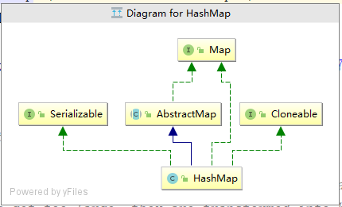
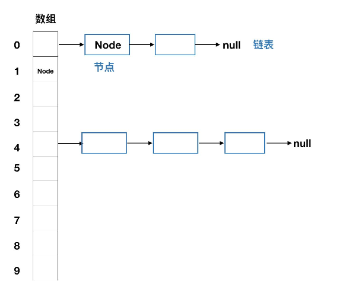
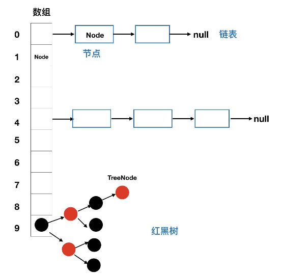
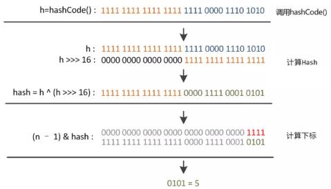
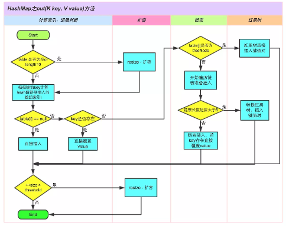
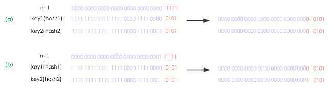
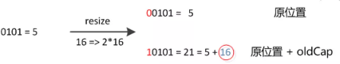

## 【Java集合】源码分析之HashMap ##

>注：该文章源码基于JDK1.8
---
### 概述 ###
HashMap实现了Serializable和cloneable接口，继承了AbstractMap类。我们先来看下HashMap的图解：



**HashMap常见知识点**

`HashMap`的数据是以键值对形式存储的，并且存储多个数据时，数据的建不能相同，如果相同该键之前保存的值将被覆盖。

如果想要保证`HashMap`能够正确的保存数据，需要确保作为建的类，必须正确的重写`equals`方法。`HashMap`存储数据的位置与添加数据的键的`hashcode()`有关。所以元素使用`HashMap`存储的时候需要确保已经按照要求重写了`hashcode()`方法。

`HashMap`只允许一条存储数据的键为null，可以允许多条数据的值为null。且键为null的键值对一定保存在`HashMap`的第一位。

`HashMap`数据保存的顺序是不确定的，而且可能会因为扩容导致元素位置发生改变，所以遍历顺序是不确定的。

`HashMap`是线程不安全的，如果需要在多线程的情况下使用，可以用`Collections.synchronizedMap(Map map) `方法使 `HashMap `具有线程安全的能力，或者使用 `ConcurrentHashMap`。

### 问题 ###

 1、`HashMap`底层数据结构是什么
 
 2、`HashMap`是怎么保存数据的
 
 3、`HashMap`是怎么扩容的
 
 4、`HashMap`是如何确定数据位置，如何处理哈希冲突的
 
 5、`HashMap`在`JDK1.8`做了哪些改动，有什么好处
 
 6、`HashMap`有哪些常用方法


### HashMap的底层数据结构 ###  

自`JDK1.8`以后对`HashMap`的底层数据结构做了一定的优化。所以可以以两条线来了解`HashMap`的底层数据结构。

#### JDK1.7以前的数据结构 ####

`HashMap` 作为使用hash值来决定元素存储位置的集合也是需要处理hash冲突的。在1.7之前JDK采用「拉链法」来存储数据，即数组和链表结合的方式：



「拉链法」用专业点的名词来说叫做链地址法。简单来说，就是数组加链表的结合。在每个数组元素上存储的都是一个链表。不同的 key 可能经过 hash 运算可能会得到相同的地址，但是一个数组单位上只能存放一个元素，采用链地址法以后，如果遇到相同的 hash 值的 key 的时候，我们可以将它放到作为数组元素的链表上。待我们去取元素的时候通过 hash 运算的结果找到这个链表，再在链表中找到与 key 相同的节点，就能找到 key 相应的值了。JDK1.7中新添加进来的元素总是放在数组相应的角标位置，而原来处于该角标的位置的节点作为 next 节点放到新节点的后边。


#### JDK1.8以后的数据结构 ####
对于`JDK1.8`以后`HashMap`在底层解决哈希冲突的方法，就不仅仅是数组加单链表的组合了，因为如果发生hash冲突的值比较多的情况下，会导致链表的长度越来越长，此时通过key来寻找单链表上对应的value值时，时间复杂度就变成了O（n）,因此在JDK1.8后，在链表新增节点导致长度超过TREEIFY_THRESHOLD = 8的时候，就会在添加元素的同时，将原来的单链表结构改为红黑树。红黑树是一种易于增删改查的二叉树，它对于数据查询的时间复杂度是O(logn)级别，所以利用红黑树能够更高效的对HashMap的数据进行操作。



#### HashMap中重要的基础参数 ####

HashMap中有一些非常重要的基本参数如下：

**哈希桶（buckets）** 在`HashMap`的注释中用哈希桶来形象的表示数组中每个地址位置。需要注意的是这并不是数组本身，数组是装哈希桶的，数组可以被称为哈希表。默认初始容量`（DEFAULT_INITIAL_CAPACITY = 1 << 4）`。表示哈希表中哈希桶的初始数量。如果我们没有通过构造方法修改这个默认初始值，那么默认长度为16。为了保证`HashMap`添加和查询的高效性，`HashMap`的容量总是2^n。这里会引来一个问题： 为什么`HashMap`的容量总是2^n？这样定义的好处是什么？

**加载因子（loadFactor）** 加载因子是哈希表（散列表）在其容量自动增加之前被允许获得的最大数量的度量。当哈希表中的条目数量超过当前容量与加载因子的乘积时，散列表就会被重新映射（即重构内部数据结构）。重新创建的哈希表（散列表）的哈希桶容量大约为原数量的两倍。默认加载因子（0.75）,在时间和空间成本上提供了良好的折中。加载因子过大会导致链表过长，加载因子过小又会导致频繁的扩容。所以不建议轻易修改默认的加载因子。

**扩容阈值（threshold）** 扩容阈值 = 哈希表容量 * 加载因子。哈希表的键值对总数 = 所有哈希桶中所有链表的节点数相加之和。扩容阈值比较的是是键值对的个数而不是哈希表的数组中有多少个位置被占了。

**树化阀值(TREEIFY_THRESHOLD)** 这个参数的概念是在JDK1.8后加入的，它的含义表示一个哈希桶的链表长度达到该值（默认为8）的时候，会将链表转为红黑树。

**非树化阀值(UNTREEIFY_THRESHOLD)** 这个参数与树化阈值相对应。当哈希桶中的链表长度小于该值（默认为6）的时候，会将红黑树重新转化为单链表的结构存储数据。\

**最小树化容量(MIN_TREEIFY_CAPACITY)** 经过上边的介绍我们只知道，当链表的节点数超过8的时候就会转化为树化存储，其实对于转化还有一个要求就是哈希表的数量超过最小树化容量的要求（默认要求是 64）,且为了避免进行扩容、树形化选择的冲突，这个值不能小于 4 * TREEIFY_THRESHOLD);在达到该有求之前优先选择扩容。扩容因为因为容量的变化可能会使单链表的长度改变。


#### 存储单元 ####

`HashMap`在`JDK1.7`中只有`Entry`一种存储单元，在`JDK1.8`以后，由于加入了红黑树的概念，就多了一种存储单元，而`Entry`也随之应景修改为`Node`。
```
static class Node<K,V> implements Map.Entry<K,V> {
    final int hash;
    final K key;
    V value;
    Node<K,V> next;

    Node(int hash, K key, V value, Node<K,V> next) {
        this.hash = hash;
        this.key = key;
        this.value = value;
        this.next = next;
    }

    public final K getKey()        { return key; }
    public final V getValue()      { return value; }
    public final String toString() { return key + "=" + value; }

    public final int hashCode() {
        return Objects.hashCode(key) ^ Objects.hashCode(value);
    }

    public final V setValue(V newValue) {
        V oldValue = value;
        value = newValue;
        return oldValue;
    }

    public final boolean equals(Object o) {
        if (o == this)
            return true;
        if (o instanceof Map.Entry) {
            Map.Entry<?,?> e = (Map.Entry<?,?>)o;
            if (Objects.equals(key, e.getKey()) &&
                Objects.equals(value, e.getValue()))
                return true;
        }
        return false;
    }
}

```

1.8中新增了红黑树节点TreeNode，属于数据结构中的红黑树

```
static final class TreeNode<K,V> extends LinkedHashMap.Entry<K,V> {
    TreeNode<K,V> parent;  // red-black tree links
    TreeNode<K,V> left;
    TreeNode<K,V> right;
    TreeNode<K,V> prev;    // needed to unlink next upon deletion
    boolean red;
}
```
----

### HashMap的四种构造方法 ###

#### 1、指定期望初始容量和加载因子的构造函数 ####
其中加载因子不能小于0，可以大于1，但是不能为无穷大
```
public HashMap(int initialCapacity, float loadFactor) {
    //判断初始容量是否大于等于0，如果小于0则抛出异常
    if (initialCapacity < 0)
        throw new IllegalArgumentException("Illegal initial capacity: " +
                                           initialCapacity);
    //如果初始长度大于int的最大值即2^31-1，那么使用最大int值
    if (initialCapacity > MAXIMUM_CAPACITY)
        initialCapacity = MAXIMUM_CAPACITY;
    //如果加载因子小于0或者为无穷大，那么抛出异常。这里Float.isNaN是判断是否无穷大的方法
    if (loadFactor <= 0 || Float.isNaN(loadFactor))
        throw new IllegalArgumentException("Illegal load factor: " +
                                           loadFactor);
    this.loadFactor = loadFactor;
    this.threshold = tableSizeFor(initialCapacity);
}
```
该构造函数并没有初始化哈希表`Node<K,V>[] table`，真正指定哈希表容量总是在添加第一个元素的时候。在构造函数最下面一行调用了`tableSizeFor`方法如下：
```
static final int tableSizeFor(int cap) {
    int n = cap - 1;
    n |= n >>> 1;
    n |= n >>> 2;
    n |= n >>> 4;
    n |= n >>> 8;
    n |= n >>> 16;
    //通过上述“或”运算后，最终n的个位必定为1；
    //然后在返回时+1，保证返回的结果肯定是2^n;
    return (n < 0) ? 1 : (n >= MAXIMUM_CAPACITY) ? MAXIMUM_CAPACITY : n + 1;
}
```
该方法根据给定的初始化长度，计算出一个>=cap的扩容阈值。

#### 2、只指定初始容量的构造函数 ####
该方法比较简单，会将指定的期望容量和默认的加载因子传递给“标号1”的构造方法。
```
public HashMap(int initialCapacity) {
    this(initialCapacity, DEFAULT_LOAD_FACTOR);
}
```

#### 3、无参构造方法 ####

该方法也是我们常用的构造方法，该方法初始化的加载因子为默认值，并没有调用其他的构造方法，具体如下：
```
public HashMap() {
    this.loadFactor = DEFAULT_LOAD_FACTOR; // all other fields defaulted
}

```

#### 4、传入集合的构造函数 ####
该方法比较复杂，涉及到添加元素，添加元素部分后面再说。
```
public HashMap(Map<? extends K, ? extends V> m) {
    this.loadFactor = DEFAULT_LOAD_FACTOR;
    putMapEntries(m, false);
}
```
### HashMap确定元素位置的方法 ###

在分析`HashMap`如何添加元素前，需要先了解`HashMap`如何确定添加元素的位置，即了解`HashMap`如何实现Hash方法。源码中的hash方法如下：
```
static final int hash(Object key) {
    int h;
    return (key == null) ? 0 : (h = key.hashCode()) ^ (h >>> 16);
}
```
从源码中可以看到，**该方法将key的hashcode右移了16位，即丢弃掉低位16位，高位16位全部为0，然后再与key的hashcode做异或运算，即高位16位与低位16位做异或运算，这么做可以在table的length比较小的时候也能够高低位都能参与到hash的计算当中，同时也不会有太大的开销**。通过上述方法获取到key最终的hash值。这时候还没有获取到，该key在hash表中的索引位置，在put方法中，**会将获取到的hash值，与table的length-1做与运算，获取到最终的索引位置**。**为什么是table的length-1呢？**
**因为HashMap的底层数组长度总是2^n，转为二进制１后面跟着多个0的情况，此时一个数与2^n取模，等同于一个数与2^n-1做与运算。**



>图片来自：https://tech.meituan.com/java-hashmap.html 侵删。

由上述可得出结论：**HashMap**在添加元素之前，会对key的hashCode的返回值做一次扰动处理，即进行一次位运算+一次异或运算**(h = key.hashCode()) ^ (h >>> 16)**。在扰动处理后，`HashMap`会将hash值与哈希表的`length-1`做位与运算得出最终的哈希桶的索引位置

### HashMap添加元素的实现 ###
直接上代码：
```
public V put(K key, V value) {
    return putVal(hash(key), key, value, false, true);
}
```
put方法调用`putVal()`，其中前三个参数很好理解，分别是key的hash值，key，value。

第四个参数为`onlyIfAbsent`，该参数含义为：只有当key值对应的位置为空的时候，才替换元素，一般传false，`JDK1.8`中新增的`putIfAbsent`方法中，传的true；

第五个参数为`evict`，如果为false，那么说明是在初始化的时候调用的。
```
/**
 * Implements Map.put and related methods
 *
 * @param hash hash for key
 * @param key the key
 * @param value the value to put
 * @param onlyIfAbsent if true, don't change existing value
 * @param evict if false, the table is in creation mode.
 * @return previous value, or null if none
 */
final V putVal(int hash, K key, V value, boolean onlyIfAbsent,
               boolean evict) {
    Node<K,V>[] tab; Node<K,V> p; int n, i;
    //如果是第一次添加元素，table== null或者table.length == 0 ，那么需要初始化table
    if ((tab = table) == null || (n = tab.length) == 0)
        n = (tab = resize()).length;
    //如果（tab.length-1）& hash，即添加key的角标位置的值为null，那么直接新建一个node放到哈希桶的对应位置    
    if ((p = tab[i = (n - 1) & hash]) == null)
        tab[i] = newNode(hash, key, value, null);
    else {
        //如果对应位置已经有元素，且key是相同的则覆盖元素
        Node<K,V> e; K k;
        if (p.hash == hash &&
            ((k = p.key) == key || (key != null && key.equals(k))))
            e = p;
        else if (p instanceof TreeNode)//否则，如果添加元素为红黑树节点，那么需要转为红黑树节点
            e = ((TreeNode<K,V>)p).putTreeVal(this, tab, hash, key, value);
        else {//如果hash值计算出的索引位置相同，但是key不相同
            //循环整个单链表到尾部
            for (int binCount = 0; ; ++binCount) {
                if ((e = p.next) == null) {
                    //拼接新的元素到列表尾部
                    p.next = newNode(hash, key, value, null);
                    //如果链表长度大于树化阈值，那么进行哈希桶树化操作
                    if (binCount >= TREEIFY_THRESHOLD - 1) // -1 for 1st
                        treeifyBin(tab, hash);
                    break;
                }
                //如果遍历过程中，发现链表中有个节点的key与要添加元素的key相同，此时 e 所指的节点为需要替换 Value 的节点，并结束循环
                if (e.hash == hash &&
                    ((k = e.key) == key || (key != null && key.equals(k))))
                    break;
                p = e;
            }
        }
        //如果循环完后 e!=null 代表需要替换e所指节点 Value
        if (e != null) { // existing mapping for key
            V oldValue = e.value;//保存原有节点的value值
            if (!onlyIfAbsent || oldValue == null)
                e.value = value;//覆盖原有值
            afterNodeAccess(e);
            return oldValue;
        }
    }
    ++modCount;
    //如果size大于扩容阈值，那么需要扩容
    if (++size > threshold)
        resize();
    afterNodeInsertion(evict);
    return null;
}
```
下面附上一张图解

>图片来来自：https://tech.meituan.com/java-hashmap.html



#### 添加元素过程表述如下 #####
1、如果`Node[] table`为null，则说明是第一次添加元素，那么初始化哈希表，或者说首次扩容哈希表。

2、计算要保存key值在table中的索引位置，计算公式为：`（table.length -1）& hash`。

3、判断索引位置是否存在元素，如果没有，那么直接插入到数组中。如果有元素且key值相同，那么直接覆盖value。这里需要正确的复写key对应的equals方法。

4、如果索引位置的key值与要插入的key值不相同，那么遍历单链表，如果遍历过程中，发现有节点key值与要插入的key值相同，那么覆盖对应的value值。如果没有发现相同的节点，那么在单链表的末尾添加新元素。

5、如果插入节点后，链表的长度大于树化阈值，那么需要将单链表转换为红黑树。

6、成功插入节点后，判断键值对个数是否大于扩容阈值，如果大于则需要再次扩容。

### HashMap扩容机制 ###
```
final Node<K,V>[] resize() {
    //记录老的哈希表
    Node<K,V>[] oldTab = table;
    //oldCap代表扩容前的数组长度，oldThr代表扩容前的扩容阈值
    int oldCap = (oldTab == null) ? 0 : oldTab.length;
    int oldThr = threshold;
    int newCap, newThr = 0;
    if (oldCap > 0) {
        //// 如果旧的容量已经达到最大容量 2^30 那么就不在继续扩容直接返回，将扩容阈值设置到 Integer.MAX_VALUE，并不代表不能装新元素，只是数组长度将不会变化
        if (oldCap >= MAXIMUM_CAPACITY) {
            threshold = Integer.MAX_VALUE;
            return oldTab;
        }
        //否则将新的数组长度扩大为旧数组的两倍，新的扩容阈值扩大为旧的两倍
        else if ((newCap = oldCap << 1) < MAXIMUM_CAPACITY &&
                 oldCap >= DEFAULT_INITIAL_CAPACITY)
            newThr = oldThr << 1; // double threshold
    }
   //oldThr 不为空，代表我们使用带参数的构造方法指定了加载因子并计算了
   //初始初始阈值 会将扩容阈值 赋值给初始容量这里不再是期望容量，
   //但是 >= 指定的期望容量
    else if (oldThr > 0) // initial capacity was placed in threshold
        newCap = oldThr;
    else {               // zero initial threshold signifies using defaults
        // 空参数构造会走这里初始化容量，和扩容阈值 分别是 16 和 12
        newCap = DEFAULT_INITIAL_CAPACITY;
        newThr = (int)(DEFAULT_LOAD_FACTOR * DEFAULT_INITIAL_CAPACITY);
    }
    //如果新的扩容阈值是0，对应的是当前 table 为空，但是有阈值的情况
    if (newThr == 0) {
        float ft = (float)newCap * loadFactor;
        newThr = (newCap < MAXIMUM_CAPACITY && ft < (float)MAXIMUM_CAPACITY ?
                  (int)ft : Integer.MAX_VALUE);
    }
    //更新全局扩容阈值
    threshold = newThr;
    @SuppressWarnings({"rawtypes","unchecked"})
    //使用新的容量初始化新的哈希表数组
        Node<K,V>[] newTab = (Node<K,V>[])new Node[newCap];
    table = newTab;
    //如果老的数组不为空，那么要进行重新插入操作，否则直接返回
    if (oldTab != null) {
        //遍历老数组中的链表或者红黑树，重新计算节点的位置
        for (int j = 0; j < oldCap; ++j) {
            Node<K,V> e;
            //如果当前数组位置存在元素
                if ((e = oldTab[j]) != null) {
                //那么释放当前数组位置的空间    
                oldTab[j] = null;
                // 如果链表只有一个节点，
               //则使用新的数组长度计算节点位于新数组中的角标并插入
                if (e.next == null)
                    newTab[e.hash & (newCap - 1)] = e;
                else if (e instanceof TreeNode)
                //如果当前节点为红黑树则需要进一步确定树中节点位于新数组中的位置
                    ((TreeNode<K,V>)e).split(this, newTab, j, oldCap);
                else { // preserve order
                   //因为扩容是容量翻倍，
                   //原链表上的每个节点 现在可能存放在原来的下标，即low位，
                   //或者扩容后的下标，即high位
                    Node<K,V> loHead = null, loTail = null;
                    Node<K,V> hiHead = null, hiTail = null;
                    Node<K,V> next;
                    do {
                   
                        next = e.next;
                        // 利用哈希值 & 旧的容量，可以得到哈希值去模后， //是大于等于 oldCap 还是小于 oldCap， //等于 0 代表小于 oldCap，应该存放在低位， //否则存放在高位（稍后有图片说明）
                        if ((e.hash & oldCap) == 0) {
                            if (loTail == null)
                                loHead = e;
                            else
                                loTail.next = e;
                            loTail = e;
                        }
                        else {
                            if (hiTail == null)
                                hiHead = e;
                            else
                                hiTail.next = e;
                            hiTail = e;
                        }
                    } while ((e = next) != null);
                    //将低位链表存放在原index处，
                    if (loTail != null) {
                        loTail.next = null;
                        newTab[j] = loHead;
                    }
                    //将高位链表存放在新index处
                    if (hiTail != null) {
                        hiTail.next = null;
                        newTab[j + oldCap] = hiHead;
                    }
                }
            }
        }
    }
    return newTab;
}
```

看完之后总结出两点，HashMap扩容主要做了两件事：

1、确定扩容后新数组的长度和扩容阈值，并扩容；

2、将原有哈希表中的元素重新存放到新的哈希表中。

主要难以理解的地方是拷贝旧的数组元素到新的数组中，为何通过(e.hash & oldCap) == 0就可以确定旧元素在新数组中的位置呢？
网上大佬说因为扩容是容量翻倍，所以原链表上的每个节点，可能存放新哈希表中在原来的下标位置， 或者扩容后的原位置偏移量为 oldCap 的位置上，下边举个例子 图片和叙述来自 https://tech.meituan.com/java-hashmap.html：
图（a）表示扩容前的key1和key2两种key确定索引位置的示例，图（b）表示扩容后key1和key2两种key确定索引位置的示例，其中hash1是key1对应的哈希与高位运算结果。



元素在重新计算hash之后，因为n变为2倍，那么n-1的mask范围在高位多1bit(红色)，因此新的index就会发生这样的变化：



所以在 JDK1.8 中扩容后，只需要看看原来的hash值新增的那个bit是1还是0就好了，是0的话索引没变，是1的话索引变成“原索引+oldCap。

### HashMap 其他添加元素的方法 ### 
上边讲构造函数的时候埋了个坑即使用：
```
public HashMap(Map<? extends K, ? extends V> m) {
   this.loadFactor = DEFAULT_LOAD_FACTOR;
   putMapEntries(m, false);
}
```

构造函数构建 `HashMap` 的时候，在这个方法里，除了赋值了默认的加载因子，并没有调用其他构造方法，而是通过批量添加元素的方法 `putMapEntries` 来构造了 `HashMap`。该方法为私有方法，真正批量添加的方法为putAll
```
public void putAll(Map<? extends K, ? extends V> m) {
   putMapEntries(m, true);
}


//同样第二参数代表是否初次创建 table 
 final void putMapEntries(Map<? extends K, ? extends V> m, boolean evict) {
   int s = m.size();
   if (s > 0) {
        //如果哈希表为空则初始化参数扩容阈值
       if (table == null) { // pre-size
           float ft = ((float)s / loadFactor) + 1.0F;
           int t = ((ft < (float)MAXIMUM_CAPACITY) ?
                    (int)ft : MAXIMUM_CAPACITY);
           if (t > threshold)
               threshold = tableSizeFor(t);
       }
       else if (s > threshold)//构造方法没有计算 threshold 默认为0 所以会走扩容函数
           resize();
        //将参数中的 map 键值对一次添加到 HashMap 中
       for (Map.Entry<? extends K, ? extends V> e : m.entrySet()) {
           K key = e.getKey();
           V value = e.getValue();
           putVal(hash(key), key, value, false, evict);
       }
   }
}
```

JDK1.8 中还新增了一个添加方法，该方法调用 putVal 且第4个参数传了 true，代表只有哈希表中对应的key 的位置上元素为空的时候添加成功，否则返回原来 key 对应的 Value 值。
```
@Override
public V putIfAbsent(K key, V value) {
   return putVal(hash(key), key, value, true, true);
}
```


### HashMap查询元素 ###
```
public V get(Object key) {
    Node<K,V> e;
    return (e = getNode(hash(key), key)) == null ? null : e.value;
}


final Node<K,V> getNode(int hash, Object key) {
    Node<K,V>[] tab; Node<K,V> first, e; int n; K k;
    //如果哈希表不为空，并且要查询key的hash值计算到的索引位置有元素
    if ((tab = table) != null && (n = tab.length) > 0 &&
        (first = tab[(n - 1) & hash]) != null) {
            //那么判断该元素的值是否与key相等，相等则直接返回该节点
        if (first.hash == hash && // always check first node
            ((k = first.key) == key || (key != null && key.equals(k))))
            return first;
            //如果不相等，那么如果为红黑树，调用红黑树获取节点的方法，返回找到的节点
        if ((e = first.next) != null) {
            if (first instanceof TreeNode)
                return ((TreeNode<K,V>)first).getTreeNode(hash, key);
                //如果为单链表，那么循环单链表，找到key值相等的节点，并返回
            do {
                if (e.hash == hash &&
                    ((k = e.key) == key || (key != null && key.equals(k))))
                    return e;
            } while ((e = e.next) != null);
        }
    }
    return null;
}
```

### HashMap的删除操作 ###

HashMap有两种删除元素的方式，但是最终都会调用`removeNode`方法，`removeNode`方法有两个参数需要注意


1、`matchValue`，如果为true，那么只有当传入的value与map中对应的value相等的时候才会删除；

2、`movable`，如果为true，在删除节点为红黑树节点时，会在删除该节点的同时删除该节点数上的其他节点
```
public V remove(Object key) {
    Node<K,V> e;
    return (e = removeNode(hash(key), key, null, false, true)) == null ?
        null : e.value;
}

@Override
public boolean remove(Object key, Object value) {
    return removeNode(hash(key), key, value, true, true) != null;
}

final Node<K,V> removeNode(int hash, Object key, Object value,
                           boolean matchValue, boolean movable) {
    Node<K,V>[] tab; Node<K,V> p; int n, index;
    //找到要删除节点在哈希桶中的位置
    if ((tab = table) != null && (n = tab.length) > 0 &&
        (p = tab[index = (n - 1) & hash]) != null) {
        Node<K,V> node = null, e; K k; V v;
        //如果在hash表上，则直接返回该节点
        if (p.hash == hash &&
            ((k = p.key) == key || (key != null && key.equals(k))))
            node = p;
        else if ((e = p.next) != null) {
            //如果索引节点为红黑树，那么遍历红黑树，找到对应节点
            if (p instanceof TreeNode)
                node = ((TreeNode<K,V>)p).getTreeNode(hash, key);
            else {
                //否则遍历单链表找到对应节点
                do {
                    if (e.hash == hash &&
                        ((k = e.key) == key ||
                         (key != null && key.equals(k)))) {
                        node = e;
                        break;
                    }
                    p = e;
                } while ((e = e.next) != null);
            }
        }
        //如果找到了要删除的节点，并根据条件判断需要删除，那么删除节点
        if (node != null && (!matchValue || (v = node.value) == value ||
                             (value != null && value.equals(v)))) {
            if (node instanceof TreeNode)
                ((TreeNode<K,V>)node).removeTreeNode(this, tab, movable);
            else if (node == p)
                tab[index] = node.next;
            else
                p.next = node.next;
            ++modCount;
            --size;
            afterNodeRemoval(node);
            return node;
        }
    }
    return null;
}
```

### HashMap迭代器 ###

我们可以编写一个Map迭代器的测试用例，来学习HashMap的迭代器
```
Map<String,String> map = new HashMap<>();
map.put("张三","男");
map.put("李四","男");
map.put("王五","男");
map.put("赵六","女");
map.put("孙七","女");
Set<Map.Entry<String,String>> set = map.entrySet();
Iterator i  = set.iterator();
while(i.hasNext()){
    Map.Entry entry = (Map.Entry)i.next();
    System.out.println(entry.getKey());
    System.out.println(entry.getValue());
}
```

由此可见我们遍历使用的是map的entrySet()
```
public Set<Map.Entry<K,V>> entrySet() {
    Set<Map.Entry<K,V>> es;
    return (es = entrySet) == null ? (entrySet = new EntrySet()) : es;
}


// 我们来看下 EntrySet 是一个 set 存储的元素是 Map 的键值对
final class EntrySet extends AbstractSet<Map.Entry<K,V>> {
   // size 放回 Map 中键值对个数
   public final int size()                 { return size; }
   //清除键值对
   public final void clear()               { HashMap.this.clear(); }
   // 获取迭代器
   public final Iterator<Map.Entry<K,V>> iterator() {
       return new EntryIterator();
   }
   
   //通过 getNode 方法获取对一个及对应 key 对应的节点 这里必须传入
   // Map.Entry 键值对类型的对象 否则直接返回 false
   public final boolean contains(Object o) {
       if (!(o instanceof Map.Entry))
           return false;
       Map.Entry<?,?> e = (Map.Entry<?,?>) o;
       Object key = e.getKey();
       Node<K,V> candidate = getNode(hash(key), key);
       return candidate != null && candidate.equals(e);
   }
   // 这里调用之前讲得 removeNode 方法 删除节点
   public final boolean remove(Object o) {
       if (o instanceof Map.Entry) {
           Map.Entry<?,?> e = (Map.Entry<?,?>) o;
           Object key = e.getKey();
           Object value = e.getValue();
           return removeNode(hash(key), key, value, true, true) != null;
       }
       return false;
   }
   ...
}


//EntryIterator 继承自 HashIterator
final class EntryIterator extends HashIterator
   implements Iterator<Map.Entry<K,V>> {
   // 这里可能是因为大家使用适配器的习惯添加了这个 next 方法
   public final Map.Entry<K,V> next() { return nextNode(); }
}

   
abstract class HashIterator {
        Node<K,V> next;        // next entry to return
        Node<K,V> current;     // current entry
        int expectedModCount;  // for fast-fail
        int index;             // current slot

        HashIterator() {
            //初始化操作数 Fast-fail 
            expectedModCount = modCount;
            // 将 Map 中的哈希表赋值给 t
            Node<K,V>[] t = table;
            current = next = null;
            index = 0;
            //从table 第一个不为空的 index 开始获取 entry
            if (t != null && size > 0) { // advance to first entry
                do {} while (index < t.length && (next = t[index++]) == null);
            }
        }
        
        public final boolean hasNext() {
            return next != null;
        }

        final Node<K,V> nextNode() {
            Node<K,V>[] t;
            Node<K,V> e = next;
            if (modCount != expectedModCount)
                throw new ConcurrentModificationException();
            if (e == null)
                throw new NoSuchElementException();
             //如果当前链表节点遍历完了，则取哈希桶下一个不为null的链表头   
            if ((next = (current = e).next) == null && (t = table) != null) {
                do {} while (index < t.length && (next = t[index++]) == null);
            }
            return e;
        }
        //这里还是调用 removeNode 函数不在赘述
        public final void remove() {
            Node<K,V> p = current;
            if (p == null)
                throw new IllegalStateException();
            if (modCount != expectedModCount)
                throw new ConcurrentModificationException();
            current = null;
            K key = p.key;
            removeNode(hash(key), key, null, false, false);
            expectedModCount = modCount;
        }
    }
```

### 小结 ###
以上内容只是我对自己分析源码和阅读相关资料的一个总结。毕竟能力有限，可能很多地方不够全面和深入，请谅解。如果你在阅读的过程中发现有错误或者有什么疑惑，欢迎留言，我会及时回复，谢谢。

>注：该文章部分参考https://juejin.im/post/5ac83fa35188255c5668afd0，侵删

