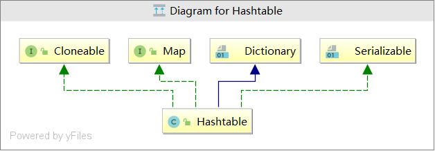

## 【Java集合】源码分析之HashTable ##

---
>注：本文所有源码基于JDK1.8

---
### 概述 ###

前面我们已经分析了``HashMap``，``TreeMap``这两种常用的Map类型，但是这两种类型都是线程不安全的。下面我们来看一下Map中最老牌的线程安全类``HashTable``的实现方式和源码解析。老规矩，先上关系图解：




由上图可以看出：

1、``HashTable``实现了``Cloneable``接口所以支持克隆（但需要注意这只是浅拷贝，如果想要深拷贝需要自己重写clone方法）;

2、``HashTable``继承自``Dictionary``类，该类声明了操作键值对的接口方法；

3、``HashTable``实现了``Serializable``接口，所以支持Java默认的序列化方法；

---
### 问题 ###

我始终觉得带着问题阅读源码才是最有效率的，下面是我在阅读源码前想到的几个问题:

1、``HashTable``的底层数据结构是怎么样的？

2、``HashTable``的默认长度是多少？是如何进行扩容的？

2、``HashTable``如何实现线程安全的？

3、``HashTable``有哪些常用方法？分别是怎么实现的？

4、```HashTable```与``HashMap``的区别是什么？

--------
### HashTable的底层数据结构 ###

``HashTable``底层为数组结构，是通过“拉链法”实现的哈希表，他的几个重要成员包括：``table``，``count``，``threshold``，``loadFactor``，``modCount``。

```
    //底层为数组结构，每一个节点的类型是Entry
    private transient Entry<?,?>[] table;

    //元素的实际数量
    private transient int count;

   //扩容阈值。用于判断HashTable是否需要扩容。（threshold = 容量 * 加载因子）
    private int threshold;

   //加载因子
    private float loadFactor;

    //HashTable的改变次数
    private transient int modCount = 0;
    
    private static class Entry<K,V> implements Map.Entry<K,V> {
            final int hash;//哈希值
            final K key;
            V value;
            Entry<K,V> next;//单向量表的下一个节点的索引
    
            protected Entry(int hash, K key, V value, Entry<K,V> next) {
                this.hash = hash;
                this.key =  key;
                this.value = value;
                this.next = next;
            }
    
            @SuppressWarnings("unchecked")
            //浅拷贝克隆方法
            protected Object clone() {
                return new Entry<>(hash, key, value,
                                      (next==null ? null : (Entry<K,V>) next.clone()));
            }
    
            // Map.Entry Ops
    
            public K getKey() {
                return key;
            }
    
            public V getValue() {
                return value;
            }
    
            public V setValue(V value) {
                //value值为空则抛出空指针异常，所以HashTable值不允许为空
                if (value == null)
                    throw new NullPointerException();
                V oldValue = this.value;
                this.value = value;
                return oldValue;
            }
            //重写equals方法
            public boolean equals(Object o) {
                if (!(o instanceof Map.Entry))
                    return false;
                Map.Entry<?,?> e = (Map.Entry<?,?>)o;
    
                return (key==null ? e.getKey()==null : key.equals(e.getKey())) &&
                   (value==null ? e.getValue()==null : value.equals(e.getValue()));
            }
            //重写hashcode方法
            public int hashCode() {
                return hash ^ Objects.hashCode(value);
            }
    
            public String toString() {
                return key.toString()+"="+value.toString();
            }
        }
    
```

### HashTable的构造函数 ###

``HashTable``有四个构造函数：


#### 1、入参为初始长度和加载因子的构造函数 ####

```
public Hashtable(int initialCapacity, float loadFactor) {
        //如果初始长度小于0,则抛出非法异常
        if (initialCapacity < 0)
            throw new IllegalArgumentException("Illegal Capacity: "+
                                               initialCapacity);
         //如果加载因子小于0或者为无穷大,则抛出非法异常
        if (loadFactor <= 0 || Float.isNaN(loadFactor))
            throw new IllegalArgumentException("Illegal Load: "+loadFactor);
        //如果初始长度为0，则修改初始长度为1
        if (initialCapacity==0)
            initialCapacity = 1;
        this.loadFactor = loadFactor;
        //创建长度为initialCapacity的哈希表
        table = new Entry<?,?>[initialCapacity];
        //计算出扩容阈值并保存
        threshold = (int)Math.min(initialCapacity * loadFactor, MAX_ARRAY_SIZE + 1);
    }

```
#### 2、入参只有初始长度的构造函数 ####

入参只有初始长度的构造函数，会使用默认的加载因子，即**0.75f**，调用上面的构造方法

``
public Hashtable(int initialCapacity) {
        this(initialCapacity, 0.75f);
    }
``

#### 3、无参构造函数 ####
无参构造函数，使用默认初始长度，即**11**，和默认加载因子0.75f,调用上面的有参构造函数。**由此可以得出，`HashTable`的默认初始长度为11，默认加载因子为0.75f**

`
public Hashtable() {
        this(11, 0.75f);
    }
`

#### 4、入参为Map集合的构造函数 ####

入参为`Map`集合的构造函数，**会先取2\*map.size()和11中的最大值**作为`HashTable`的初始长度，0.75f作为加载因子调用有参构造函数，
然后将Map集合中的所有值存入`HashTable`中，putAll方法后面会详细分析

``
    public Hashtable(Map<? extends K, ? extends V> t) {
        this(Math.max(2*t.size(), 11), 0.75f);
        putAll(t);
    }
``
### HashTable常用方法 ###

查看源码发现，HashTable几乎所有的public方法，都加上了synchronize关键字，所以才能保证线程安全，但是也会导致效率低下。所以现在HashTable使用
得都比较少。在多线程环境下，建议使用ConcurrentHashMap替换HashTable，ConcurrentHashMap在后面会有讲解

#### 添加元素put()方法 ####

```
public synchronized V put(K key, V value) {
        // Make sure the value is not null
        //确认存入的value值不为空
        if (value == null) {
            throw new NullPointerException();
        }

        // Makes sure the key is not already in the hashtable.
        Entry<?,?> tab[] = table;
        //计算key的hash值
        int hash = key.hashCode();
        //hash值与Integer.MAX_VALUE（即2^32-1，二进制位11111....）取与，作用是过滤负数，然后
        //与hashTable的长度求模，将得到的角标索引限制在哈希表内部
        int index = (hash & 0x7FFFFFFF) % tab.length;
        @SuppressWarnings("unchecked")
        //获取该索引位置的节点值
        Entry<K,V> entry = (Entry<K,V>)tab[index];
        //如果老的节点值不为空，那么循环单链表，如果能找到与插入key相等的节点，那么更新节点的值，并返回老节点
        for(; entry != null ; entry = entry.next) {
            if ((entry.hash == hash) && entry.key.equals(key)) {
                V old = entry.value;
                entry.value = value;
                return old;
            }
        }
        //没有找到相同节点，那么直接插入新的节点
        addEntry(hash, key, value, index);
        return null;
    }
    
    private void addEntry(int hash, K key, V value, int index) {
            修改HashTable的次数+1
            modCount++;
    
            Entry<?,?> tab[] = table;
            //如果tab的容量大于等于扩容阈值的话，那么进行扩容
            //并重新计算Key的索引位置
            if (count >= threshold) {
                // Rehash the table if the threshold is exceeded
                //扩容
                rehash();
                
                tab = table;
                //重新计算key的索引位置
                hash = key.hashCode();
                index = (hash & 0x7FFFFFFF) % tab.length;
            }
    
            // Creates the new entry.
            @SuppressWarnings("unchecked")
            //获取索引原节点
            Entry<K,V> e = (Entry<K,V>) tab[index];
            //生成新的节点并保存
            tab[index] = new Entry<>(hash, key, value, e);
            count++;
        }
```
#### 批量添加元素的方法putAll() ####

批量添加元素的代码层面实现方法是for循环调用put()方法

````
    public synchronized void putAll(Map<? extends K, ? extends V> t) {
        for (Map.Entry<? extends K, ? extends V> e : t.entrySet())
            put(e.getKey(), e.getValue());
    }
````

#### 扩容方法Rehash() ####

`HashTable`的默认长度为11，加载因子为0.75f。当HashTable的元素数量大于等于扩容阈值的时候，需要进行扩容，
扩容方法为 **原长度\*2+1** ，并需要将旧的数组元素，重新计算新的索引，插入到新的数组中。

```
protected void rehash() {
        //记录下旧的哈希表长度
        int oldCapacity = table.length;
        //保存旧的哈希表
        Entry<?,?>[] oldMap = table;

        // overflow-conscious code
        //新的哈希表长度为oldCapacity*2+1
        int newCapacity = (oldCapacity << 1) + 1;
        //如果新的哈希表长度大于最大数组长度,且老的哈希表长度等于最大数组长度，那么新的哈希表长度不变
        //（注意这里与HashMap不同，HashMap是最大整数，这个是java允许的最大数组长度）
        if (newCapacity - MAX_ARRAY_SIZE > 0) {
            if (oldCapacity == MAX_ARRAY_SIZE)
                // Keep running with MAX_ARRAY_SIZE buckets
                return;
            newCapacity = MAX_ARRAY_SIZE;
        }
        //创建新的哈希表
        Entry<?,?>[] newMap = new Entry<?,?>[newCapacity];
        //修改hashTable次数+1
        modCount++;
        //计算新的扩容阈值
        threshold = (int)Math.min(newCapacity * loadFactor, MAX_ARRAY_SIZE + 1);
        //将新的哈希表保存到全局
        table = newMap;
        //循环将原哈希表中的键值对保存到新的哈希表中
        for (int i = oldCapacity ; i-- > 0 ;) {
            for (Entry<K,V> old = (Entry<K,V>)oldMap[i] ; old != null ; ) {
                Entry<K,V> e = old;
                old = old.next;
                //重新计算节点的索引位置
                int index = (e.hash & 0x7FFFFFFF) % newCapacity;
                e.next = (Entry<K,V>)newMap[index];
                newMap[index] = e;
            }
        }
    }
```

#### 获取元素get() ####

```
public synchronized V get(Object key) {
        Entry<?,?> tab[] = table;
        //计算要查询key的索引值
        int hash = key.hashCode();
        int index = (hash & 0x7FFFFFFF) % tab.length;
        //找到哈希表索引值上的单向链表
        for (Entry<?,?> e = tab[index] ; e != null ; e = e.next) {
            //找到与key值相等的节点，返回其对应的value值
            if ((e.hash == hash) && e.key.equals(key)) {
                return (V)e.value;
            }
        }
        return null;
    }
```

#### 删除节点remove() ####

删除节点时唯一需要注意的是当节点在哈希表上时，需要将单向链表的第二个节点（如果有）挂到哈希表的对应索引位置

```
public synchronized V remove(Object key) {
        Entry<?,?> tab[] = table;
        int hash = key.hashCode();
        //计算要删除节点key的索引位置
        int index = (hash & 0x7FFFFFFF) % tab.length;
        @SuppressWarnings("unchecked")
        Entry<K,V> e = (Entry<K,V>)tab[index];
        //循环对应索引位置的单向链表
        for(Entry<K,V> prev = null ; e != null ; prev = e, e = e.next) {
            //找到节点的key与删除key值相等的节点
            if ((e.hash == hash) && e.key.equals(key)) {
                modCount++;
                //如果节点前还有节点，那么将后一个节点挂在前一个节点上
                if (prev != null) {
                    prev.next = e.next;
                } else {
                    //如果节点钱没有了，那么需要将后一个节点挂在哈希表对饮的索引位置上
                    tab[index] = e.next;
                }
                //数量-1
                count--;
                V oldValue = e.value;
                e.value = null;
                //返回删除节点的value值
                return oldValue;
            }
        }
        return null;
    }

```

#### 遍历方法 ####

这里只介绍两种遍历方法，一种是通过`keySet().iterator()`。另外一种是通过获取枚举值遍历。

```
private void testIter(){
        Hashtable hashtable = new Hashtable<String,String>();
        hashtable.put("aaa","111");
        hashtable.put("bbb","222");
        hashtable.put("ccc","333");
        hashtable.put("ddd","444");
        Iterator<String> iterator  = hashtable.keySet().iterator();
        for(;iterator.hasNext();){
            String key = (String)iterator.next();
            String value = (String)hashtable.get(key);
            System.out.println(key + "-"+value);
        }

        Enumeration<String> enumeration = hashtable.keys();
        while (enumeration.hasMoreElements()){
            System.out.println(enumeration.nextElement());
        }
    }

```


### HashTable 与 HashMap 的区别 ###

1、自JDK1.8以后`HashMap`的底层结构为数组+链表+红黑树，而`HashTable`的底层数据结构为数组+链表；

2、`HashMap`的默认长度为16，且每次扩容，为原长度的2倍，保证长度永远是2的n次方。而`HashTable`的默认长度
为11，且每次扩容长度为`oldTab.length*2+1`。`HashTable`的长度必定为奇数，有的时候还会是素数，这么做可以使数据均匀
散列，减少哈希碰撞，由于`HashMap`数组链表和红黑树的特殊数据结构，并且其特殊的获取下标索引的方法，所以不需要数组长度为奇数 

3、`HashMap`没有完全使用默认的`hashCode`方法计算key的哈希值，而是使用了自己的`hash()`方法：`(h = key.hashCode()) ^ (h >>> 16)`使高16位和低16都参与到hash值的计算中。`HashTable`则直接使用`hashCode()`方法计算哈希值；

4、`HashMap`获取节点索引的方法为`(n - 1) & hash`，`hash`和`tab.length-1`做与运算，保证索引位置在哈希表长度以内的同时，使key的索引散列更均匀分布;而`HashTable`计算索引位置的方法为：`int index = (hash & 0x7FFFFFFF) % tab.length`

5、`HashTable`基本上所有的`public`都加上了`synchronized`关键字，来保证线程安全性，但这也是它的效率比较低。而`HashMap`是线程不安全的。

6、`HashMap`允许key和value为空，但是只允许一个key为空，且必定保存在哈希桶的0索引位置。而`HashTable`不允许key和value为空。


>注：以上的所有内容都是我的个人见解，如果有什么不对或不解，欢迎留言纠错和提问，谢谢！