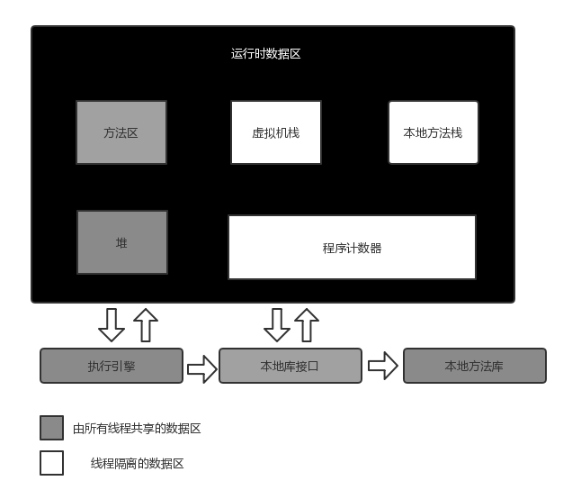

### String相关知识 ###
>本文源码基于JDK1.8

### 概述 ###
String并不属于Java八大基础类型中的一种，但是其使用频率却不比任何一种基础类型低，所以了解String的常用方法和一些相关类就显得尤为重要了，否则在日常使用的过程中，就会埋下各种坑而不自知，在项目上生产后查找相关问题又变得极其艰难。


### JVM相关 ###
深入了解String之前，先简单复习下JVM的相关知识，下面是Java虚拟机运行时的数据区图示



#### 程序计数器（线程私有） ####

程序计数器是一块较小的内存空间，它可以看作是当前线程所执行的字节码的行号指示器。字节码解释器工作时就是通过改变这个计数器的值来选取下一条需要执行的字节码指令的，分支、循环、跳转、异常处理、线程恢复等基础功能都要依赖计数器完成。

#### Java虚拟机栈（线程私有）####

虚拟机栈描述的是Java方法执行的内存模型：每个方法在执行的同时都会创建一个栈帧用于存储局部变量表、操作数栈、动态链接、方法出口等信息。虚拟机栈的生命周期与线程相同，每一个方法从调用到执行完成的过程，就对应着一个栈帧在虚拟机栈中入栈到出栈的过程。

#### 本地方法栈（线程私有） ####

本地方法栈与虚拟机栈作用类似，他们之间的区别不过是虚拟机栈为虚拟机执行Java方法（也就是字节码）服务，而本地方法栈则为虚拟机使用的native方法服务。

#### Java堆（线程共享） ####

Java堆（Java Heap）是Java虚拟机所管理的内存中最大的一块，在虚拟机启动时创建。此区域的唯一目的就是存放对象的实例，几乎所有的对象实例都在这里分配内存。

#### 方法区（线程共享） ####

方法区用于存储已被虚拟机加载的类信息、常量、静态变量、即时编译器编译后的代码等数据。

#### 运行时常量池（线程共享） ####

运行时常量池是方法区的一部分。class文件中除了有类的版本、字段、方法、接口等描述信息外，还有一项信息是常量池，用于存放编译期生成的各种字面量和符号引用，这部分内容将在类加载后进入方法区的运行时常量池中存放。

**下面重点了解下字符串常量池**

字符串常量池存放在运行时常量池中 ，字符串常量池的存在使虚拟机减少了内存开销，提高了性能。

当我们使用字面量创建字符创常量时，例如Sting a = "aaa"，JVM会首先检索字符串常量池，如果该字符串已经存在常量池中，那么直接将此字符串对象的引用地址赋值给a，引用a存放在Java虚拟机栈中。如果在常量池中没有，那么就会实例化该字符串，并存放在常量池中，并将此字符串对象的地址赋值给a。

当我们使用new关键字创建字符串对象时，例如String a = new String("aaa"),JVM会首先检索字符串常量池，如果在常量池中已经存在，那么不会在常量池中再创建对象，而是直接在堆中复制该对象的副本，然后将堆中对象的引用地址赋值给a ，如果常量池中不存在，那么实例化该对象并存放到常量池中，然后在堆中赋值该对象的副本，并将堆中对象的引用地址赋值给a。

### String源码分析 ###

```java
public final class String
    implements java.io.Serializable, Comparable<String>, CharSequence {
    /** The value is used for character storage. */
    private final char value[];

    /** Cache the hash code for the string */
    private int hash; // Default to 0

    /** use serialVersionUID from JDK 1.0.2 for interoperability */
    private static final long serialVersionUID = -6849794470754667710L;

    /**
     * Class String is special cased within the Serialization Stream Protocol.
     *
     * A String instance is written into an ObjectOutputStream according to
     * <a href="{@docRoot}/../platform/serialization/spec/output.html">
     * Object Serialization Specification, Section 6.2, "Stream Elements"</a>
     */
    private static final ObjectStreamField[] serialPersistentFields =
        new ObjectStreamField[0];
    }
```

上面是部分String的源码，String类有final关键字修饰，这意味着String不能被继承，并且其所有成员变量和方法都默认final修饰。String实现了Serializable，Comparable,CharSequence接口。**Serializable**用于支持序列化， **Comparable**用于对两个实例化对象进行比较。**CharSequence**是一个只读的字符序列，包括length(), charAt(int index), subSequence(int start, int end)这几个API接口，值得一提的是，StringBuffer和StringBuild也是实现了改接口。

##### String成员变量 #####

**char value[]**：保存String内容的数组
**offset**:保存第一个索引  
**count**:保存字符串长度
**hash**:缓存实例化对象时计算的hashcode值，由于String是不可变的，所以每次的hashcode必定相同，缓存之后就不需要去计算了，这样可以提升性能

### String在JVM层解析 ###

#### 1、创建字符串形式 ####
 创建字符串的两种基本形式如下：
 ```
    String s1 = "1";
    String s2 = new String("1");
```
在虚拟机中，s1使用引号（字面量）创建字符串，在**编译期**的时候就会对常量池检索，判断是否存在该字符串。如果存在那么不会创建新的，直接返回对象的引用；如果不存在，那么现在常量池中创建对象，然后返回对象的引用给s1。

s2使用关键词new创建字符串，JVM会首先检查字符串常量池，如果该字符串已经存在常量池中，那么不再在字符串常量池创建该字符串对象，而直接堆中复制该对象的副本，然后将堆中对象的地址赋值给引用s2，如果字符串不存在常量池中，就会实例化该字符串并且将其放到常量池中，然后在堆中复制该对象的副本，然后将堆中对象的地址赋值给引用s2。注意：此时是运行期，那么字符串常量池是在运行时常量池中的。

#### 2、“+”形式创建字符串 ####
 
 ```
 形式一：String s = "a" + "b" + "c"
 
```
如果使用“+”拼接的字符串全部都是常量，那么在编译期就能确定最终的值，就可以直接入字符串常量池，一样会先判断静态常量池（编译期常量池）字符串常量池中是否存在该字符串，如果存在，则直接返回常量池中对象的引用，如果不存在，则先创建对象到常量池，再返回引用给s.


 
 ```
 形式二：String s = "a" + new String("b") + "c" + "d"
 
```
如果使用“+”拼接的字符串中含有变量时，也就是说在运行期才能够给确定具体的值。首先编译期会将竟可能多的常量连接在一起,形成新的字符串，然后参与到后续的连接中，即
`String s = "a" + new String("b") + "cd"`

接下来的字符串连接是从左向右依次进行，对于不同的字符串，首先以最左边的字符串为参数创建StringBuilder对象（可变字符串对象），然后依次对右边进行append操作，最后将StringBuilder对象通过toString()方法转换成String对象（注意：中间的多个字符串常量不会自动拼接）。实际上的实现过程为：`String s=new StringBuilder(“a”).append(new String(“b”)).append(“cd”).toString();`当使用+进行多个字符串连接时，实际上是产生了一个StringBuilder对象和一个String对象。


### String的Equals和“==” ###

String为引用数据类型，String重写了Object的equals方法，比较的是两个对象的值，如果值相等，则equals返回true。而“==”比较的是两个对象的内存地址是否相同，下面是一些String相关的equals和==比较

```
public  void testEquals(){
        //在编译期，在字符串常量池中创建对象“abc”，返回该对象引用给s1
        String s1 = "abc";
        //在编译期，字符串常量池中已经存在了对象“abc”,不用重新创建，直接返回对象引用给s2
        String s2 = "abc";
        System.out.println("s1.equals(s2):"+ s1.equals(s2));//结果返回true,值相等
        System.out.println("s1 = s2 ：" + (s1 == s2));//结果返回true，指向常量池中的同一个对象
        
        
        
        //如果不计s1的创建过程，那么s3创建时，会在常量池中创建一个对象，并在堆中创建一个对象，然后将堆中对象的引用赋值给s3
        String s3 = new String("abc");
        //s4创建时，由于常量池中已经存在对象值为“abc”，所以只在堆中创建对象，并将对象的引用返回给s4
        String s4 = new String("abc");
        System.out.println("s3.equals(s4):"+s3.equals(s4));//结果返回true，值相等
        System.out.println("s3 = s4:"+ (s3 == s4));//返回false，指向不同的对象
        System.out.println("s3.equals(s1):"+s3.equals(s1));//返回true,值相等
        System.out.println("s3 = s1 :"+(s3 ==s1));//返回false，一个指向常量池中对象，一个指向堆中对象
        
        
        
        //由于“+”拼接的字符创都是常量，所以在编译期就会被优化， 效果等同于String s5 = "abcd";
        String s5 = "ab" + "c";
        System.out.println("s1 =s5 ：" + (s1 == s5));//返回true，都指向常量池中的同一个对象
        
        
        //由于“+”拼接的字串中包含变量，所以在运行期时才能确定，并系统会先创建“ab”的StringBuilder ,然后再append
        String s6 = "ab" + new String("c");
        System.out.println("s1 = s6: " + (s1 == s6));//返回false，指向不同的对象
        
        
        String s7 = "c";
        String s8 = "ab" + s7;//由于s7是变量，在运行时才能确定，所以会产生新的对象，保存在堆中
        System.out.println("s1 = s8：" + (s1 == s8));//返回false，指向不同对象
        
        
        final  String s9 = "c";
        String s10 = "ab" + s9;//s9为常量，所以在编译期就会优化
        System.out.println("s1 = s10 :" + (s1 == s10) );//返回true,都指向常量池中的同一个对象
    }

```

运行结果如下：

```
s1.equals(s2):true
s1 = s2 ：true
s3.equals(s4):true
s3 = s4:false
s3.equals(s1):true
s3 = s1 :false
s1 =s5 ：true
s1 = s6: false
s1 = s8：false
s1 = s10 :true

```

### String 、StringBuilder 与 StringBuffer 的区别 ###

我们知道String是不可变的，当需要拼接字符串时，会产生很多无用的中间对象，如果频繁的进行这种你操作，会对性能产生一定的影响。而StringBuffer就是为了解决上述问题而产生的一个类。它提供的append和add方法可以将字符串添加到已有序列的末尾或者指定位置，其本质上是一个线程安全的可修改的字符序列，该类把所有能修改序列的方法都加上了synchronized方法以保证线程安全，但代价就是性能比较低。

而在很多情况下，字符串拼接并不需要线程安全，所以StringBuilder就应运而生了，StringBuilder是JDK1.5发布的，本质上与StringBuffer没有什么区别，只是去掉了线程安全部分，减少了开销。

StringBuffer 和 StringBuilder 二者都继承了 AbstractStringBuilder ，底层都是利用可修改的char数组(JDK 9 以后是 byte数组)。所以如果我们有大量的字符串拼接，如果能预知大小的话最好在new StringBuffer 或者StringBuilder 的时候设置好capacity，避免多次扩容的开销。扩容要抛弃原有数组，还要进行数组拷贝创建新的数组。