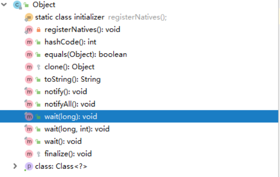

### object常用方法 ###

>本文源码都基于JDK1.8

### 概述 ###

Java是一门面向对象的编程语言，在Java的世界里，万物皆对象。而Object是一切对象的祖先。所以理解Object的常用方法就非常必要了，下面是Object的成员方法图解：



### 问题 ###

1、hashCode()方法的作用是什么？

2、equals()方法和hashCode()方法的关联是什么？

3、equals()与“==”的区别是什么？

4、native关键字的作用是什么？

5、clone()的深拷贝和浅拷贝的区别是什么？

6、线程相关方法的用法


### Native关键字 ###

在初次见到Native关键字的时候，我还懵比，这个Native是干啥的，我怎么从来没用过。为什么我找不到被Native修饰的方法的实现呢？

其实Native关键字是JNI的一部分，JNI全称是Java Native Interface。JNI是JDK的一部分，它允许Java代码与其他语言代码进行交互。Java本身是运行在虚拟机上的，Java本身是不允许直接访问硬件的，这就引出了Native关键字。

用Native修饰的方法，在虚拟机里都有一个与之同名的函数，去做Java想要做的事情。 使用native关键字说明这个方法是原生函数，也就是这个方法是用C/C++语言实现的，并且被编译成了DLL，由java去调用。这些函数的实现体在DLL中，JDK的源代码中并不包含，对于不同的平台它们也是不同的。这也是java的底层机制，实际上java就是在不同的平台上调用不同的native方法实现对操作系统的访问的

### hashCode() ###

hashCode()是一个native本地方法，其实默认的hashCode()方法返回的就是对象对应的内存地址。当我们在一些场景下复写了hashCode()方法后，例如需要使用map来存放对象的时候，覆写后hashCode返回的就不是对象的内存地址了。

#### hash算法简介 ####
 hash 算法，又被称为散列算法，基本上，哈希算法就是将对象本身的键值，通过特定的数学函数运算或者使用其他方法，转化成相应的数据存储地址的。而哈希法所使用的数学函数就被称为 『哈希函数』又可以称之为散列函数。在常见的 hash 函数中有一种最简单的方法交「除留余数法」，操作方法就是将要存入数据除以某个常数后，使用余数作为索引值。 下面看个例子：
将 323 ，458 ，25 ，340 ，28 ，969， 77 使用「除留余数法」存储在长度为11的数组中。我们假设上边说的某个常数即为数组长度11。 每个数除以11以后存放的位置如下图所示：


试想一下我们现在想要拿到 77 在数组中的位置，是不是只需要 arr[77%11] = 77 就可以了。但是上述简单的 hash 算法，缺点也是很明显的，比如 77 和 88 对 11 取余数得到的值都是 0，但是角标为 0 位置已经存放了 77 这个数据，那88就不知道该去哪里了。上述现象在哈希法中有个名词叫碰撞：

碰撞：若两个不同的数据经过相同哈希函数运算后，得到相同的结果，那么这种现象就做碰撞。

于是在设计 hash 函数的时候我们就要尽可能做到：

降低碰撞的可能性。尽量将要存入的元素经过 hash 函数运算后的结果，尽量能够均匀的分布在指定的容器（我们在称之为桶）。

前文说了 hashCode 方法与 java 中使用散列表的集合类息息相关，我们拿 Set 来举例，我们都知道 Set 中是不允许存放重复的元素的。那么我们凭借什么来判断已有的 Set 集合中是否有何要存入的元素重复的元素呢？有人可能会说我们可以通过 equals 来判断两个元素是否相同。那么问题又来，如果 Set 中已经有 10000个元素了，那么之后在存入一个元素岂不是要调用 10000 次 equals 方法。显然这不合理，性能低到令人发指。那要怎么办才能保证即高效又不重复呢？答案就在于 hashCode 这个函数。经过之前的分析我们知道 hash 算法是使用特定的运算来得到数据的存储位置的，那么 hashCode 方法就充当了这个特定的函数运算。这里我们可以简单认为调用 hashCode 方法后得到数值就是元素的存储位置（其实集合内部还做了进一步的运算，以保证尽可能的均匀分布在桶内）。当 Set 需要存放一个元素的时候，首先会调用 hashCode 方法去查看对应的地址上有没有存放元素，如果没有则表示 Set 中肯定没有相同的元素，直接存放在对应位置就好，但是如果 hashCode 的结果相同，即发生了碰撞，那么我们在进一步调用该位置元素的 equals 方法与要存放的元素进行比较，如果相同就不存了，如果不相同就需要进一步散列其它的地址。这样我们就可以尽可能高效的保证了无重复元素的方法。

### equals（） ####

equals 方法属于Object基类的方法，所有的对象都拥有这个方法，并有权重写该方法。该方法返回了一个boolean类型的结果，代表比较的两个对象是否相同。事实上很多java定义好的一些引用数据类型，都重写了equals 方法。当我们自定义引用数据类型的时候，如果判定两个对象相等，需要根据具体的业务规则而定，但是必须遵循以下规则；

**自反性（reflexive）**：对于任意不为null 的引用值x，x.equals(x)一定为true；

**对称性（symmetric）**:  对于任意不为null的引用值x和y,当且仅当x.equals(y)为true时，y.equals(x) 为true；

**传递性（transitive）**： 对于任意不为null的引用值x、y和z，如果x.equals(y)为true同时y.equal(z)为true，那么x.equals(z)也为true；

**一致性（consistent）**：对于任意不为null的引用值x和y，如果用于equals比较的对象信息没有被修改的话，多次调用时 x.equals(y) 要么一致地返回 true 要么一致地返回 false。

**null值要求**：对于任意不为 null 的引用值 x，x.equals(null) 返回 false。

#### equals 与 == 的区别 ####

java数据类型可以分为基础数据类型和引用数据类型。基础数据类型包括short,int,byte,long,dubble,float,boolean,char八种。对于基础数据类型，==判断的是左右两边的值。
```
int a = 10;
int b = 10;
float c = 10.0f;
//以下输出结果均为 true
System.out.println("(a == b) = " + (a == b));
System.out.println("(b == c) = " + (b == c));
```
而对于引用数据类型，==操作符判断的就是左右两边对象的内存地址是否相同。也就是说通过==判断的两个引用数据类型，如果相等，那么他们指向的肯定是同一个对象。

**可以总结出两者比较的结果如下：**

1、如果==两边都是基础数据类型，那么比较的是两个的值是否相等；

2、如果==两边都是引用数据类型，那么比较的是两者的内存地址是否相同。若相同，则左右两边的是同一个对象。

3、Object基类的equals默认比较的是两者的内存地址是否相等。在构建的对象没有重写equals对象时，equals与==作用相同。

4、equals用于比较引用数据类型是否相等。在满足equals判断规则的前提下，两个对象只要规定的属性相同，那么就认为两个对象是相同的。


#### equals 与 hashCode的关系 ####

1、如果两个对象调用equals方法返回的true，那么他们的hashCode一定相同；

2、如果两个对象的hashCode相同，他们却不一定是同一个对象，调用equals方法，不一定为true；但是如果两个对象的hashCode不相同，那么他们一定不是同一个对象，调用equals方法一定返回false；

### clone 深浅拷贝 ###

在某些情况下，我们需要获取一个对象的拷贝来处理某些事情。这个时候就需要用到object.clone方法，要是用clone方法的类，必须实现cloneable接口，才能够使用clone方法，否则在使用时会抛出CloneNotSupportedException。而我们在实际应用中可能会发现，当对象中包含可变的引用数据类型时，在拷贝得到的新对象中对该引用数据类型的属性进行修改，原始对象相应的属性也会发生变化，这种现象就是“浅拷贝”。object默认的clone方法就是浅拷贝。

在了解浅拷贝和深拷贝之前，我们需要先了解一点铺垫知识：Java中的数据类型分为基础数据类型和引用数据类型。这两种类型在进行赋值操作和作为方法参数或返回值时，会有值传递和引用地址传递的差别。

### 浅拷贝 ####

我们来写一个例子看一下clone()方法的浅拷贝现象：
```
/**
 * @author xiongchenyang
 * @Date 2019/6/21
 **/
public class CloneTest {


    public static void main(String[] args) throws CloneNotSupportedException {
        Student student = new Student("张三","男",28 ,new Address("深圳","南海大道"));
        Student cloneStudent = (Student) student.clone();
        System.out.println("student的地址:"+student);
        System.out.println("cloneStudent的地址:"+cloneStudent);
        cloneStudent.setAge(44);
        Address address = cloneStudent.getAddress();
        address.setProvince("北京");
        System.out.println("修改cloneStudent后结果为：");
        System.out.println("cloneStudent:" + cloneStudent.display());
        System.out.println("student:"+student.display());
    }

    static class Student implements Cloneable{
        private  String name;
        private String sex;
        private Integer age;
        private Address address;

        private Student(String name, String sex, Integer age, Address address) {
            this.name = name;
            this.sex = sex;
            this.age = age;
            this.address = address;
        }

        public String getName() {
            return name;
        }

        public void setName(String name) {
            this.name = name;
        }

        public String getSex() {
            return sex;
        }

        public void setSex(String sex) {
            this.sex = sex;
        }

        public Integer getAge() {
            return age;
        }

        public void setAge(Integer age) {
            this.age = age;
        }

        public Address getAddress() {
            return address;
        }

        public void setAddress(Address address) {
            this.address = address;
        }

        public String display() {
            return "Student{" +
                    "name='" + name + '\'' +
                    ", sex='" + sex + '\'' +
                    ", age=" + age +
                    ", address=" + address +
                    '}';
        }

        @Override
        protected Object clone() throws CloneNotSupportedException {
            return super.clone();
        }
    }


    static class Address {
        private String province;
        private String street;

        public Address(String province, String street) {
            this.province = province;
            this.street = street;
        }

        public String getProvince() {
            return province;
        }

        public void setProvince(String province) {
            this.province = province;
        }

        public String getStreet() {
            return street;
        }

        public void setStreet(String street) {
            this.street = street;
        }

        @Override
        public String toString() {
            return "Address [province=" + province + ", street=" + street + "]";
        }

    }
}

```
上述代码运行后的结果为：
```$xslt
student的地址:com.xcy.test.CloneTest$Student@47fd17e3
cloneStudent的地址:com.xcy.test.CloneTest$Student@7cdbc5d3
修改cloneStudent后结果为：
cloneStudent:Student{name='张三', sex='男', age=44, address=Address [province=北京, street=南海大道]}
student:Student{name='张三', sex='男', age=28, address=Address [province=北京, street=南海大道]}
```

可以看到，clone之后我们得到的是两个对象，我们改变clone得到的cloneStudent的基础类型(值类型)属性后，原始student的值不会随之改变；但是我们改变了cloneStudent的引用类型属性后，原始student的引用类型属性也随之改变了。

总结：浅拷贝创建了一个新的对象，然后将当前对象的非静态字段复制到该对象，如果字段类型为基础类型（值类型）,那么复制该字段的值；如果字段类型为引用类型，那么复制该字段的引用到新的对象，而不是复制引用指向的值到新的对象。
此时新对象中的引用类型字段相当于原始字段中引用类型字段你的一个副本，原始对象和新对象的引用字段指向的是同一个对象。


#### 深拷贝 ####

浅拷贝是对值类型进行拷贝，对引用数据类型进行引用的拷贝。那么深拷贝就是要讲引用类型的属性内容也都拷贝一份新的。

我目前了解到的深拷贝实现方式，总共两种：1、引用类型也实现cloneable接口，并重写clone()方法；2、通过序列化和反序列化，实现。下面我们用两种方式实现下深拷贝

#####1、实现cloneable接口 #####

修改Address类：
```
static class Address implements  Cloneable {
        
        
        @Override
        protected Object clone() throws CloneNotSupportedException {
            return super.clone();
        }

        ……
    }
```
修改Student类：
```
static class Student implements Cloneable{

        @Override
        protected Object clone() throws CloneNotSupportedException {
            Student student = (Student) super.clone();
            student.address = (Address) address.clone();
            return student;
        }
    }
    
    ……
```

执行原测试代码之后得到结果如下:
```$xslt
student的地址:com.xcy.test.CloneTest$Student@47fd17e3
cloneStudent的地址:com.xcy.test.CloneTest$Student@7cdbc5d3
修改cloneStudent后结果为：
cloneStudent:Student{name='张三', sex='男', age=44, address=Address [province=北京, street=南海大道]}
student:Student{name='张三', sex='男', age=28, address=Address [province=深圳, street=南海大道]}
```

可以看到重写Clone方法后，执行原测试代码，修改cloneStudent的Address的province属性后，原student对应的值没有发生改变。我们也不难想到，当一个实体类中有多个引用数据类型时，我们需要手动引用多个引用数据类型的clone方法，不是很方便。而对于这种情况，我们可以考虑用序列化来进行深拷贝。

编写序列化和反序列化的深拷贝方法：
```$xslt
import java.io.*;

/**
 * @author xiongchenyang
 * @Date 2019/6/24
 **/
public class DeepClone implements Serializable {
    private static final long serialVersionUID = 1L;

    /**
     * 利用序列化和反序列化进行对象的深拷贝
     * @return
     * @throws Exception
     */
    protected Object deepClone() throws Exception{
        //序列化
        ByteArrayOutputStream bos = new ByteArrayOutputStream();
        ObjectOutputStream oos = new ObjectOutputStream(bos);

        oos.writeObject(this);

        //反序列化
        ByteArrayInputStream bis = new ByteArrayInputStream(bos.toByteArray());
        ObjectInputStream ois = new ObjectInputStream(bis);

        return ois.readObject();
    }
}

```
Student和Address方法都继承DeepClone。然后执行下面的测试代码：

```$xslt
public static void main(String[] args) throws Exception {
        Student student = new Student("张三","男",28 ,new Address("深圳","南海大道"));
        Student cloneStudent = (Student) student.deepClone();
        System.out.println("student的地址:"+student);
        System.out.println("cloneStudent的地址:"+cloneStudent);
        cloneStudent.setAge(44);
        Address address = cloneStudent.getAddress();
        address.setProvince("北京");
        System.out.println("修改cloneStudent后结果为：");
        System.out.println("cloneStudent:" + cloneStudent.display());
        System.out.println("student:"+student.display());
    }

```
得到结果如下：

```$xslt
student的地址:com.xcy.test.CloneTest$Student@1b0375b3
cloneStudent的地址:com.xcy.test.CloneTest$Student@32d992b2
修改cloneStudent后结果为：
cloneStudent:Student{name='张三', sex='男', age=44, address=Address [province=北京, street=南海大道]}
student:Student{name='张三', sex='男', age=28, address=Address [province=深圳, street=南海大道]}
```
由以上结果可以发现，修改克隆得到的cloneStudent值，对原student没有任何影响

### 线程相关方法 ###

Object中线程相关的方法有wait(),wait(long)，wait(long,int)，notify(),notifyAll()这五个方法，它们都属于final方法，其中wait(long),notify(),notifyAll()又属于native 方法，所以他们无法被子类重写。这些方法有一个共同特点：**他们都必须在同步方法或者同步块中执行，因为在调用他们的时候都必须持有对象锁，如果方法没有持有对象锁，那么会抛出InterruptedException异常**

#### wait(long) ####
```
public final native void wait(long timeout) throws InterruptedException;
```
当执行wait(long)方法时，会释放当前锁，让出CPU资源，线程由Running状态变为Waiting状态，并将当前线程放入到对象的等待队列中。如果超出入参的等待时间，那么该线程将被唤醒，进入同步队列，由waiting状态转换为Blocked状态。

#### wait(),wait(long,int) ####

这两个方法的本质是调用wait(long)方法，具体可以看下面的代码：
```
public final void wait(long timeout, int nanos) throws InterruptedException {
        if (timeout < 0) {
            throw new IllegalArgumentException("timeout value is negative");
        }

        if (nanos < 0 || nanos > 999999) {
            throw new IllegalArgumentException(
                                "nanosecond timeout value out of range");
        }

        if (nanos > 0) {
            timeout++;
        }

        wait(timeout);
    }
    
    public final void wait() throws InterruptedException {
            wait(0);
        }

```

#### notify(),notifyAll() ####

notify()当在同步方法或同步块中，执行该方法并退出当前同步块或同步方法后，会释放锁，并随机唤醒当前等待队列中的某一线程，将该线程从等待队列加入到同步队列中。notify()默认唤醒策略是：先进入wait的线程先被唤醒 （可以自己设置策略）

notifyAll()则会将等待队列中的所有线程都唤醒，加入到同步队列中，然后这些线程会竞争对象锁，竞争到的线程会执行。notifyAll()默认唤醒策略是：采用LIFO策略 （可以自己设置策略）


>这里先简要了解一下wait(),notify(),notifyAll()方法的作用，在后面学习到多线程相关知识的时候，会对object中的线程通信方法做一个详细的分析。


