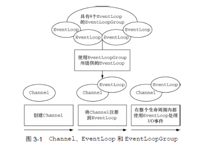

## Netty的组件和设计

### Channel、EventChannel和ChannelFuture
接下来，我们会对于Channel、EventChannel和ChannelFuture类进行讨论，这些类合在一起，可以被认为是Netty网络抽象的代表：
 + channel——Socket
 + Eventloop——控制流、多线程处理、并发
 + channelFuture——异步通知
 
 #### Channel接口
 基本的IO操作（bind()/connect()/read()/write()）依赖于底层网络传输所提供的原语。在基于java的网络编程中，其基本的构造是class socket。Netty的channel接口提供的API，大大降低了直接使用Socket类的复杂性。此外，channel也是拥有许多预定义的、专门化实现的广泛类层次结构的根，下面是一个简短的部分清单：
 
 + EmbeddedChannel;
 + LocalServerChannel;
 + NioDatagramChannel;
 + NioSctpChannel;
 + NioSocketChannel。
 
 #### EventLoop接口
 EventLoop定义了Netty的核心抽象，用于处理链接的生命周期中所发生的事件。下图在高层次上说明了：EventLoopGroup、EventLoop、Thread和channel之间的关系：
 
 
 
 这些关系是：
 + 一个EventLoopGroup 包含一个或多个EventLoop;
 + 一个EventLoop在他的生命周期内，只和Thread绑定；
 + 所有由EventLoop处理的IO时间都将在他专有的Thread上被处理；
 + 一个Channel在她的生命周期内只注册于一个EventLoop；
 + 一个EventLoop可能会被分配给一个或多个Channel。
 
 #### ChannelFuture接口
 Netty中所有的IO操作都是异步的。因为一个操作不会立马返回，所以我们需要一种用于在之后的某个时间点确定其结果的方法。为此，Netty提供了ChannelFuture接口，其addListener()方法注册了一个ChannelFutureListener,以便在某个操作完成时（无论是否成功）得到通知。可以将ChannelFuture看做是将来要执行的操作的结果的占位符。它究竟什么时候被执行，则可能取决于若干的因素，因此不可能准确地预测，但是可以肯定的是，他将被执行。此外，所有属于同一个channel的操作都被保证其将以它们被调用的顺序被执行。
 
 
 