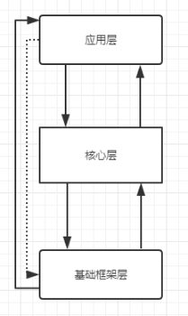
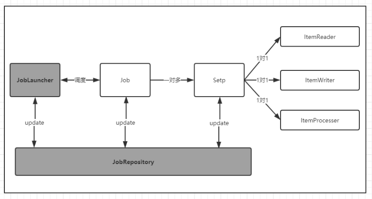

## SpringBatch基础框架 ##

### 概述 ###
SpringBatch核心架构分为三层：应用层、核心层、基础架构层。应用层包含所有批处理作业，通过Spring框架管理程序员自定义的代码。核心层包含SpringBatch启动和控制所需要的核心类，如：JobLauncher,Job和Step等。

应用层和核心层建立在基础架构之上，基础架构提供通用的读(ItemReader)、写(ItemWrite)和服务处理(如：RetryTemplate:重试模板；RepeatTemplate:重复模板,可以被应用层和核心层使用)。SpringBatch的三层体系架构使得SpringBatch框架在不同层级扩展，避免不同层级间的影响。

### SpringBatch批处理框架架构 ###

SpringBatch框架采用了埃森哲提供的经典的批处理框架模型。每个Job有一个或多个作业步Step;每个Step作业步对应一个ItemProcessor、ItemReader和ItemWriter;JobLauncher可以启动Job,启动Job时需要从JobRepository中读取JobExecution;当前Job和Step运行的结果和状态会保存在JobRepository中。

### SpringBatch关键词解析 ###

| 领域对象（关键词） | 描述 |
| :---- | :---- |
| Job | 作业。批处理的核心概念，是Batch操作的基础单元|
| Job Instance|作业实例。每个作业执行时，都会生成一个作业实例，实例会放在JobRepository中， 如果作业失败，下次重新执行该作业的时候，会使用同一个作业实例; 对于Job和Job Repository的关系，可以理解为Java类和类的实例。
| Job Parameter|作业参数，它是一组用来启动批处理任务的参数， 在启动Job的时候，可以设置任何需要的作业参数，需要注意的是作业参数 会用来标识作业实例，即不同的Job实例是通过Job参数来区分的
| Job Execution|作业执行器，其负责具体Job的执行，每次启动Job都会创建一个新的Job执行器|
| Job Repository|作业仓库。负责存储作业执行过程中的状态数据及结果，为JobLauncher、Job、Step提供标准的CRUD操作|
| Job Launcher|作业调度器，它根据给定的Job Parameters执行作业|
| Step|作业步。Job的一个执行环节，多个或一个Step组成一个Job,封装了批处理任务中的一个独立的连续阶段|
| Step Execution|作业步执行器。它负责具体Step的执行，每次运行Step都会启动一个新的执行器|
| Tasklet | 微进程。它是Step中具体执行逻辑的操作，可以重复执行，可以设置具体的同步、异步操作等|
| Execution Context| 执行上下文。它是一组框架持久化与控制的key/value，能够让开发者在Job Execution或Step Execution范畴保存需要持久化的状态。|
| Item | 条目。一条数据记录|
| Chunk|Item集合。它给定数量Item的集合，可以定义对Chunk的读操作、处理操作、写操作，提交间隔等|
| Item Reader | 条目读，其表示Step读取数据，一次读取一条|
| Item Writer| 条目写，用于表示Step输出数据，一次输出一条|
| Item Processor| 条目处理。用于表示Item的处理作业|